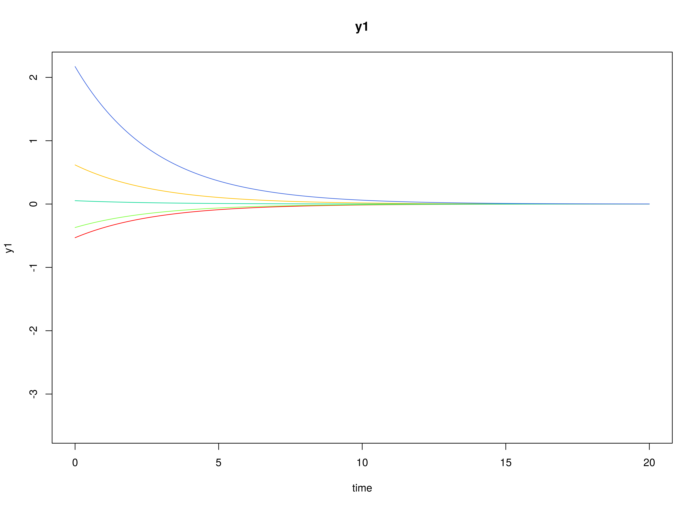
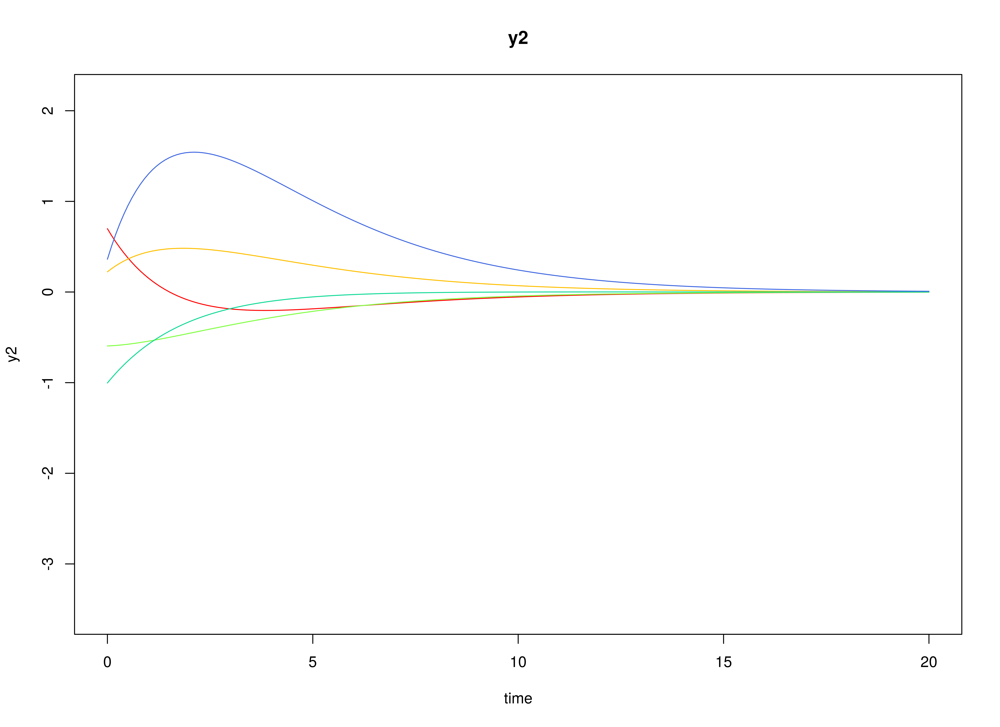
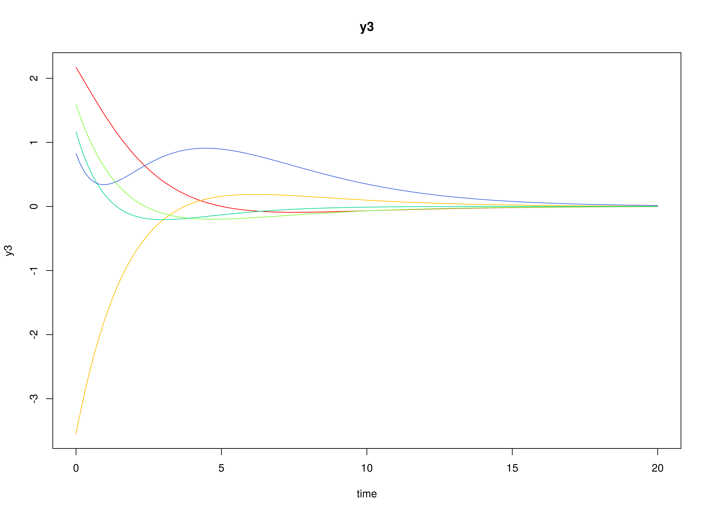

## Model

The measurement model is given by
\begin{equation}
  \mathbf{y}_{i, t}
  =
  \boldsymbol{\nu}
  +
  \boldsymbol{\Lambda}
  \boldsymbol{\eta}_{i, t}
  +
  \boldsymbol{\varepsilon}_{i, t},
  \quad
  \mathrm{with}
  \quad
  \boldsymbol{\varepsilon}_{i, t}
  \sim
  \mathcal{N}
  \left(
  \mathbf{0},
  \boldsymbol{\Theta}
  \right)
\end{equation}
where
$\mathbf{y}_{i, t}$,
$\boldsymbol{\eta}_{i, t}$,
and
$\boldsymbol{\varepsilon}_{i, t}$
are random variables
and
$\boldsymbol{\nu}$,
$\boldsymbol{\Lambda}$,
and
$\boldsymbol{\Theta}$
are model parameters.
$\mathbf{y}_{i, t}$
represents a vector of observed random variables,
$\boldsymbol{\eta}_{i, t}$
a vector of latent random variables,
and
$\boldsymbol{\varepsilon}_{i, t}$
a vector of random measurement errors,
at time $t$ and individual $i$.
$\boldsymbol{\nu}$
denotes a vector of intercepts,
$\boldsymbol{\Lambda}$
a matrix of factor loadings,
and
$\boldsymbol{\Theta}$
the covariance matrix of
$\boldsymbol{\varepsilon}$.

An alternative representation of the measurement error
is given by
\begin{equation}
  \boldsymbol{\varepsilon}_{i, t}
  =
  \boldsymbol{\Theta}^{\frac{1}{2}}
  \mathbf{z}_{i, t},
  \quad
  \mathrm{with}
  \quad
  \mathbf{z}_{i, t}
  \sim
  \mathcal{N}
  \left(
  \mathbf{0},
  \mathbf{I}
  \right)
\end{equation}
where
$\mathbf{z}_{i, t}$ is a vector of
independent standard normal random variables and
$\left( \boldsymbol{\Theta}^{\frac{1}{2}} \right) \left( \boldsymbol{\Theta}^{\frac{1}{2}} \right)^{\prime} = \boldsymbol{\Theta}$ .

The dynamic structure is given by
\begin{equation}
  \mathrm{d} \boldsymbol{\eta}_{i, t}
  =
  \boldsymbol{\Phi}
  \left(
  \boldsymbol{\eta}_{i, t}
  -
  \boldsymbol{\mu}
  \right)
  \mathrm{d}t
  +
  \boldsymbol{\Sigma}^{\frac{1}{2}}
  \mathrm{d}
  \mathbf{W}_{i, t}
\end{equation}
where
$\boldsymbol{\mu}$
is the long-term mean or equilibrium level,
$\boldsymbol{\Phi}$
is the rate of mean reversion,
determining how quickly the variable returns to its mean,
$\boldsymbol{\Sigma}$
is the matrix of volatility
or randomness in the process, and
$\mathrm{d}\boldsymbol{W}$
is a Wiener process or Brownian motion,
which represents random fluctuations.

## Data Generation

### Notation

Let $t = 500$ be the number of time points and $n = 10$ be the number of individuals.

Let the measurement model intecept vector $\boldsymbol{\nu}$ be given by

\begin{equation}
\boldsymbol{\nu}
=
\left(
\begin{array}{c}
  0 \\
  0 \\
  0 \\
\end{array}
\right) .
\end{equation}

Let the factor loadings matrix $\boldsymbol{\Lambda}$ be given by

\begin{equation}
\boldsymbol{\Lambda}
=
\left(
\begin{array}{ccc}
  1 & 0 & 0 \\
  0 & 1 & 0 \\
  0 & 0 & 1 \\
\end{array}
\right) .
\end{equation}

Let the measurement error covariance matrix $\boldsymbol{\Theta}$ be given by

\begin{equation}
\boldsymbol{\Theta}
=
\left(
\begin{array}{ccc}
  0.2 & 0 & 0 \\
  0 & 0.2 & 0 \\
  0 & 0 & 0.2 \\
\end{array}
\right) .
\end{equation}

Let the initial condition
$\boldsymbol{\eta}_{0}$
be given by

\begin{equation}
\boldsymbol{\eta}_{0} \sim \mathcal{N} \left( \boldsymbol{\mu}_{\boldsymbol{\eta} \mid 0}, \boldsymbol{\Sigma}_{\boldsymbol{\eta} \mid 0} \right)
\end{equation}

\begin{equation}
\boldsymbol{\mu}_{\boldsymbol{\eta} \mid 0}
=
\left(
\begin{array}{c}
  0 \\
  0 \\
  0 \\
\end{array}
\right)
\end{equation}

\begin{equation}
\boldsymbol{\Sigma}_{\boldsymbol{\eta} \mid 0}
=
\left(
\begin{array}{ccc}
  1 & 0.2 & 0.2 \\
  0.2 & 1 & 0.2 \\
  0.2 & 0.2 & 1 \\
\end{array}
\right) .
\end{equation}

Let the long-term mean vector $\boldsymbol{\mu}$ be given by

\begin{equation}
\boldsymbol{\mu}
=
\left(
\begin{array}{c}
  0 \\
  0 \\
  0 \\
\end{array}
\right) .
\end{equation}

Let the rate of mean reversion matrix $\boldsymbol{\Phi}$ be given by

\begin{equation}
\boldsymbol{\Phi}
=
\left(
\begin{array}{ccc}
  -0.357 & 0 & 0 \\
  0.771 & -0.511 & 0 \\
  -0.45 & 0.729 & -0.693 \\
\end{array}
\right) .
\end{equation}

Let the dynamic process noise covariance matrix $\boldsymbol{\Sigma}$ be given by

\begin{equation}
\boldsymbol{\Sigma}
=
\left(
\begin{array}{ccc}
  0.2445556 & 0.0220159 & -0.0500476 \\
  0.0220159 & 0.070678 & 0.0153946 \\
  -0.0500476 & 0.0153946 & 0.0755306 \\
\end{array}
\right) .
\end{equation}

Let $\Delta t = 0.1$.

### R Function Arguments


``` r
n
#> [1] 10
time
#> [1] 500
delta_t
#> [1] 0.1
mu0
#> [1] 0 0 0
sigma0
#>      [,1] [,2] [,3]
#> [1,]  1.0  0.2  0.2
#> [2,]  0.2  1.0  0.2
#> [3,]  0.2  0.2  1.0
mu
#> [1] 0 0 0
phi
#>        [,1]   [,2]   [,3]
#> [1,] -0.357  0.000  0.000
#> [2,]  0.771 -0.511  0.000
#> [3,] -0.450  0.729 -0.693
sigma
#>             [,1]       [,2]        [,3]
#> [1,]  0.24455556 0.02201587 -0.05004762
#> [2,]  0.02201587 0.07067800  0.01539456
#> [3,] -0.05004762 0.01539456  0.07553061
nu
#> [1] 0 0 0
lambda
#>      [,1] [,2] [,3]
#> [1,]    1    0    0
#> [2,]    0    1    0
#> [3,]    0    0    1
theta
#>      [,1] [,2] [,3]
#> [1,]  0.2  0.0  0.0
#> [2,]  0.0  0.2  0.0
#> [3,]  0.0  0.0  0.2
```

### Visualizing the Dynamics Without Measurement Error and Process Noise (n = 5 with Different Initial Condition)



### Using the `SimSSMOUFixed` Function from the `simStateSpace` Package to Simulate Data


``` r
library(simStateSpace)
sim <- SimSSMOUFixed(
  n = n,
  time = time,
  delta_t = delta_t,
  mu0 = mu0,
  sigma0_l = sigma0_l,
  mu = mu,
  phi = phi,
  sigma_l = sigma_l,
  nu = nu,
  lambda = lambda,
  theta_l = theta_l,
  type = 0
)
data <- as.data.frame(sim)
head(data)
#>   id time          y1          y2        y3
#> 1  1  0.0  0.29937539 -1.37581548 1.3779071
#> 2  1  0.1 -0.98770381 -0.03632195 0.8363080
#> 3  1  0.2  0.33221051 -0.40321664 1.2054318
#> 4  1  0.3 -0.09485392 -0.82030556 1.0272653
#> 5  1  0.4 -1.50322069 -0.36841853 0.1821731
#> 6  1  0.5 -0.75049839  0.35752476 0.2862544
plot(sim)
```


## Model Fitting

The `FitCTVARIDMx` function fits a CT-VAR model on each individual $i$.
The argument `theta_fixed = FALSE` is used here to model the measurement error variances.


``` r
library(fitCTVARMx)
fit <- FitCTVARIDMx(
  data = data,
  observed = paste0("y", seq_len(k)),
  id = "id",
  time = "time",
  theta_fixed = FALSE,
  ncores = parallel::detectCores()
)
fit
#> 
#> Means of the estimated paramaters per individual.
#>      phi_11      phi_21      phi_31      phi_12      phi_22      phi_32 
#> -0.99722949  0.95122711 -0.80239749  0.42068315 -0.67971580  1.03223527 
#>      phi_13      phi_23      phi_33    sigma_11    sigma_22    sigma_33 
#> -0.58344255  0.15686252 -0.96351172  0.30496054  0.08162716  0.07656524 
#>    theta_11    theta_22    theta_33 
#>  0.19464192  0.18655239  0.20310336
```

## Multivariate Meta-Analysis

The `MetaVARMx` function performs multivariate meta-analysis using the estimated parameters
and the corresponding sampling variance-covariance matrix for each individual $i$.
Estimates with the prefix `b0` correspond to the estimates of `phi`.


``` r
library(metaVAR)
meta <- MetaVARMx(
  object = fit,
  random = FALSE,
  ncores = parallel::detectCores()
)
#> Running Model with 9 parameters
#> 
#> Beginning initial fit attempt
#> Running Model with 9 parameters
#> 
#>  Lowest minimum so far:  -64.1091062816891
#> 
#> Solution found
```



```
#> 
#>  Solution found!  Final fit=-64.109106 (started at 544.82025)  (1 attempt(s): 1 valid, 0 errors)
#>  Start values from best fit:
#> -0.430268780300005,0.922592460531924,-0.616172503758499,0.0719151003797164,-0.644603539281568,0.80303030596861,-0.110515674133675,0.103613670327686,-0.664549169846479
summary(meta)
#>          est     se        z      p    2.5%   97.5%
#> b0_1 -0.4303 0.1439  -2.9900 0.0028 -0.7123 -0.1482
#> b0_2  0.9226 0.0780  11.8288 0.0000  0.7697  1.0755
#> b0_3 -0.6162 0.0722  -8.5310 0.0000 -0.7577 -0.4746
#> b0_4  0.0719 0.1216   0.5913 0.5543 -0.1665  0.3103
#> b0_5 -0.6446 0.0723  -8.9206 0.0000 -0.7862 -0.5030
#> b0_6  0.8030 0.0667  12.0306 0.0000  0.6722  0.9339
#> b0_7 -0.1105 0.0967  -1.1433 0.2529 -0.3000  0.0789
#> b0_8  0.1036 0.0627   1.6515 0.0986 -0.0194  0.2266
#> b0_9 -0.6645 0.0580 -11.4613 0.0000 -0.7782 -0.5509
```

## References


