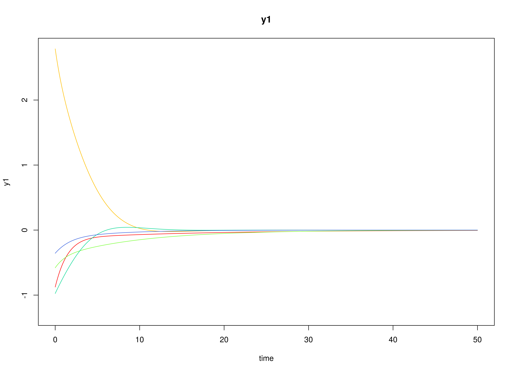
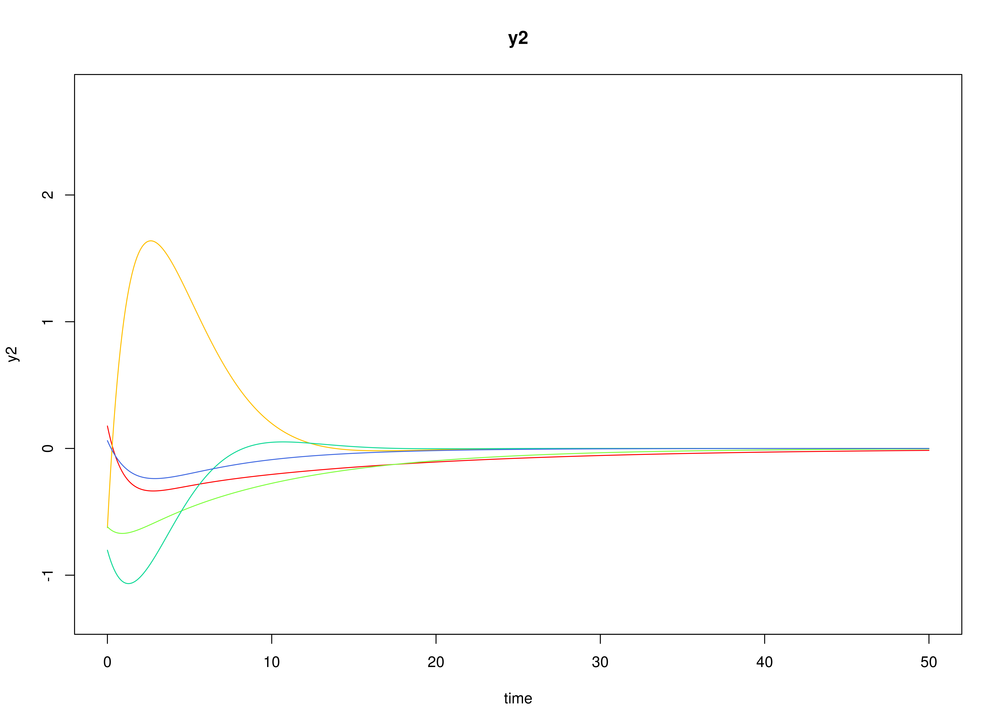
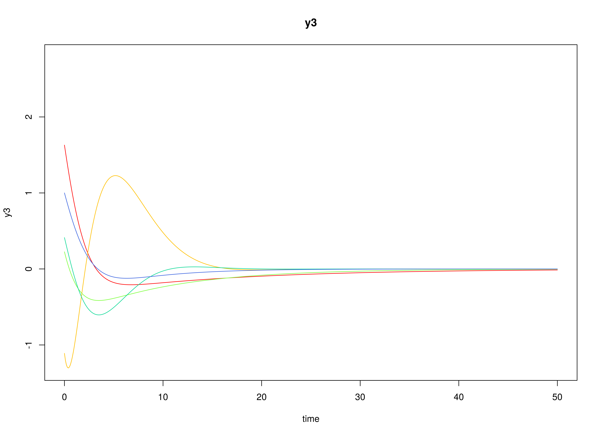

## Model

The measurement model is given by
\begin{equation}
  \mathbf{y}_{i, t}
  =
  \boldsymbol{\nu}
  +
  \boldsymbol{\Lambda}
  \boldsymbol{\eta}_{i, t}
  +
  \boldsymbol{\varepsilon}_{i, t},
  \quad
  \mathrm{with}
  \quad
  \boldsymbol{\varepsilon}_{i, t}
  \sim
  \mathcal{N}
  \left(
  \mathbf{0},
  \boldsymbol{\Theta}
  \right)
\end{equation}
where
$\mathbf{y}_{i, t}$,
$\boldsymbol{\eta}_{i, t}$,
and
$\boldsymbol{\varepsilon}_{i, t}$
are random variables
and
$\boldsymbol{\nu}$,
$\boldsymbol{\Lambda}$,
and
$\boldsymbol{\Theta}$
are model parameters.
$\mathbf{y}_{i, t}$
represents a vector of observed random variables,
$\boldsymbol{\eta}_{i, t}$
a vector of latent random variables,
and
$\boldsymbol{\varepsilon}_{i, t}$
a vector of random measurement errors,
at time $t$ and individual $i$.
$\boldsymbol{\nu}$
denotes a vector of intercepts,
$\boldsymbol{\Lambda}$
a matrix of factor loadings,
and
$\boldsymbol{\Theta}$
the covariance matrix of
$\boldsymbol{\varepsilon}$.

An alternative representation of the measurement error
is given by
\begin{equation}
  \boldsymbol{\varepsilon}_{i, t}
  =
  \boldsymbol{\Theta}^{\frac{1}{2}}
  \mathbf{z}_{i, t},
  \quad
  \mathrm{with}
  \quad
  \mathbf{z}_{i, t}
  \sim
  \mathcal{N}
  \left(
  \mathbf{0},
  \mathbf{I}
  \right)
\end{equation}
where
$\mathbf{z}_{i, t}$ is a vector of
independent standard normal random variables and
$\left( \boldsymbol{\Theta}^{\frac{1}{2}} \right) \left( \boldsymbol{\Theta}^{\frac{1}{2}} \right)^{\prime} = \boldsymbol{\Theta}$ .

The dynamic structure is given by
\begin{equation}
  \mathrm{d} \boldsymbol{\eta}_{i, t}
  =
  \boldsymbol{\Phi}
  \left(
  \boldsymbol{\eta}_{i, t}
  -
  \boldsymbol{\mu}
  \right)
  \mathrm{d}t
  +
  \boldsymbol{\Sigma}^{\frac{1}{2}}
  \mathrm{d}
  \mathbf{W}_{i, t}
\end{equation}
where
$\boldsymbol{\mu}$
is the long-term mean or equilibrium level,
$\boldsymbol{\Phi}$
is the rate of mean reversion,
determining how quickly the variable returns to its mean,
$\boldsymbol{\Sigma}$
is the matrix of volatility
or randomness in the process, and
$\mathrm{d}\boldsymbol{W}$
is a Wiener process or Brownian motion,
which represents random fluctuations.

## Data Generation

### Notation

Let $t = 1000$ be the number of time points and $n = 100$ be the number of individuals.

Let the measurement model intecept vector $\boldsymbol{\nu}$ be given by

\begin{equation}
\boldsymbol{\nu}
=
\left(
\begin{array}{c}
  0 \\
  0 \\
  0 \\
\end{array}
\right) .
\end{equation}

Let the factor loadings matrix $\boldsymbol{\Lambda}$ be given by

\begin{equation}
\boldsymbol{\Lambda}
=
\left(
\begin{array}{ccc}
  1 & 0 & 0 \\
  0 & 1 & 0 \\
  0 & 0 & 1 \\
\end{array}
\right) .
\end{equation}

Let the measurement error covariance matrix $\boldsymbol{\Theta}$ be given by

\begin{equation}
\boldsymbol{\Theta}
=
\left(
\begin{array}{ccc}
  0 & 0 & 0 \\
  0 & 0 & 0 \\
  0 & 0 & 0 \\
\end{array}
\right) .
\end{equation}

Let the initial condition
$\boldsymbol{\eta}_{0}$
be given by

\begin{equation}
\boldsymbol{\eta}_{0} \sim \mathcal{N} \left( \boldsymbol{\mu}_{\boldsymbol{\eta} \mid 0}, \boldsymbol{\Sigma}_{\boldsymbol{\eta} \mid 0} \right)
\end{equation}

\begin{equation}
\boldsymbol{\mu}_{\boldsymbol{\eta} \mid 0}
=
\left(
\begin{array}{c}
  0 \\
  0 \\
  0 \\
\end{array}
\right)
\end{equation}

\begin{equation}
\boldsymbol{\Sigma}_{\boldsymbol{\eta} \mid 0}
=
\left(
\begin{array}{ccc}
  1 & 0 & 0 \\
  0 & 1 & 0 \\
  0 & 0 & 1 \\
\end{array}
\right) .
\end{equation}

Let the long-term mean vector $\boldsymbol{\mu}$ be given by

\begin{equation}
\boldsymbol{\mu}
=
\left(
\begin{array}{c}
  0 \\
  0 \\
  0 \\
\end{array}
\right) .
\end{equation}

Let the drift matrix $\boldsymbol{\Phi}$ be normally distributed with the following means

\begin{equation}
\left(
\begin{array}{ccc}
  -0.357 & 0 & 0 \\
  0.771 & -0.511 & 0 \\
  -0.45 & 0.729 & -0.693 \\
\end{array}
\right)
\end{equation}

and covariance matrix

\begin{equation}
\left(
\begin{array}{ccc}
  0.01 & 0 & 0 & 0 & 0 & 0 & 0 & 0 & 0 \\
  0 & 0.01 & 0 & 0 & 0 & 0 & 0 & 0 & 0 \\
  0 & 0 & 0.01 & 0 & 0 & 0 & 0 & 0 & 0 \\
  0 & 0 & 0 & 0.01 & 0 & 0 & 0 & 0 & 0 \\
  0 & 0 & 0 & 0 & 0.01 & 0 & 0 & 0 & 0 \\
  0 & 0 & 0 & 0 & 0 & 0.01 & 0 & 0 & 0 \\
  0 & 0 & 0 & 0 & 0 & 0 & 0.01 & 0 & 0 \\
  0 & 0 & 0 & 0 & 0 & 0 & 0 & 0.01 & 0 \\
  0 & 0 & 0 & 0 & 0 & 0 & 0 & 0 & 0.01 \\
\end{array}
\right) .
\end{equation}

The SimPhiN function from the simStateSpace package generates random drift matrices from the multivariate normal distribution. Note that the function generates drift matrices that are stable.

Let the dynamic process noise covariance matrix $\boldsymbol{\Sigma}$ be given by

\begin{equation}
\boldsymbol{\Sigma}
=
\left(
\begin{array}{ccc}
  0.1 & 0 & 0 \\
  0 & 0.1 & 0 \\
  0 & 0 & 0.1 \\
\end{array}
\right) .
\end{equation}

Let $\Delta t = 0.1$.

### R Function Arguments


``` r
n
#> [1] 100
time
#> [1] 1000
delta_t
#> [1] 0.1
mu0
#> [[1]]
#> [1] 0 0 0
sigma0
#>      [,1] [,2] [,3]
#> [1,]    1    0    0
#> [2,]    0    1    0
#> [3,]    0    0    1
sigma0_l
#> [[1]]
#>      [,1] [,2] [,3]
#> [1,]    1    0    0
#> [2,]    0    1    0
#> [3,]    0    0    1
mu
#> [[1]]
#> [1] 0 0 0
# first phi in the list of length n
phi[[1]]
#>            [,1]        [,2]        [,3]
#> [1,] -0.4101502  0.02987347  0.09881764
#> [2,]  0.8531253 -0.47051414  0.12907652
#> [3,] -0.2282550  0.66648281 -0.72701868
sigma
#>      [,1] [,2] [,3]
#> [1,]  0.1  0.0  0.0
#> [2,]  0.0  0.1  0.0
#> [3,]  0.0  0.0  0.1
sigma_l
#> [[1]]
#>           [,1]      [,2]      [,3]
#> [1,] 0.3162278 0.0000000 0.0000000
#> [2,] 0.0000000 0.3162278 0.0000000
#> [3,] 0.0000000 0.0000000 0.3162278
nu
#> [[1]]
#> [1] 0 0 0
lambda
#> [[1]]
#>      [,1] [,2] [,3]
#> [1,]    1    0    0
#> [2,]    0    1    0
#> [3,]    0    0    1
theta
#>      [,1] [,2] [,3]
#> [1,]    0    0    0
#> [2,]    0    0    0
#> [3,]    0    0    0
theta_l
#> [[1]]
#>      [,1] [,2] [,3]
#> [1,]    0    0    0
#> [2,]    0    0    0
#> [3,]    0    0    0
```

### Visualizing the Dynamics Without Process Noise (n = 5 with Different Initial Condition)



### Using the `SimSSMOUIVary` Function from the `simStateSpace` Package to Simulate Data


``` r
library(simStateSpace)
sim <- SimSSMOUIVary(
  n = n,
  time = time,
  delta_t = delta_t,
  mu0 = mu0,
  sigma0_l = sigma0_l,
  mu = mu,
  phi = phi,
  sigma_l = sigma_l,
  nu = nu,
  lambda = lambda,
  theta_l = theta_l
)
data <- as.data.frame(sim)
head(data)
#>   id time        y1         y2        y3
#> 1  1  0.0 -1.407144 -0.3703871 -1.005882
#> 2  1  0.1 -1.372881 -0.4764856 -1.058330
#> 3  1  0.2 -1.290353 -0.5443476 -1.018862
#> 4  1  0.3 -1.239194 -0.7836783 -1.072401
#> 5  1  0.4 -1.110661 -0.9018310 -1.060215
#> 6  1  0.5 -1.198872 -0.8450478 -1.084714
plot(sim)
```


## Model Fitting

The `FitCTVARIDMx` function fits a CT-VAR model on each individual $i$.


``` r
library(fitCTVARMx)
fit <- FitCTVARIDMx(
  data = data,
  observed = paste0("y", seq_len(k)),
  id = "id",
  time = "time",
  ncores = parallel::detectCores()
)
fit
#> 
#> Means of the estimated paramaters per individual.
#>       phi_11       phi_21       phi_31       phi_12       phi_22       phi_32 
#> -0.405740018  0.777807791 -0.457255643  0.000949408 -0.549470908  0.724583368 
#>       phi_13       phi_23       phi_33     sigma_11     sigma_22     sigma_33 
#>  0.003763113 -0.013551647 -0.735826877  0.099096944  0.099638843  0.100193412
```

## Multivariate Meta-Analysis

The `MetaVARMx` function performs multivariate meta-analysis using the estimated parameters
and the corresponding sampling variance-covariance matrix for each individual $i$.
Estimates with the prefix `b0` correspond to the estimates of `phi_mu`.
Estimates with the prefix `t2` correspond to the estimates of `phi_sigma`.
Estimates with the prefix `i2` correspond to the estimates of heterogeniety.


``` r
library(metaVAR)
meta <- MetaVARMx(
  object = fit,
  ncores = parallel::detectCores()
)
#> Running Model with 54 parameters
#> 
#> Beginning initial fit attempt
#> Running Model with 54 parameters
#> 
#>  Lowest minimum so far:  -1055.20798364779
#> 
#> Solution found
```



```
#> 
#>  Solution found!  Final fit=-1055.208 (started at 1913.8071)  (1 attempt(s): 1 valid, 0 errors)
#>  Start values from best fit:
#> -0.368215077870551,0.758004619888213,-0.445348547129297,-0.00259548089838012,-0.525237480803691,0.707066573656684,0.00887192873521369,-0.0130470148803766,-0.704786904653878,0.0986629410567898,-0.0224554304610873,-0.0290202795131264,-0.0525041775240815,0.0303275729012615,-0.0221512844834145,-0.0031923102089739,-0.0364127385979409,-0.0227174453766843,0.0977767408029249,0.00810086512903533,-0.00211004939373607,-0.00924759734220302,0.0233493281276896,0.0152974170379625,-0.0442252367487274,0.0115042151708625,0.113081382321301,0.000441122192918318,-0.0217699469230903,-0.0242793648787607,0.0123573929157343,0.00603520617171793,0.0166809301094449,0.0831177823273738,-0.0198598413439216,-0.023369698337819,-0.0193601691242102,-0.00474995924052152,0.033281463746558,0.0697770217052085,0.0227609182036582,0.0040387679547211,0.0466866151045008,-0.00826855839334424,0.0910280068710754,0.00117444581777574,0.00121046370755754,-0.0267976980538823,0.0929536966140059,-0.00491000506278253,-0.0163393761919743,0.0818180909790329,0.00103005086858039,0.0833381562852945
summary(meta)
#>            est     se        z      p    2.5%   97.5%
#> b0_1   -0.3682 0.0156 -23.6533 0.0000 -0.3987 -0.3377
#> b0_2    0.7580 0.0155  49.0156 0.0000  0.7277  0.7883
#> b0_3   -0.4453 0.0165 -26.9155 0.0000 -0.4778 -0.4129
#> b0_4   -0.0026 0.0141  -0.1840 0.8540 -0.0302  0.0251
#> b0_5   -0.5252 0.0131 -39.9888 0.0000 -0.5510 -0.4995
#> b0_6    0.7071 0.0146  48.4911 0.0000  0.6785  0.7356
#> b0_7    0.0089 0.0138   0.6451 0.5188 -0.0181  0.0358
#> b0_8   -0.0130 0.0148  -0.8822 0.3776 -0.0420  0.0159
#> b0_9   -0.7048 0.0142 -49.7441 0.0000 -0.7326 -0.6770
#> t2_1_1  0.0097 0.0033   2.9632 0.0030  0.0033  0.0162
#> t2_2_1 -0.0022 0.0023  -0.9589 0.3376 -0.0067  0.0023
#> t2_3_1 -0.0029 0.0024  -1.1692 0.2423 -0.0077  0.0019
#> t2_4_1 -0.0052 0.0025  -2.0672 0.0387 -0.0101 -0.0003
#> t2_5_1  0.0030 0.0020   1.5169 0.1293 -0.0009  0.0069
#> t2_6_1 -0.0022 0.0021  -1.0177 0.3088 -0.0064  0.0020
#> t2_7_1 -0.0003 0.0021  -0.1516 0.8795 -0.0044  0.0038
#> t2_8_1 -0.0036 0.0022  -1.6016 0.1093 -0.0080  0.0008
#> t2_9_1 -0.0022 0.0021  -1.0793 0.2805 -0.0063  0.0018
#> t2_2_2  0.0101 0.0032   3.1172 0.0018  0.0037  0.0164
#> t2_3_2  0.0014 0.0024   0.5976 0.5501 -0.0033  0.0062
#> t2_4_2  0.0010 0.0021   0.4610 0.6448 -0.0032  0.0051
#> t2_5_2 -0.0016 0.0021  -0.7544 0.4506 -0.0057  0.0025
#> t2_6_2  0.0028 0.0021   1.3067 0.1913 -0.0014  0.0070
#> t2_7_2  0.0016 0.0021   0.7603 0.4471 -0.0025  0.0056
#> t2_8_2 -0.0035 0.0022  -1.5611 0.1185 -0.0079  0.0009
#> t2_9_2  0.0016 0.0021   0.7856 0.4321 -0.0024  0.0057
#> t2_3_3  0.0137 0.0036   3.7621 0.0002  0.0066  0.0208
#> t2_4_3  0.0016 0.0023   0.6883 0.4913 -0.0029  0.0060
#> t2_5_3 -0.0034 0.0021  -1.6343 0.1022 -0.0075  0.0007
#> t2_6_3 -0.0019 0.0024  -0.7907 0.4291 -0.0067  0.0028
#> t2_7_3  0.0016 0.0022   0.7374 0.4609 -0.0027  0.0059
#> t2_8_3  0.0014 0.0024   0.5806 0.5615 -0.0033  0.0060
#> t2_9_3  0.0026 0.0023   1.1478 0.2511 -0.0019  0.0071
#> t2_4_4  0.0097 0.0028   3.4574 0.0005  0.0042  0.0152
#> t2_5_4 -0.0032 0.0018  -1.7584 0.0787 -0.0068  0.0004
#> t2_6_4 -0.0008 0.0020  -0.4204 0.6742 -0.0048  0.0031
#> t2_7_4 -0.0015 0.0020  -0.7396 0.4596 -0.0054  0.0024
#> t2_8_4  0.0016 0.0020   0.7872 0.4311 -0.0024  0.0056
#> t2_9_4  0.0039 0.0020   2.0090 0.0445  0.0001  0.0078
#> t2_5_5  0.0067 0.0023   2.9209 0.0035  0.0022  0.0113
#> t2_6_5  0.0017 0.0018   0.9287 0.3531 -0.0019  0.0053
#> t2_7_5  0.0002 0.0018   0.0908 0.9277 -0.0033  0.0036
#> t2_8_5  0.0025 0.0019   1.3232 0.1858 -0.0012  0.0063
#> t2_9_5 -0.0024 0.0018  -1.3374 0.1811 -0.0059  0.0011
#> t2_6_6  0.0110 0.0029   3.8299 0.0001  0.0054  0.0166
#> t2_7_6  0.0008 0.0020   0.3942 0.6934 -0.0031  0.0047
#> t2_8_6  0.0009 0.0021   0.4275 0.6690 -0.0033  0.0051
#> t2_9_6 -0.0030 0.0022  -1.3814 0.1672 -0.0073  0.0013
#> t2_7_7  0.0094 0.0025   3.7407 0.0002  0.0045  0.0144
#> t2_8_7 -0.0007 0.0020  -0.3373 0.7359 -0.0045  0.0032
#> t2_9_7 -0.0018 0.0019  -0.9526 0.3408 -0.0054  0.0019
#> t2_8_8  0.0122 0.0030   4.0625 0.0000  0.0063  0.0181
#> t2_9_8  0.0000 0.0020   0.0035 0.9972 -0.0040  0.0040
#> t2_9_9  0.0100 0.0027   3.6756 0.0002  0.0047  0.0154
#> i2_1    0.4209 0.0822   5.1185 0.0000  0.2597  0.5821
#> i2_2    0.4332 0.0787   5.5010 0.0000  0.2788  0.5875
#> i2_3    0.5104 0.0664   7.6859 0.0000  0.3802  0.6405
#> i2_4    0.4993 0.0723   6.9050 0.0000  0.3576  0.6410
#> i2_5    0.4071 0.0826   4.9278 0.0000  0.2452  0.5691
#> i2_6    0.5306 0.0650   8.1602 0.0000  0.4031  0.6580
#> i2_7    0.5175 0.0667   7.7549 0.0000  0.3867  0.6483
#> i2_8    0.5803 0.0599   9.6805 0.0000  0.4628  0.6977
#> i2_9    0.5272 0.0678   7.7754 0.0000  0.3943  0.6601
```

## References


