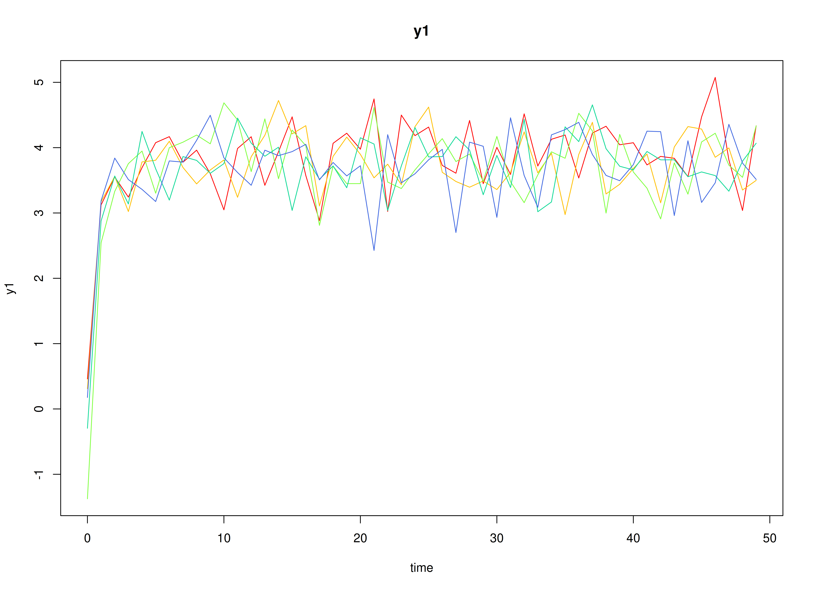
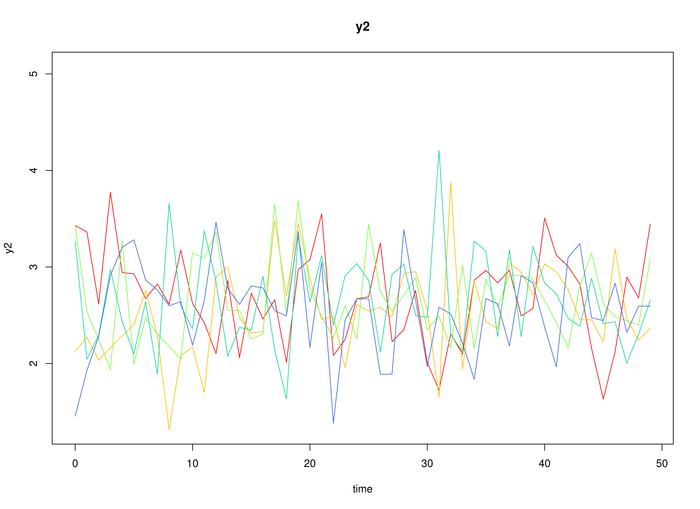

## Model

The measurement model is given by
\begin{equation}
  \mathbf{y}_{i, t}
  =
  \boldsymbol{\Lambda}
  \boldsymbol{\eta}_{i, t}
  +
  \boldsymbol{\varepsilon}_{i, t},
  \quad
  \mathrm{with}
  \quad
  \boldsymbol{\varepsilon}_{i, t}
  \sim
  \mathcal{N}
  \left(
  \mathbf{0},
  \boldsymbol{\Theta}
  \right)
\end{equation}
where
$\mathbf{y}_{i, t}$,
$\boldsymbol{\eta}_{i, t}$,
and
$\boldsymbol{\varepsilon}_{i, t}$
are random variables
and
$\boldsymbol{\Lambda}$,
and
$\boldsymbol{\Theta}$
are model parameters.
$\mathbf{y}_{i, t}$
represents a vector of observed random variables,
$\boldsymbol{\eta}_{i, t}$
a vector of latent random variables,
and
$\boldsymbol{\varepsilon}_{i, t}$
a vector of random measurement errors,
at time $t$ and individual $i$.
$\boldsymbol{\Lambda}$
denotes a matrix of factor loadings,
and
$\boldsymbol{\Theta}$
the covariance matrix of
$\boldsymbol{\varepsilon}$.
In this model,
$\boldsymbol{\Lambda}$ is an identity matrix and
$\boldsymbol{\Theta}$ is a diagonal matrix.

The dynamic structure is given by
\begin{equation}
  \boldsymbol{\eta}_{i, t}
  =
  \boldsymbol{\alpha}
  +
  \boldsymbol{\beta}
  \boldsymbol{\eta}_{i, t - 1}
  +
  \boldsymbol{\zeta}_{i, t},
  \quad
  \mathrm{with}
  \quad
  \boldsymbol{\zeta}_{i, t}
  \sim
  \mathcal{N}
  \left(
  \mathbf{0},
  \boldsymbol{\Psi}
  \right)
\end{equation}
where
$\boldsymbol{\eta}_{i, t}$,
$\boldsymbol{\eta}_{i, t - 1}$,
and
$\boldsymbol{\zeta}_{i, t}$
are random variables,
and
$\boldsymbol{\alpha}$,
$\boldsymbol{\beta}$,
and
$\boldsymbol{\Psi}$
are model parameters.
Here,
$\boldsymbol{\eta}_{i, t}$
is a vector of latent variables
at time $t$ and individual $i$,
$\boldsymbol{\eta}_{i, t - 1}$
represents a vector of latent variables
at time $t - 1$ and individual $i$,
and
$\boldsymbol{\zeta}_{i, t}$
represents a vector of dynamic noise
at time $t$ and individual $i$.
$\boldsymbol{\alpha}$
denotes a vector of intercepts,
$\boldsymbol{\beta}$
a matrix of autoregression
and cross regression coefficients,
and
$\boldsymbol{\Psi}$
the covariance matrix of
$\boldsymbol{\zeta}_{i, t}$.
In this model,
$\boldsymbol{\Psi}$ is a symmetric matrix.

## Data Generation

The parameters used in this example were based on @Bringmann-Vissers-Wichers-etal-2013.

### Notation

Let $t = 1000$ be the number of time points and $n = 100$ be the number of individuals.

Let the measurement model intecept vector $\boldsymbol{\nu}$ be given by

\begin{equation}
\boldsymbol{\nu}
=
\left(
\begin{array}{c}
  0 \\
  0 \\
\end{array}
\right) .
\end{equation}

Let the factor loadings matrix $\boldsymbol{\Lambda}$ be given by

\begin{equation}
\boldsymbol{\Lambda}
=
\left(
\begin{array}{cc}
  1 & 0 \\
  0 & 1 \\
\end{array}
\right) .
\end{equation}

Let the measurement error covariance matrix $\boldsymbol{\Theta}$ be given by

\begin{equation}
\boldsymbol{\Theta}
=
\left(
\begin{array}{cc}
  0.2 & 0 \\
  0 & 0.2 \\
\end{array}
\right) .
\end{equation}

Let the initial condition
$\boldsymbol{\eta}_{0}$
be given by

\begin{equation}
\boldsymbol{\eta}_{0} \sim \mathcal{N} \left( \boldsymbol{\mu}_{\boldsymbol{\eta} \mid 0}, \boldsymbol{\Sigma}_{\boldsymbol{\eta} \mid 0} \right)
\end{equation}

\begin{equation}
\boldsymbol{\mu}_{\boldsymbol{\eta} \mid 0}
=
\left(
\begin{array}{c}
  3.8143546 \\
  2.5763481 \\
\end{array}
\right)
\end{equation}

\begin{equation}
\boldsymbol{\Sigma}_{\boldsymbol{\eta} \mid 0}
=
\left(
\begin{array}{cc}
  1.3978842 & 0.5782369 \\
  0.5782369 & 1.6636513 \\
\end{array}
\right) .
\end{equation}

Let the transition matrix $\boldsymbol{\beta}$ be given by

\begin{equation}
\left(
\begin{array}{cc}
  0.28 & -0.048 \\
  -0.035 & 0.26 \\
\end{array}
\right) .
\end{equation}

Let the dynamic process noise $\boldsymbol{\Psi}$ be given by

\begin{equation}
\boldsymbol{\Psi}
=
\left(
\begin{array}{cc}
  1.3 & 0.5696315 \\
  0.5696315 & 1.56 \\
\end{array}
\right) .
\end{equation}


### R Function Arguments


``` r
n
#> [1] 100
time
#> [1] 1000
mu0
#> [1] 3.814355 2.576348
sigma0
#>           [,1]      [,2]
#> [1,] 1.3978842 0.5782369
#> [2,] 0.5782369 1.6636513
sigma0_l
#>           [,1]     [,2]
#> [1,] 1.1823215 0.000000
#> [2,] 0.4890691 1.193509
alpha
#> [1] 2.87 2.04
beta
#>        [,1]   [,2]
#> [1,]  0.280 -0.048
#> [2,] -0.035  0.260
psi
#>           [,1]      [,2]
#> [1,] 1.3000000 0.5696315
#> [2,] 0.5696315 1.5600000
psi_l
#>           [,1]     [,2]
#> [1,] 1.1401754 0.000000
#> [2,] 0.4995998 1.144727
nu
#> [1] 0 0
lambda
#>      [,1] [,2]
#> [1,]    1    0
#> [2,]    0    1
theta
#>      [,1] [,2]
#> [1,]  0.2  0.0
#> [2,]  0.0  0.2
```

### Visualizing the Dynamics Without Process Noise (n = 5 with Different Initial Condition)



### Using the `SimSSMFixed` Function from the `simStateSpace` Package to Simulate Data


``` r
library(simStateSpace)
sim <- SimSSMFixed(
  n = n,
  time = time,
  mu0 = mu0,
  sigma0_l = sigma0_l,
  alpha = alpha,
  beta = beta,
  psi_l = psi_l,
  nu = nu,
  lambda = lambda,
  theta_l = theta_l
)
data <- as.data.frame(sim)
head(data)
#>   id time       y1        y2
#> 1  1    0 3.455114 1.9223092
#> 2  1    1 5.696312 0.6452660
#> 3  1    2 4.364664 1.4954592
#> 4  1    3 4.900281 2.6730811
#> 5  1    4 2.325515 0.2139305
#> 6  1    5 3.340405 1.9930331
plot(sim)
```


## Model Fitting

The `DTVAR` function fits a DT-VAR model on each individual $i$ using the `byid = TRUE` argument.
The model type is specified using the `model` argument.


``` r
library(fitDTVARMx)
fit <- DTVAR(
  data = data,
  observed = paste0("y", seq_len(k)),
  id = "id",
  model = 5,
  byid = TRUE,
  ncores = parallel::detectCores()
)
fit
#>  paramaters per individual.
#>            beta_11       beta_21      beta_12     beta_22    alpha_1
#>   [1,]  0.18641828 -0.1246388839  0.040285464  0.51086585   2.979992
#>   [2,]  0.18702067 -0.0383608848  0.011939822  0.32995981   3.060792
#>   [3,]  0.24332540 -0.0573344753 -0.027830727  0.25935642   2.971805
#>   [4,] -0.49553997  0.0909311177  0.248295878  0.22546670   5.120778
#>   [5,]  0.26751549 -0.0358849469 -0.039690765  0.26905723   2.849800
#>   [6,]  0.21588472 -0.0394028527 -0.072052227  0.21953263   3.250841
#>   [7,] -0.40291399  0.0861757258  0.244810008  0.24436564   4.777029
#>   [8,] -6.22119629 17.3731365552 -2.213303253  6.16473941  33.163168
#>   [9,]  0.36983483 -0.0399822551 -0.076578713  0.22492597   2.603363
#>  [10,]  0.20214901 -0.1089063969 -0.015732558  0.36780158   3.093402
#>  [11,]  0.22082369  0.0167131726  0.012935916  0.25423927   2.997717
#>  [12,]  0.28387821 -0.0785250959 -0.143754947  0.41307014   3.053287
#>  [13,]  0.26285927  0.2724939702  0.151838307 -0.38510877   2.465242
#>  [14,]  0.22470396 -0.0511568307 -0.022872409  0.30799159   3.034742
#>  [15,]  0.24923881  0.2973134710  0.040276365 -0.40413743   2.765974
#>  [16,]  0.22497497 -0.0451621440 -0.028261361  0.27428941   2.986907
#>  [17,]  0.20569452  0.0151335521 -0.027790255  0.19753876   3.096065
#>  [18,]  0.22296535 -0.0360406327 -0.016378426  0.22244096   2.997756
#>  [19,] -0.52150974  0.1236031974  0.207275328  0.23087091   5.350660
#>  [20,] -0.22950532  0.2316364526  0.278801535  0.20709972   3.935291
#>  [21,] -0.54153459  0.1035150514  0.288248948  0.22305976   5.195919
#>  [22,] -0.48894120 -0.0069389398  0.236268781  0.26274276   5.054882
#>  [23,]  0.28605110  0.3416158805 -0.091792104 -0.53293874   2.998255
#>  [24,]  0.19786927  0.2615988750  0.069868588 -0.52669559   2.919464
#>  [25,]  0.34656782  0.0610932361 -0.062726688  0.23457696   2.631640
#>  [26,]  0.40267837 -0.0404158392 -0.065212376  0.29555194   2.435190
#>  [27,] -0.36315571  0.1630889850  0.295468794  0.25837293   4.497802
#>  [28,]  0.34621720  0.0382765001 -0.075104607  0.25161034   2.707811
#>  [29,]  0.32261488  0.0541076607 -0.034258759  0.28400654   2.615787
#>  [30,] -0.45317874 -0.0904313687  0.241481160  0.30018160   4.988961
#>  [31,]  0.30533309 -0.0886497611 -0.011950540  0.36158267   2.623436
#>  [32,]  0.23144507 -0.0319756061 -0.065369787  0.25973921   3.119297
#>  [33,]  0.22721693 -0.0782111359 -0.001191344  0.41125222   2.895690
#>  [34,]  0.20246323 -0.0533348026 -0.041335910  0.26682898   3.073160
#>  [35,] -0.42006748  0.1516409817  0.272474310  0.16631181   4.768648
#>  [36,]  0.24975849 -0.0170419385 -0.027439744  0.19652446   2.880629
#>  [37,]  0.36794581 -0.0708770715 -0.111255602  0.22458464   2.615815
#>  [38,]  0.29885904  0.2803712983 -0.122041672 -0.59478764   3.007830
#>  [39,] -0.28323532  0.1752537051  0.233018619  0.21246230   4.245317
#>  [40,]  0.21731260 -0.0539107549  0.004580096  0.23943296   2.913902
#>  [41,]  0.25218978 -0.0049605029 -0.049483959  0.24891786   3.065359
#>  [42,] -0.45621780 -0.0894694385  0.258222586  0.29467386   4.890402
#>  [43,]  0.21707593  0.2715845677  0.253652137 -0.33047675   2.326942
#>  [44,]  0.26841796  0.2394601584  0.015690023 -0.51027964   2.712916
#>  [45,]  0.26091322 -0.0004818307 -0.073999228  0.14948141   2.994382
#>  [46,]  0.23558055 -0.0690765235 -0.051612642  0.25984720   3.072072
#>  [47,]  0.22821650  0.3512218005  0.137145896 -0.29348965   2.629399
#>  [48,]  0.41209327 -0.0274444238 -0.222955209  0.28937934   2.847916
#>  [49,] -0.57731221 -0.0752757270  0.212949545  0.28498058   5.297543
#>  [50,] -0.46886921 -0.1125511886  0.196857555  0.26822568   5.132144
#>  [51,] -0.20692236  0.4027688589  0.330052952  0.24862242   3.716022
#>  [52,]  0.31657563  0.2640219705  0.069834123 -0.36720131   2.456541
#>  [53,]  0.27159215  0.3730621119  0.054852405 -0.37056318   2.650756
#>  [54,] -0.57429201 -0.0747438482  0.246331950  0.29346471   5.328256
#>  [55,] -0.23569404  0.3135286246  0.289893415  0.26225922   3.979966
#>  [56,]  0.23186029 -0.0618152780 -0.015595587  0.30177660   3.013343
#>  [57,]  0.11356496  0.2026101368  0.269441947 -0.46157458   2.723082
#>  [58,]  0.25768786 -0.0284612170 -0.049568104  0.18686507   2.917902
#>  [59,]  0.21769248 -0.0247854449  0.089901082  0.29565511   2.715356
#>  [60,]  0.29156822 -0.0886704913 -0.082393890  0.36185081   2.900992
#>  [61,]  0.36109905 -0.0076655004 -0.081532338  0.17124817   2.706843
#>  [62,]  0.30151357  0.4559834760  0.235447795 -0.27817437   2.035392
#>  [63,]  0.22717337 -0.0663704037 -0.063432914  0.46403115   3.110645
#>  [64,]  0.19503459  0.3523069254  0.206032265 -0.28721164   2.551564
#>  [65,]  0.28562287  0.4279941311  0.211322123 -0.35365641   2.264337
#>  [66,]  0.09468113  0.3446554680  0.458266080 -0.12678892   2.214063
#>  [67,]  0.26460893  0.2691042221  0.151113995 -0.33642903   2.397502
#>  [68,]  0.24807723 -0.0455046057 -0.024178368  0.23132390   2.911745
#>  [69,]  0.46898720 -0.0176559298 -0.153023868  0.37501597   2.399719
#>  [70,]  0.24713656 -0.0075505359 -0.041404179  0.20133746   3.023575
#>  [71,]  0.26565687 -0.0057591895 -0.062619834  0.18285779   2.936687
#>  [72,]  0.25599763 -0.0223524455 -0.028525062  0.33634203   2.927188
#>  [73,]  3.00382388 12.2133169461 -0.682782438 -2.76859585  -5.975772
#>  [74,]  0.36877587 -0.1023925393 -0.071365119  0.37025117   2.607475
#>  [75,]  0.28232777  0.0456008129 -0.069649137  0.17526272   2.944940
#>  [76,]  0.24165513 -0.0500527402 -0.052947651  0.24764505   3.074867
#>  [77,]  0.24308996 -0.0827748727 -0.040396299  0.30730023   3.041809
#>  [78,]  0.26173344  0.3110157188 -0.085564177 -0.53870396   3.008291
#>  [79,] -0.27162300  0.1122965297  0.307727253  0.27023441   4.089307
#>  [80,]  0.26663651  0.3247055190  0.008547672 -0.56290489   2.785782
#>  [81,]  0.25810621 -0.0591238356 -0.083337426  0.21377377   3.029800
#>  [82,]  0.30852393 -0.1031812036 -0.101628209  0.22988221   2.941970
#>  [83,]  0.30593382 -0.0004904000 -0.105373330  0.23110360   2.853444
#>  [84,]  0.22087532 -0.0063052225 -0.001769489  0.23894492   2.999558
#>  [85,]  0.23938166 -0.0101381184  0.004999113  0.26493328   2.911712
#>  [86,]  0.26252365 -0.0543761848 -0.010218673  0.32967478   2.821183
#>  [87,]  0.22365159 -0.0468903182 -0.018674623  0.23172889   3.045983
#>  [88,]  0.31162564 -0.0496342309 -0.035736088  0.22385461   2.713325
#>  [89,] -0.32944852  0.1336929903  0.343005058  0.25726577   4.303670
#>  [90,]  0.21813289 -0.0248689824 -0.067885768  0.20956513   3.124206
#>  [91,]  0.25419097  0.3517914117  0.202816773 -0.34741390   2.330164
#>  [92,]  0.30004664 -0.0529557451 -0.043386192  0.23741690   2.790575
#>  [93,]  6.98749487 -3.6889279619 13.348278610 -7.04408664 -55.776876
#>  [94,]  0.19025696  0.2948858295  0.202914855 -0.42667377   2.613325
#>  [95,]  0.43817824  0.0546869344 -0.089207067  0.22491515   2.365037
#>  [96,]  0.19397156  0.3628708806  0.330679144 -0.08362985   2.185927
#>  [97,]  0.30342899  0.2573014215 -0.095016934 -0.57628519   2.901062
#>  [98,]  0.20293818  0.0075202439 -0.042052933  0.19976216   3.090847
#>  [99,]  0.33269305 -0.0938309646 -0.059518248  0.39652758   2.685613
#> [100,]  0.21066091 -0.0687494352 -0.004561809  0.38293529   3.035989
#>            alpha_2        psi_11      psi_21        psi_22      theta_11
#>   [1,]   1.7406370  1.479979e+00  0.49246751  7.435394e-01 2.225074e-308
#>   [2,]   1.9257901  1.456173e+00  0.49305821  1.530596e+00  1.685267e-17
#>   [3,]   2.0936626  1.430603e+00  0.55912635  1.743999e+00  3.920727e-02
#>   [4,]   1.6389143 2.225074e-308  0.56700552  1.625276e+00  1.672212e+00
#>   [5,]   1.9406480  1.510292e+00  0.59070683  1.795636e+00 2.225074e-308
#>   [6,]   2.2270869  1.527036e+00  0.61551049  1.703250e+00  1.626512e-17
#>   [7,]   1.5728194 2.225074e-308  0.54693283  1.254063e+00  1.483779e+00
#>   [8,] -79.3822141  2.370814e-13 -0.02543115  1.040395e-01  1.775263e+00
#>   [9,]   2.2798797  1.023793e+00  0.61263870  1.801870e+00  5.449386e-01
#>  [10,]   2.0665888  1.452688e+00  0.59151533  1.109688e+00 2.225074e-308
#>  [11,]   1.8886376  1.490100e+00  0.48613376  1.635838e+00 2.225074e-308
#>  [12,]   1.8036309  1.493663e+00  0.62482194  9.422039e-01 2.225074e-308
#>  [13,]   2.5340473  1.044174e+00  0.55632613  1.186256e-16  4.524768e-01
#>  [14,]   2.0224917  1.660157e+00  0.59554075  1.264059e+00 2.225074e-308
#>  [15,]   2.5237099  1.254317e+00  0.54421449  9.293712e-16  2.559647e-01
#>  [16,]   1.9822617  1.456335e+00  0.53926524  1.716375e+00  2.740155e-17
#>  [17,]   1.9871117  1.502168e+00  0.58252900  1.878113e+00 2.225074e-308
#>  [18,]   2.1698002  1.533402e+00  0.65394072  1.796925e+00 2.225074e-308
#>  [19,]   1.4924847 2.225074e-308  0.62240631  1.843934e+00  1.778230e+00
#>  [20,]   1.2303483  6.687317e-19  0.49394731  8.577692e-01  1.529522e+00
#>  [21,]   1.5572671 2.225074e-308  0.53064416  1.627529e+00  1.716171e+00
#>  [22,]   1.8993466  4.613462e-15  0.62462897  1.865201e+00  1.592087e+00
#>  [23,]   2.4906567  1.626455e+00  0.70913283  1.135378e-15  6.664541e-16
#>  [24,]   2.8603277  1.524258e+00  0.56733394 2.225074e-308  3.268528e-02
#>  [25,]   1.7507158  1.305627e+00  0.55278985  1.731550e+00  2.187616e-01
#>  [26,]   1.9892309  9.216965e-01  0.54926409  1.380743e+00  5.526066e-01
#>  [27,]   1.3150025 2.225074e-308  0.53154064  8.877930e-01  1.547136e+00
#>  [28,]   1.7097205  1.244459e+00  0.46573462  1.318963e+00  2.020090e-01
#>  [29,]   1.5958774  1.060302e+00  0.50473725  1.703151e+00  3.802388e-01
#>  [30,]   2.1974765  6.026782e-16  0.54703775  1.334362e+00  1.501943e+00
#>  [31,]   1.9667363  1.046401e+00  0.53626308  1.444013e+00  3.593344e-01
#>  [32,]   2.0137253  1.472440e+00  0.56838020  1.381252e+00 2.225074e-308
#>  [33,]   1.7902513  1.436022e+00  0.57049068  9.825176e-01 2.225074e-308
#>  [34,]   2.0321476  1.259453e+00  0.66748208  1.522460e+00  2.287661e-01
#>  [35,]   1.6370676  3.749402e-14  0.55119669  1.308625e+00  1.733230e+00
#>  [36,]   2.1777931  1.579260e+00  0.47163120  1.465222e+00 2.225074e-308
#>  [37,]   2.2518218  9.154314e-01  0.55349004  1.598157e+00  5.644835e-01
#>  [38,]   3.2104735  1.589373e+00  0.55771180 2.225074e-308  2.536475e-15
#>  [39,]   1.3365517 2.225074e-308  0.53932992  1.238154e+00  1.630060e+00
#>  [40,]   2.1172070  1.481550e+00  0.58407114  1.836911e+00  4.756247e-02
#>  [41,]   1.9256941  1.529247e+00  0.58756896  1.717046e+00 2.225074e-308
#>  [42,]   2.2260420  3.886311e-14  0.67845181  1.474667e+00  1.618984e+00
#>  [43,]   2.3579171  1.051697e+00  0.53300625 2.225074e-308  4.792820e-01
#>  [44,]   3.0505796  1.462814e+00  0.58975117  7.706248e-16  8.547957e-17
#>  [45,]   2.2129437  1.392713e+00  0.50009117  1.729828e+00  4.562345e-17
#>  [46,]   2.1283114  1.517267e+00  0.51651599  1.747579e+00 2.225074e-308
#>  [47,]   1.9564423  8.665672e-01  0.58555491  6.803802e-14  5.930242e-01
#>  [48,]   1.9487070  8.950519e-01  0.56236929  1.194029e+00  4.813546e-01
#>  [49,]   2.1463283 2.225074e-308  0.58792363  1.799600e+00  1.654173e+00
#>  [50,]   2.2731456 2.225074e-308  0.61125757  1.743349e+00  1.525526e+00
#>  [51,]   0.4449431  1.934664e-17  0.50192254  8.266537e-01  1.503798e+00
#>  [52,]   2.5339304  8.932826e-01  0.58252123  1.853671e-14  6.536289e-01
#>  [53,]   2.1232361  1.019255e+00  0.63664061 2.225074e-308  5.016283e-01
#>  [54,]   2.0419860  1.121474e-17  0.57353713  1.915916e+00  1.640063e+00
#>  [55,]   0.7863782  1.716270e-12  0.56949998  8.573211e-01  1.639482e+00
#>  [56,]   2.0010307  1.480880e+00  0.54703874  1.513986e+00  1.265175e-17
#>  [57,]   2.8698605  1.550925e+00  0.51364151 2.225074e-308 2.225074e-308
#>  [58,]   2.1727155  1.499392e+00  0.56032193  1.729036e+00 2.225074e-308
#>  [59,]   1.8788889  1.482592e+00  0.51545633  1.219947e+00  8.103334e-17
#>  [60,]   1.9952320  1.230754e+00  0.64952519  1.084757e+00  2.657081e-01
#>  [61,]   2.2172124  1.160292e+00  0.51773029  1.758793e+00  3.282142e-01
#>  [62,]   1.5918735  6.637802e-01  0.54627714 2.225074e-308  7.231003e-01
#>  [63,]   1.6330077  1.493978e+00  0.55176571  7.840033e-01  5.262391e-19
#>  [64,]   2.0245171  7.038584e-01  0.47077056  3.284366e-17  6.773235e-01
#>  [65,]   1.8152197  8.286814e-01  0.57048298 2.225074e-308  7.553954e-01
#>  [66,]   1.6601807  6.957634e-01  0.48273932 2.225074e-308  9.403898e-01
#>  [67,]   2.4979327  1.329900e+00  0.66306343  6.406658e-17  2.195444e-01
#>  [68,]   2.1511024  1.472512e+00  0.65673751  1.835137e+00  1.260244e-17
#>  [69,]   1.6865340  8.490054e-01  0.54594924  1.099736e+00  6.009059e-01
#>  [70,]   2.1016578  1.449506e+00  0.56696480  1.681239e+00 2.225074e-308
#>  [71,]   2.1543545  1.310330e+00  0.62554197  1.790335e+00  2.388178e-01
#>  [72,]   1.8290960  1.582338e+00  0.66764535  9.610666e-01  8.985238e-18
#>  [73,] -37.3978540  1.763456e-01  0.75346957  3.060190e+00  1.455615e+00
#>  [74,]   2.0179808  1.099285e+00  0.53269978  1.216498e+00  4.135981e-01
#>  [75,]   1.9132784  1.358705e+00  0.58301359  1.748754e+00  6.830619e-02
#>  [76,]   2.1768897  1.511754e+00  0.53369043  1.805139e+00 2.225074e-308
#>  [77,]   2.1539735  1.560857e+00  0.57834264  1.496029e+00 2.225074e-308
#>  [78,]   2.8283983  1.513730e+00  0.68500360 2.225074e-308  7.063859e-02
#>  [79,]   1.4161164 2.225074e-308  0.67313831  1.040341e+00  1.594068e+00
#>  [80,]   2.7624201  1.528378e+00  0.54570966 2.225074e-308  9.935922e-14
#>  [81,]   2.3601509  1.360200e+00  0.50789214  1.561079e+00  1.544429e-01
#>  [82,]   2.4430722  1.025879e+00  0.58720613  1.818344e+00  5.134543e-01
#>  [83,]   2.0219157  1.184982e+00  0.60183774  1.467090e+00  2.118293e-01
#>  [84,]   1.9472112  1.427399e+00  0.53675932  1.381664e+00  1.521016e-18
#>  [85,]   1.9419517  1.595501e+00  0.61518465  1.741506e+00 2.225074e-308
#>  [86,]   1.9770277  1.529385e+00  0.58650582  1.470216e+00  1.069200e-17
#>  [87,]   2.1051940  1.491163e+00  0.55092150  1.730088e+00 2.225074e-308
#>  [88,]   2.1617008  1.229108e+00  0.59123079  1.823012e+00  3.184525e-01
#>  [89,]   1.4668070  2.265146e-15  0.59118358  9.765164e-01  1.612921e+00
#>  [90,]   2.1394204  1.561472e+00  0.65044953  1.848507e+00  3.115577e-17
#>  [91,]   2.1364402  8.870499e-01  0.53962036 2.225074e-308  6.415524e-01
#>  [92,]   2.1532400  1.254943e+00  0.58062546  1.485008e+00  2.791385e-01
#>  [93,]  33.9154636  5.713896e-02 -0.02242219  4.850942e-18  3.029789e+00
#>  [94,]   2.5508065  1.365681e+00  0.56625119  1.631704e-16  2.012445e-01
#>  [95,]   1.7595609  7.997424e-01  0.54911977  1.874677e+00  5.577631e-01
#>  [96,]   1.3377557  1.077059e-01  0.56712808  3.991208e-17  1.459661e+00
#>  [97,]   2.9355433  1.377159e+00  0.50745735 2.225074e-308  6.275543e-02
#>  [98,]   2.0591535  1.462002e+00  0.58247158  1.797399e+00  7.580131e-17
#>  [99,]   1.9196130  1.268288e+00  0.64282019  1.115769e+00  3.110510e-01
#> [100,]   1.8735652  1.474221e+00  0.59099422  1.133843e+00  7.208510e-19
#>             theta_22
#>   [1,]  8.362179e-01
#>   [2,]  1.875229e-01
#>   [3,]  1.355608e-02
#>   [4,]  7.324542e-02
#>   [5,]  4.810951e-17
#>   [6,]  2.437736e-17
#>   [7,]  4.624693e-01
#>   [8,]  3.194841e+00
#>   [9,] 2.225074e-308
#>  [10,]  4.461197e-01
#>  [11,] 2.225074e-308
#>  [12,]  8.229454e-01
#>  [13,]  1.860607e+00
#>  [14,]  3.536035e-01
#>  [15,]  1.682860e+00
#>  [16,]  1.047854e-17
#>  [17,] 2.225074e-308
#>  [18,] 2.225074e-308
#>  [19,] 2.225074e-308
#>  [20,]  7.541814e-01
#>  [21,] 2.225074e-308
#>  [22,]  2.628102e-14
#>  [23,]  2.005893e+00
#>  [24,]  1.951583e+00
#>  [25,] 2.225074e-308
#>  [26,]  3.867576e-01
#>  [27,]  7.568617e-01
#>  [28,]  4.647108e-01
#>  [29,] 2.225074e-308
#>  [30,]  5.684846e-01
#>  [31,]  3.442528e-01
#>  [32,]  4.006996e-01
#>  [33,]  6.143501e-01
#>  [34,]  2.523851e-01
#>  [35,]  3.759570e-01
#>  [36,]  1.693741e-01
#>  [37,]  2.006823e-01
#>  [38,]  1.978288e+00
#>  [39,]  4.337382e-01
#>  [40,] 2.225074e-308
#>  [41,] 2.225074e-308
#>  [42,]  3.820960e-01
#>  [43,]  1.746081e+00
#>  [44,]  1.871895e+00
#>  [45,] 2.225074e-308
#>  [46,] 2.225074e-308
#>  [47,]  1.821993e+00
#>  [48,]  4.785786e-01
#>  [49,]  1.674433e-16
#>  [50,] 2.225074e-308
#>  [51,]  9.448747e-01
#>  [52,]  1.856008e+00
#>  [53,]  1.850737e+00
#>  [54,] 2.225074e-308
#>  [55,]  8.735048e-01
#>  [56,]  1.893571e-01
#>  [57,]  1.830133e+00
#>  [58,]  2.937407e-17
#>  [59,]  5.461761e-01
#>  [60,]  6.002325e-01
#>  [61,]  1.808658e-17
#>  [62,]  1.811663e+00
#>  [63,]  9.048722e-01
#>  [64,]  1.772046e+00
#>  [65,]  1.963017e+00
#>  [66,]  1.734354e+00
#>  [67,]  1.864199e+00
#>  [68,]  2.806990e-02
#>  [69,]  5.839042e-01
#>  [70,]  8.808039e-02
#>  [71,] 2.225074e-308
#>  [72,]  6.825035e-01
#>  [73,]  1.578060e-18
#>  [74,]  4.616164e-01
#>  [75,]  7.550001e-02
#>  [76,] 2.225074e-308
#>  [77,]  3.698724e-01
#>  [78,]  1.936786e+00
#>  [79,]  7.854645e-01
#>  [80,]  1.933524e+00
#>  [81,]  1.257991e-01
#>  [82,]  1.034420e-16
#>  [83,]  3.153942e-01
#>  [84,]  3.156774e-01
#>  [85,] 2.225074e-308
#>  [86,]  2.656067e-01
#>  [87,]  1.394573e-02
#>  [88,]  3.414885e-17
#>  [89,]  8.297680e-01
#>  [90,] 2.225074e-308
#>  [91,]  1.775797e+00
#>  [92,]  1.858881e-01
#>  [93,]  2.381740e+00
#>  [94,]  1.928155e+00
#>  [95,] 2.225074e-308
#>  [96,]  1.818866e+00
#>  [97,]  1.823439e+00
#>  [98,]  4.693238e-17
#>  [99,]  5.225798e-01
#> [100,]  5.428382e-01
```

## Multivariate Meta-Analysis

The `MetaVARMx` function performs multivariate meta-analysis using the estimated parameters
and the corresponding sampling variance-covariance matrix for each individual $i$.
Estimates with the prefix `b0` correspond to the estimates of `beta` and `alpha`.


``` r
library(metaVAR)
meta <- MetaVARMx(
  object = fit,
  random = FALSE,
  intercept = TRUE,
  ncores = parallel::detectCores()
)
#> Running Model with 6 parameters
#> 
#> Beginning initial fit attempt
#> Running Model with 6 parameters
#> 
#>  Lowest minimum so far:  1087.35421285757
#> 
#> Solution found
```



```
#> 
#>  Solution found!  Final fit=1087.3542 (started at 1211413.4)  (1 attempt(s): 1 valid, 0 errors)
#>  Start values from best fit:
#> 0.180911225824393,0.0177051424455964,-0.0019626242356115,0.17347210370997,3.13096048258537,2.06883175823639
summary(meta)
#>          est     se        z      p    2.5%  97.5%
#> b0_1  0.1809 0.0057  31.5130 0.0000  0.1697 0.1922
#> b0_2  0.0177 0.0038   4.6376 0.0000  0.0102 0.0252
#> b0_3 -0.0020 0.0024  -0.8296 0.4068 -0.0066 0.0027
#> b0_4  0.1735 0.0054  31.9559 0.0000  0.1628 0.1841
#> b0_5  3.1310 0.0203 154.5626 0.0000  3.0913 3.1707
#> b0_6  2.0688 0.0184 112.3111 0.0000  2.0327 2.1049
```

## References


