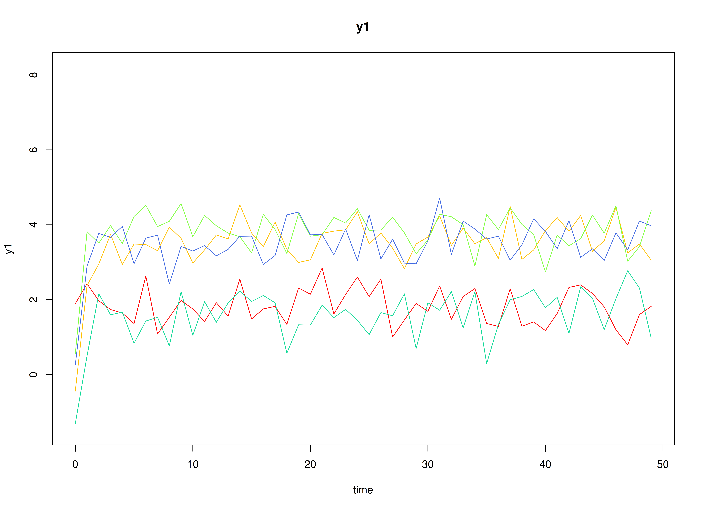
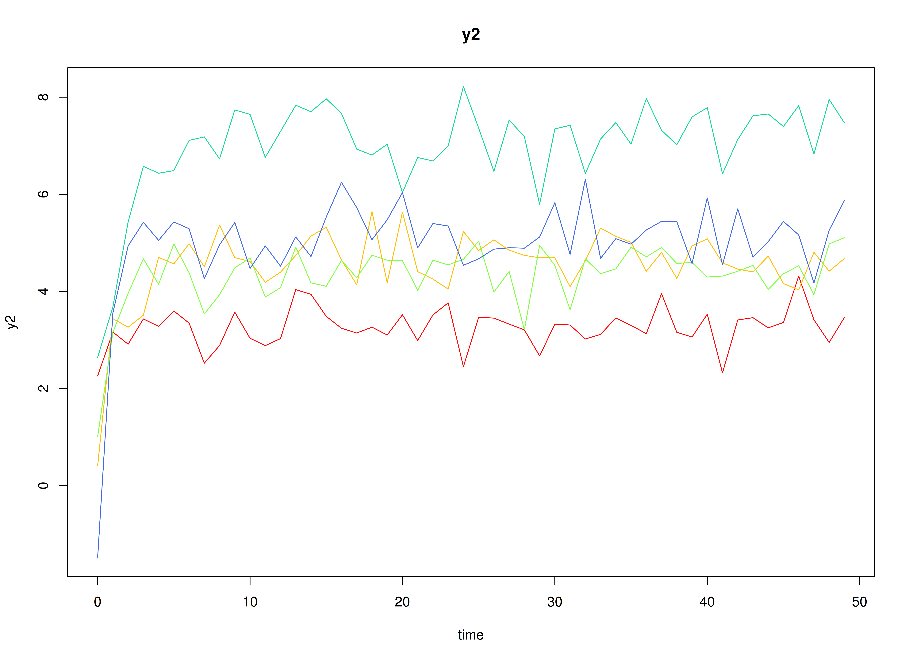
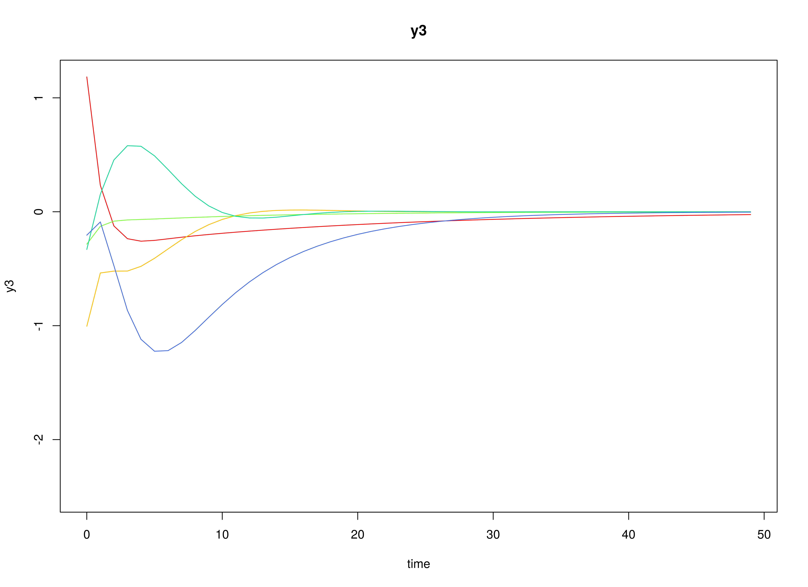

## Model

The measurement model is given by
\begin{equation}
  \mathbf{y}_{i, t}
  =
  \boldsymbol{\eta}_{i, t}
\end{equation}
where $\mathbf{y}_{i, t}$
represents a vector of observed variables
and $\boldsymbol{\eta}_{i, t}$
a vector of latent variables
for individual $i$ and time $t$.
Since the observed and latent variables are equal,
we only generate data
from the dynamic structure.

The dynamic structure is given by
\begin{equation}
  \boldsymbol{\eta}_{i, t}
  =
  \boldsymbol{\alpha}
  +
  \boldsymbol{\beta}
  \boldsymbol{\eta}_{i, t - 1}
  +
  \boldsymbol{\zeta}_{i, t},
  \quad
  \mathrm{with}
  \quad
  \boldsymbol{\zeta}_{i, t}
  \sim
  \mathcal{N}
  \left(
  \mathbf{0},
  \boldsymbol{\Psi}
  \right)
\end{equation}
where
$\boldsymbol{\eta}_{i, t}$,
$\boldsymbol{\eta}_{i, t - 1}$,
and
$\boldsymbol{\zeta}_{i, t}$
are random variables,
and
$\boldsymbol{\alpha}$,
$\boldsymbol{\beta}$,
and
$\boldsymbol{\Psi}$
are model parameters.
Here,
$\boldsymbol{\eta}_{i, t}$
is a vector of latent variables
at time $t$ and individual $i$,
$\boldsymbol{\eta}_{i, t - 1}$
represents a vector of latent variables
at time $t - 1$ and individual $i$,
and
$\boldsymbol{\zeta}_{i, t}$
represents a vector of dynamic noise
at time $t$ and individual $i$.
$\boldsymbol{\alpha}$
denotes a vector of intercepts,
$\boldsymbol{\beta}$
a matrix of autoregression
and cross regression coefficients,
and
$\boldsymbol{\Psi}$
the covariance matrix of
$\boldsymbol{\zeta}_{i, t}$.

An alternative representation of the dynamic noise
is given by
\begin{equation}
  \boldsymbol{\zeta}_{i, t}
  =
  \boldsymbol{\Psi}^{\frac{1}{2}}
  \mathbf{z}_{i, t},
  \quad
  \mathrm{with}
  \quad
  \mathbf{z}_{i, t}
  \sim
  \mathcal{N}
  \left(
  \mathbf{0},
  \mathbf{I}
  \right)
\end{equation}
where
$\left( \boldsymbol{\Psi}^{\frac{1}{2}} \right) \left( \boldsymbol{\Psi}^{\frac{1}{2}} \right)^{\prime} = \boldsymbol{\Psi}$ .

## Data Generation

### Notation

Let $t = 500$ be the number of time points and $n = 10$ be the number of individuals.

Let the initial condition
$\boldsymbol{\eta}_{0}$
be given by

\begin{equation}
\boldsymbol{\eta}_{0} \sim \mathcal{N} \left( \boldsymbol{\mu}_{\boldsymbol{\eta} \mid 0}, \boldsymbol{\Sigma}_{\boldsymbol{\eta} \mid 0} \right)
\end{equation}

\begin{equation}
\boldsymbol{\mu}_{\boldsymbol{\eta} \mid 0}
=
\left(
\begin{array}{c}
  0 \\
  0 \\
  0 \\
\end{array}
\right)
\end{equation}

\begin{equation}
\boldsymbol{\Sigma}_{\boldsymbol{\eta} \mid 0}
=
\left(
\begin{array}{ccc}
  1 & 0 & 0 \\
  0 & 1 & 0 \\
  0 & 0 & 1 \\
\end{array}
\right) .
\end{equation}

Let the constant vector $\boldsymbol{\alpha}$ be given by

\begin{equation}
\boldsymbol{\alpha}
=
\left(
\begin{array}{c}
  0 \\
  0 \\
  0 \\
\end{array}
\right) .
\end{equation}

Let the transition matrix $\boldsymbol{\beta}$ be normally distributed with the following means

\begin{equation}
\left(
\begin{array}{ccc}
  0.7 & 0 & 0 \\
  0.5 & 0.6 & 0 \\
  -0.1 & 0.4 & 0.5 \\
\end{array}
\right)
\end{equation}

and covariance matrix

\begin{equation}
\left(
\begin{array}{ccc}
  0.01 & 0 & 0 & 0 & 0 & 0 & 0 & 0 & 0 \\
  0 & 0.01 & 0 & 0 & 0 & 0 & 0 & 0 & 0 \\
  0 & 0 & 0.01 & 0 & 0 & 0 & 0 & 0 & 0 \\
  0 & 0 & 0 & 0.01 & 0 & 0 & 0 & 0 & 0 \\
  0 & 0 & 0 & 0 & 0.01 & 0 & 0 & 0 & 0 \\
  0 & 0 & 0 & 0 & 0 & 0.01 & 0 & 0 & 0 \\
  0 & 0 & 0 & 0 & 0 & 0 & 0.01 & 0 & 0 \\
  0 & 0 & 0 & 0 & 0 & 0 & 0 & 0.01 & 0 \\
  0 & 0 & 0 & 0 & 0 & 0 & 0 & 0 & 0.01 \\
\end{array}
\right) .
\end{equation}

The `SimBetaN` function from the `simStateSpace` package generates random transition matrices from the multivariate normal distribution. Note that the function generates transition matrices that are weakly stationary.

Let the dynamic process noise $\boldsymbol{\Psi}$ be given by

\begin{equation}
\boldsymbol{\Psi}
=
\left(
\begin{array}{ccc}
  0.1 & 0 & 0 \\
  0 & 0.1 & 0 \\
  0 & 0 & 0.1 \\
\end{array}
\right) .
\end{equation}

### R Function Arguments


``` r
n
#> [1] 10
time
#> [1] 500
mu0
#> [[1]]
#> [1] 0 0 0
sigma0
#>      [,1] [,2] [,3]
#> [1,]    1    0    0
#> [2,]    0    1    0
#> [3,]    0    0    1
sigma0_l
#> [[1]]
#>      [,1] [,2] [,3]
#> [1,]    1    0    0
#> [2,]    0    1    0
#> [3,]    0    0    1
# first alpha in the list of length n
alpha[[1]]
#> [1] 0 0 0
# first beta in the list of length n
beta[[1]]
#>           [,1]       [,2]       [,3]
#> [1,] 0.6468498 0.02987347 0.09881764
#> [2,] 0.5821253 0.64048586 0.12907652
#> [3,] 0.1217450 0.33748281 0.46598132
psi
#>      [,1] [,2] [,3]
#> [1,]  0.1  0.0  0.0
#> [2,]  0.0  0.1  0.0
#> [3,]  0.0  0.0  0.1
psi_l
#> [[1]]
#>           [,1]      [,2]      [,3]
#> [1,] 0.3162278 0.0000000 0.0000000
#> [2,] 0.0000000 0.3162278 0.0000000
#> [3,] 0.0000000 0.0000000 0.3162278
```

### Visualizing the Dynamics Without Process Noise (n = 5 with Different Initial Condition)



### Using the `SimSSMVARIVary` Function from the `simStateSpace` Package to Simulate Data


``` r
library(simStateSpace)
sim <- SimSSMVARIVary(
  n = n,
  time = time,
  mu0 = mu0,
  sigma0_l = sigma0_l,
  alpha = alpha,
  beta = beta,
  psi_l = psi_l
)
data <- as.data.frame(sim)
head(data)
#>   id time          y1         y2         y3
#> 1  1    0 -0.01667824  0.3471271 -0.5695179
#> 2  1    1  0.05129435  0.2859970 -0.2306270
#> 3  1    2 -0.33999076  0.6114834 -0.2472465
#> 4  1    3 -0.01661439 -0.2579420  0.2733639
#> 5  1    4 -0.50080900  0.2572493  0.1186636
#> 6  1    5 -0.19775105  0.1878050  0.3271472
plot(sim)
```


## Model Fitting

The `FitDTVARIDMx` function fits a DT-VAR model on each individual $i$.


``` r
library(fitDTVARMx)
fit <- FitDTVARIDMx(
  data = data,
  observed = paste0("y", seq_len(k)),
  id = "id",
  ncores = parallel::detectCores()
)
fit
#> 
#> Means of the estimated paramaters per individual.
#>     beta_11     beta_21     beta_31     beta_12     beta_22     beta_32 
#>  0.65993097  0.50030159 -0.06447561  0.04378504  0.64014151  0.43853603 
#>     beta_13     beta_23     beta_33      psi_11      psi_22      psi_33 
#> -0.03958630  0.01326219  0.49408009  0.10016808  0.09849587  0.09896985
```

## Multivariate Meta-Analysis

The `MetaVARMx` function performs multivariate meta-analysis using the estimated parameters
and the corresponding sampling variance-covariance matrix for each individual $i$.
Estimates with the prefix `b0` correspond to the estimates of `beta_mu`.
Estimates with the prefix `b1` correspond to the estimates of the effects of `x` on `y`. Note that the effects of `x` on `y` in this case are all zeros.
Estimates with the prefix `t2` correspond to the estimates of `beta_sigma`.
Estimates with the prefix `i2` correspond to the estimates of heterogeniety.


``` r
x <- lapply(
  X = seq_len(n),
  FUN = function(i) {
    stats::rnorm(n = 2)
  }
)
```


``` r
library(metaVAR)
meta <- MetaVARMx(
  object = fit,
  x = x,
  ncores = parallel::detectCores()
)
#> Running Model with 72 parameters
#> 
#> Beginning initial fit attempt
#> Running Model with 72 parameters
#> 
#>  Lowest minimum so far:  -271.390852130041
#> 
#> Solution found
```



```
#> 
#>  Solution found!  Final fit=-271.39085 (started at 181.8219)  (1 attempt(s): 1 valid, 0 errors)
#>  Start values from best fit:
#> 0.657962241220472,0.51033967227259,-0.0567954629371411,0.0436811090007591,0.646664986578893,0.430527116896467,-0.0436390242964322,0.00154840596736853,0.487898856324546,-0.00171536960435824,-0.034191117183634,-0.0113769270104645,0.0127319728424718,-0.0508064711449298,0.0471040811841622,0.01281829562478,0.0546428473180705,0.00622674705947665,-0.0373278899849594,0.014326900038314,0.028172759926688,0.0243067434491325,-0.0599933548337579,0.0411649030024198,-0.00765519846664582,0.0184720225764948,-0.0429177873844594,0.0905260823187534,-0.021491827954899,-0.0684365870852203,-0.0385766717650605,-0.0397820953825144,0.0697830119273889,0.0216721203484656,0.00226476659139843,-0.0387608704309943,0.0938677998194565,0.0560340468885324,-0.00547507779064828,-0.0445965647751857,0.0122944202686715,0.0445209535326955,0.0226673510970409,-0.0177582479425677,0.0803964481064007,-0.00291115918767587,0.0339254072134867,-0.0558721012759551,0.00565473299932731,0.0491000139565992,0.0400736439582104,0.0423325753230253,-0.00259506146832299,0.0589777289459285,0.0182802588818472,0.0231307478025296,-0.0262048351748966,0.0434713659152594,-0.00220143633147934,0.0145752853266376,0.0178717992928919,-0.00739474262589907,0.0314365412417938,-0.0674172052618052,-0.0259762913278114,0.0297884215651565,1.06466555090781e-07,5.12114502520714e-08,-7.09828307697287e-08,1.54526931839517e-08,3.8067107662408e-09,2.2250738585072e-308
summary(meta)
#>            est     se       z      p    2.5%  97.5%
#> b0_1    0.6580 0.0318 20.6838 0.0000  0.5956 0.7203
#> b0_2    0.5103 0.0336 15.2090 0.0000  0.4446 0.5761
#> b0_3   -0.0568 0.0407 -1.3940 0.1633 -0.1366 0.0231
#> b0_4    0.0437 0.0211  2.0739 0.0381  0.0024 0.0850
#> b0_5    0.6467 0.0282 22.9417 0.0000  0.5914 0.7019
#> b0_6    0.4305 0.0379 11.3717 0.0000  0.3563 0.5047
#> b0_7   -0.0436 0.0300 -1.4533 0.1461 -0.1025 0.0152
#> b0_8    0.0015 0.0238  0.0649 0.9482 -0.0452 0.0483
#> b0_9    0.4879 0.0251 19.4167 0.0000  0.4386 0.5371
#> b1_11  -0.0017 0.0389 -0.0441 0.9648 -0.0779 0.0745
#> b1_21  -0.0342 0.0410 -0.8342 0.4042 -0.1145 0.0461
#> b1_31  -0.0114 0.0499 -0.2279 0.8197 -0.1092 0.0865
#> b1_41   0.0127 0.0264  0.4831 0.6291 -0.0389 0.0644
#> b1_51  -0.0508 0.0349 -1.4542 0.1459 -0.1193 0.0177
#> b1_61   0.0471 0.0468  1.0058 0.3145 -0.0447 0.1389
#> b1_71   0.0128 0.0367  0.3494 0.7268 -0.0591 0.0847
#> b1_81   0.0546 0.0290  1.8835 0.0596 -0.0022 0.1115
#> b1_91   0.0062 0.0306  0.2032 0.8390 -0.0538 0.0663
#> b1_12  -0.0373 0.0378 -0.9880 0.3232 -0.1114 0.0367
#> b1_22   0.0143 0.0398  0.3600 0.7188 -0.0637 0.0923
#> b1_32   0.0282 0.0484  0.5822 0.5605 -0.0667 0.1230
#> b1_42   0.0243 0.0253  0.9616 0.3362 -0.0252 0.0738
#> b1_52  -0.0600 0.0336 -1.7847 0.0743 -0.1259 0.0059
#> b1_62   0.0412 0.0451  0.9127 0.3614 -0.0472 0.1296
#> b1_72  -0.0077 0.0355 -0.2155 0.8294 -0.0773 0.0620
#> b1_82   0.0185 0.0281  0.6564 0.5116 -0.0367 0.0736
#> b1_92  -0.0429 0.0297 -1.4438 0.1488 -0.1012 0.0153
#> t2_1_1  0.0082 0.0042  1.9436 0.0519 -0.0001 0.0165
#> t2_2_1 -0.0019 0.0032 -0.6033 0.5463 -0.0083 0.0044
#> t2_3_1 -0.0062 0.0043 -1.4437 0.1488 -0.0146 0.0022
#> t2_4_1 -0.0035 0.0024 -1.4776 0.1395 -0.0081 0.0011
#> t2_5_1 -0.0036 0.0029 -1.2421 0.2142 -0.0093 0.0021
#> t2_6_1  0.0063 0.0041  1.5407 0.1234 -0.0017 0.0144
#> t2_7_1  0.0020 0.0029  0.6753 0.4995 -0.0037 0.0077
#> t2_8_1  0.0002 0.0022  0.0917 0.9269 -0.0042 0.0046
#> t2_9_1 -0.0035 0.0026 -1.3454 0.1785 -0.0086 0.0016
#> t2_2_2  0.0093 0.0047  1.9600 0.0500  0.0000 0.0185
#> t2_3_2  0.0067 0.0046  1.4726 0.1409 -0.0022 0.0157
#> t2_4_2  0.0003 0.0021  0.1502 0.8806 -0.0038 0.0044
#> t2_5_2 -0.0033 0.0030 -1.0939 0.2740 -0.0093 0.0026
#> t2_6_2 -0.0003 0.0038 -0.0916 0.9270 -0.0077 0.0071
#> t2_7_2  0.0037 0.0032  1.1559 0.2477 -0.0026 0.0100
#> t2_8_2  0.0021 0.0024  0.8500 0.3953 -0.0027 0.0069
#> t2_9_2 -0.0008 0.0025 -0.3330 0.7391 -0.0057 0.0041
#> t2_3_3  0.0143 0.0069  2.0667 0.0388  0.0007 0.0278
#> t2_4_3  0.0021 0.0026  0.8006 0.4234 -0.0030 0.0072
#> t2_5_3  0.0030 0.0035  0.8366 0.4028 -0.0040 0.0099
#> t2_6_3 -0.0086 0.0054 -1.5881 0.1123 -0.0192 0.0020
#> t2_7_3  0.0015 0.0037  0.4013 0.6882 -0.0057 0.0086
#> t2_8_3  0.0051 0.0033  1.5386 0.1239 -0.0014 0.0115
#> t2_9_3  0.0049 0.0034  1.4275 0.1534 -0.0018 0.0116
#> t2_4_4  0.0033 0.0019  1.7887 0.0737 -0.0003 0.0070
#> t2_5_4  0.0016 0.0018  0.8540 0.3931 -0.0020 0.0052
#> t2_6_4 -0.0001 0.0024 -0.0421 0.9664 -0.0048 0.0046
#> t2_7_4 -0.0003 0.0019 -0.1690 0.8658 -0.0041 0.0034
#> t2_8_4  0.0006 0.0015  0.4190 0.6752 -0.0023 0.0035
#> t2_9_4  0.0004 0.0016  0.2352 0.8140 -0.0027 0.0034
#> t2_5_5  0.0066 0.0033  1.9819 0.0475  0.0001 0.0132
#> t2_6_5 -0.0055 0.0036 -1.5134 0.1302 -0.0126 0.0016
#> t2_7_5 -0.0021 0.0026 -0.7974 0.4252 -0.0072 0.0030
#> t2_8_5  0.0013 0.0020  0.6483 0.5168 -0.0026 0.0052
#> t2_9_5  0.0034 0.0024  1.4621 0.1437 -0.0012 0.0081
#> t2_6_6  0.0126 0.0060  2.0893 0.0367  0.0008 0.0244
#> t2_7_6  0.0007 0.0034  0.1979 0.8431 -0.0060 0.0073
#> t2_8_6 -0.0018 0.0027 -0.6546 0.5127 -0.0072 0.0036
#> t2_9_6 -0.0058 0.0034 -1.6718 0.0946 -0.0125 0.0010
#> t2_7_7  0.0076 0.0038  1.9927 0.0463  0.0001 0.0150
#> t2_8_7  0.0038 0.0024  1.5453 0.1223 -0.0010 0.0086
#> t2_9_7 -0.0040 0.0026 -1.5527 0.1205 -0.0090 0.0010
#> t2_8_8  0.0045 0.0024  1.8871 0.0591 -0.0002 0.0091
#> t2_9_8  0.0000 0.0018 -0.0196 0.9843 -0.0035 0.0034
#> t2_9_9  0.0051 0.0027  1.9051 0.0568 -0.0001 0.0103
#> i2_1    0.8675 0.0591 14.6755 0.0000  0.7516 0.9833
#> i2_2    0.8814 0.0533 16.5374 0.0000  0.7770 0.9859
#> i2_3    0.9198 0.0357 25.7697 0.0000  0.8498 0.9898
#> i2_4    0.7956 0.0909  8.7485 0.0000  0.6173 0.9738
#> i2_5    0.8872 0.0505 17.5660 0.0000  0.7882 0.9862
#> i2_6    0.9371 0.0282 33.2267 0.0000  0.8818 0.9924
#> i2_7    0.8991 0.0455 19.7529 0.0000  0.8099 0.9883
#> i2_8    0.8430 0.0701 12.0223 0.0000  0.7055 0.9804
#> i2_9    0.8575 0.0642 13.3636 0.0000  0.7317 0.9832
```

## References


