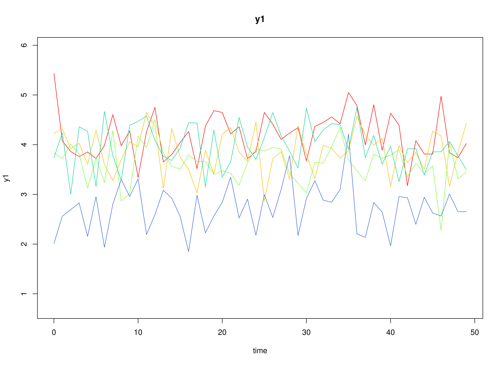

## Model

The measurement model is given by
\begin{equation}
  \mathbf{y}_{i, t}
  =
  \boldsymbol{\eta}_{i, t}
\end{equation}
where $\mathbf{y}_{i, t}$
represents a vector of observed variables
and $\boldsymbol{\eta}_{i, t}$
a vector of latent variables
for individual $i$ and time $t$.
Since the observed and latent variables are equal,
we only generate data
from the dynamic structure.

The dynamic structure is given by
\begin{equation}
  \boldsymbol{\eta}_{i, t}
  =
  \boldsymbol{\alpha}
  +
  \boldsymbol{\beta}
  \boldsymbol{\eta}_{i, t - 1}
  +
  \boldsymbol{\zeta}_{i, t},
  \quad
  \mathrm{with}
  \quad
  \boldsymbol{\zeta}_{i, t}
  \sim
  \mathcal{N}
  \left(
  \mathbf{0},
  \boldsymbol{\Psi}
  \right)
\end{equation}
where
$\boldsymbol{\eta}_{i, t}$,
$\boldsymbol{\eta}_{i, t - 1}$,
and
$\boldsymbol{\zeta}_{i, t}$
are random variables,
and
$\boldsymbol{\alpha}$,
$\boldsymbol{\beta}$,
and
$\boldsymbol{\Psi}$
are model parameters.
Here,
$\boldsymbol{\eta}_{i, t}$
is a vector of latent variables
at time $t$ and individual $i$,
$\boldsymbol{\eta}_{i, t - 1}$
represents a vector of latent variables
at time $t - 1$ and individual $i$,
and
$\boldsymbol{\zeta}_{i, t}$
represents a vector of dynamic noise
at time $t$ and individual $i$.
$\boldsymbol{\alpha}$
denotes a vector of intercepts,
$\boldsymbol{\beta}$
a matrix of autoregression
and cross regression coefficients,
and
$\boldsymbol{\Psi}$
the covariance matrix of
$\boldsymbol{\zeta}_{i, t}$.

An alternative representation of the dynamic noise
is given by
\begin{equation}
  \boldsymbol{\zeta}_{i, t}
  =
  \boldsymbol{\Psi}^{\frac{1}{2}}
  \mathbf{z}_{i, t},
  \quad
  \mathrm{with}
  \quad
  \mathbf{z}_{i, t}
  \sim
  \mathcal{N}
  \left(
  \mathbf{0},
  \mathbf{I}
  \right)
\end{equation}
where
$\left( \boldsymbol{\Psi}^{\frac{1}{2}} \right) \left( \boldsymbol{\Psi}^{\frac{1}{2}} \right)^{\prime} = \boldsymbol{\Psi}$ .

## Data Generation

### Notation

Let $t = 500$ be the number of time points and $n = 10$ be the number of individuals.

Let the initial condition
$\boldsymbol{\eta}_{0}$
be given by

\begin{equation}
\boldsymbol{\eta}_{0} \sim \mathcal{N} \left( \boldsymbol{\mu}_{\boldsymbol{\eta} \mid 0}, \boldsymbol{\Sigma}_{\boldsymbol{\eta} \mid 0} \right)
\end{equation}

\begin{equation}
\boldsymbol{\mu}_{\boldsymbol{\eta} \mid 0}
=
\left(
\begin{array}{c}
  0 \\
  0 \\
  0 \\
\end{array}
\right)
\end{equation}

\begin{equation}
\boldsymbol{\Sigma}_{\boldsymbol{\eta} \mid 0}
=
\left(
\begin{array}{ccc}
  1 & 0 & 0 \\
  0 & 1 & 0 \\
  0 & 0 & 1 \\
\end{array}
\right) .
\end{equation}

Let the constant vector $\boldsymbol{\alpha}$ be given by

\begin{equation}
\boldsymbol{\alpha}
=
\left(
\begin{array}{c}
  0 \\
  0 \\
  0 \\
\end{array}
\right) .
\end{equation}

Let the transition matrix $\boldsymbol{\beta}$ be normally distributed with the following means

\begin{equation}
\left(
\begin{array}{ccc}
  0.7 & 0 & 0 \\
  0.5 & 0.6 & 0 \\
  -0.1 & 0.4 & 0.5 \\
\end{array}
\right)
\end{equation}

and covariance matrix

\begin{equation}
\left(
\begin{array}{ccc}
  0.01 & 0 & 0 & 0 & 0 & 0 & 0 & 0 & 0 \\
  0 & 0.01 & 0 & 0 & 0 & 0 & 0 & 0 & 0 \\
  0 & 0 & 0.01 & 0 & 0 & 0 & 0 & 0 & 0 \\
  0 & 0 & 0 & 0.01 & 0 & 0 & 0 & 0 & 0 \\
  0 & 0 & 0 & 0 & 0.01 & 0 & 0 & 0 & 0 \\
  0 & 0 & 0 & 0 & 0 & 0.01 & 0 & 0 & 0 \\
  0 & 0 & 0 & 0 & 0 & 0 & 0.01 & 0 & 0 \\
  0 & 0 & 0 & 0 & 0 & 0 & 0 & 0.01 & 0 \\
  0 & 0 & 0 & 0 & 0 & 0 & 0 & 0 & 0.01 \\
\end{array}
\right) .
\end{equation}

The `SimBetaN` function from the `simStateSpace` package generates random transition matrices from the multivariate normal distribution. Note that the function generates transition matrices that are weakly stationary.

Let the dynamic process noise $\boldsymbol{\Psi}$ be given by

\begin{equation}
\boldsymbol{\Psi}
=
\left(
\begin{array}{ccc}
  0.1 & 0 & 0 \\
  0 & 0.1 & 0 \\
  0 & 0 & 0.1 \\
\end{array}
\right) .
\end{equation}

### R Function Arguments


``` r
n
#> [1] 10
time
#> [1] 500
mu0
#> [[1]]
#> [1] 0 0 0
sigma0
#>      [,1] [,2] [,3]
#> [1,]    1    0    0
#> [2,]    0    1    0
#> [3,]    0    0    1
sigma0_l
#> [[1]]
#>      [,1] [,2] [,3]
#> [1,]    1    0    0
#> [2,]    0    1    0
#> [3,]    0    0    1
# first alpha in the list of length n
alpha[[1]]
#> [1] 0 0 0
# first beta in the list of length n
beta[[1]]
#>           [,1]       [,2]       [,3]
#> [1,] 0.6468498 0.02987347 0.09881764
#> [2,] 0.5821253 0.64048586 0.12907652
#> [3,] 0.1217450 0.33748281 0.46598132
psi
#>      [,1] [,2] [,3]
#> [1,]  0.1  0.0  0.0
#> [2,]  0.0  0.1  0.0
#> [3,]  0.0  0.0  0.1
psi_l
#> [[1]]
#>           [,1]      [,2]      [,3]
#> [1,] 0.3162278 0.0000000 0.0000000
#> [2,] 0.0000000 0.3162278 0.0000000
#> [3,] 0.0000000 0.0000000 0.3162278
```

### Visualizing the Dynamics Without Process Noise (n = 5 with Different Initial Condition)



### Using the `SimSSMVARIVary` Function from the `simStateSpace` Package to Simulate Data


``` r
library(simStateSpace)
sim <- SimSSMVARIVary(
  n = n,
  time = time,
  mu0 = mu0,
  sigma0_l = sigma0_l,
  alpha = alpha,
  beta = beta,
  psi_l = psi_l
)
data <- as.data.frame(sim)
head(data)
#>   id time          y1         y2         y3
#> 1  1    0 -0.01667824  0.3471271 -0.5695179
#> 2  1    1  0.05129435  0.2859970 -0.2306270
#> 3  1    2 -0.33999076  0.6114834 -0.2472465
#> 4  1    3 -0.01661439 -0.2579420  0.2733639
#> 5  1    4 -0.50080900  0.2572493  0.1186636
#> 6  1    5 -0.19775105  0.1878050  0.3271472
plot(sim)
```


## Model Fitting

The `FitDTVARIDMx` function fits a DT-VAR model on each individual $i$.


``` r
library(fitDTVARMx)
fit <- FitDTVARIDMx(
  data = data,
  observed = paste0("y", seq_len(k)),
  id = "id",
  ncores = parallel::detectCores()
)
fit
#> 
#> Means of the estimated paramaters per individual.
#>     beta_11     beta_21     beta_31     beta_12     beta_22     beta_32 
#>  0.65993097  0.50030159 -0.06447561  0.04378504  0.64014151  0.43853603 
#>     beta_13     beta_23     beta_33      psi_11      psi_22      psi_33 
#> -0.03958630  0.01326219  0.49408009  0.10016808  0.09849587  0.09896985
```

## Multivariate Meta-Analysis

The `MetaVARMx` function performs multivariate meta-analysis using the estimated parameters
and the corresponding sampling variance-covariance matrix for each individual $i$.
Estimates with the prefix `b0` correspond to the estimates of `beta_mu`.
Estimates with the prefix `t2` correspond to the estimates of `beta_sigma`.
Estimates with the prefix `i2` correspond to the estimates of heterogeniety.


``` r
library(metaVAR)
meta <- MetaVARMx(
  object = fit,
  ncores = parallel::detectCores()
)
#> Running Model with 54 parameters
#> 
#> Beginning initial fit attempt
#> Running Model with 54 parameters
#> 
#>  Lowest minimum so far:  -233.273136746635
#> 
#> Solution found
```



```
#> 
#>  Solution found!  Final fit=-233.27314 (started at 181.8219)  (1 attempt(s): 1 valid, 0 errors)
#>  Start values from best fit:
#> 0.663041724572586,0.499851332252941,-0.0643086017086123,0.0441855936629897,0.641690582489318,0.436819914756742,-0.0384934675771523,0.0131870554480993,0.496740488918218,0.0989093243486189,-0.0371965233822885,-0.0792665458050528,-0.0455805171172934,-0.0235509419342169,0.0574192062185801,0.0234061954443153,0.0113199013879781,-0.0146574087078752,0.100651492501076,0.0554165235688819,-0.0107235470796025,-0.0424072856634077,0.0119085856701224,0.0353609390586207,0.00426919578201158,-0.0362887896154651,0.0818824186969839,-0.00491894397536974,0.0337609894427482,-0.0582818886948576,0.00609381536749847,0.0529691896922064,0.0496686991504768,0.0388130755929363,-0.0199460147111959,0.0730677223684971,0.0240595290234243,0.041658110386113,-0.030619977899605,0.0698365478128839,-0.0254004529090468,0.00711321288431311,-0.00257323063549339,0.00479935612783492,0.030599913759569,-0.0709442568254873,-0.0352264249080394,0.0186633107411965,0.00359514220260675,0.0214974529971091,0.0428086669307039,5.64516765552293e-06,1.32508333332301e-05,4.3528252744175e-08
summary(meta)
#>            est     se       z      p    2.5%  97.5%
#> b0_1    0.6630 0.0333 19.9283 0.0000  0.5978 0.7283
#> b0_2    0.4999 0.0358 13.9775 0.0000  0.4298 0.5699
#> b0_3   -0.0643 0.0416 -1.5445 0.1225 -0.1459 0.0173
#> b0_4    0.0442 0.0215  2.0585 0.0395  0.0021 0.0863
#> b0_5    0.6417 0.0310 20.6683 0.0000  0.5808 0.7025
#> b0_6    0.4368 0.0383 11.4197 0.0000  0.3618 0.5118
#> b0_7   -0.0385 0.0290 -1.3294 0.1837 -0.0952 0.0183
#> b0_8    0.0132 0.0270  0.4893 0.6246 -0.0396 0.0660
#> b0_9    0.4967 0.0283 17.5614 0.0000  0.4413 0.5522
#> t2_1_1  0.0098 0.0049  1.9909 0.0465  0.0002 0.0194
#> t2_2_1 -0.0037 0.0039 -0.9334 0.3506 -0.0114 0.0040
#> t2_3_1 -0.0078 0.0050 -1.5664 0.1173 -0.0177 0.0020
#> t2_4_1 -0.0045 0.0028 -1.6308 0.1029 -0.0099 0.0009
#> t2_5_1 -0.0023 0.0034 -0.6943 0.4875 -0.0089 0.0042
#> t2_6_1  0.0057 0.0044  1.2860 0.1984 -0.0030 0.0143
#> t2_7_1  0.0023 0.0032  0.7349 0.4624 -0.0039 0.0085
#> t2_8_1  0.0011 0.0029  0.3928 0.6944 -0.0045 0.0067
#> t2_9_1 -0.0014 0.0030 -0.4783 0.6325 -0.0074 0.0045
#> t2_2_2  0.0115 0.0057  2.0063 0.0448  0.0003 0.0228
#> t2_3_2  0.0085 0.0054  1.5742 0.1154 -0.0021 0.0191
#> t2_4_2  0.0006 0.0024  0.2521 0.8010 -0.0042 0.0054
#> t2_5_2 -0.0034 0.0037 -0.9100 0.3628 -0.0107 0.0039
#> t2_6_2 -0.0009 0.0043 -0.2158 0.8291 -0.0094 0.0076
#> t2_7_2  0.0027 0.0034  0.7942 0.4271 -0.0039 0.0093
#> t2_8_2  0.0000 0.0030  0.0028 0.9977 -0.0059 0.0060
#> t2_9_2 -0.0031 0.0034 -0.9247 0.3551 -0.0097 0.0035
#> t2_3_3  0.0161 0.0077  2.0876 0.0368  0.0010 0.0311
#> t2_4_3  0.0026 0.0029  0.8925 0.3721 -0.0031 0.0084
#> t2_5_3  0.0023 0.0042  0.5496 0.5826 -0.0059 0.0104
#> t2_6_3 -0.0087 0.0058 -1.4919 0.1357 -0.0200 0.0027
#> t2_7_3  0.0006 0.0038  0.1580 0.8745 -0.0069 0.0081
#> t2_8_3  0.0037 0.0037  0.9828 0.3257 -0.0037 0.0110
#> t2_9_3  0.0032 0.0039  0.8268 0.4084 -0.0044 0.0108
#> t2_4_4  0.0037 0.0021  1.8099 0.0703 -0.0003 0.0078
#> t2_5_4  0.0006 0.0021  0.2763 0.7823 -0.0036 0.0048
#> t2_6_4  0.0004 0.0026  0.1439 0.8856 -0.0048 0.0055
#> t2_7_4 -0.0005 0.0020 -0.2735 0.7845 -0.0044 0.0033
#> t2_8_4  0.0008 0.0018  0.4361 0.6628 -0.0028 0.0044
#> t2_9_4 -0.0004 0.0019 -0.1945 0.8457 -0.0042 0.0034
#> t2_5_5  0.0088 0.0043  2.0258 0.0428  0.0003 0.0173
#> t2_6_5 -0.0071 0.0044 -1.6083 0.1078 -0.0157 0.0015
#> t2_7_5 -0.0018 0.0029 -0.6334 0.5265 -0.0075 0.0038
#> t2_8_5  0.0003 0.0026  0.1264 0.8994 -0.0048 0.0054
#> t2_9_5  0.0045 0.0031  1.4436 0.1489 -0.0016 0.0106
#> t2_6_6  0.0138 0.0066  2.0844 0.0371  0.0008 0.0267
#> t2_7_6  0.0008 0.0035  0.2332 0.8156 -0.0060 0.0077
#> t2_8_6 -0.0004 0.0032 -0.1093 0.9130 -0.0067 0.0060
#> t2_9_6 -0.0060 0.0040 -1.4904 0.1361 -0.0138 0.0019
#> t2_7_7  0.0075 0.0038  1.9879 0.0468  0.0001 0.0149
#> t2_8_7  0.0043 0.0028  1.5174 0.1292 -0.0013 0.0099
#> t2_9_7 -0.0032 0.0028 -1.1467 0.2515 -0.0087 0.0023
#> t2_8_8  0.0064 0.0033  1.9607 0.0499  0.0000 0.0128
#> t2_9_8  0.0013 0.0025  0.5236 0.6005 -0.0035 0.0061
#> t2_9_9  0.0071 0.0036  1.9813 0.0476  0.0001 0.0142
#> i2_1    0.8866 0.0505 17.5593 0.0000  0.7876 0.9855
#> i2_2    0.9022 0.0439 20.5309 0.0000  0.8161 0.9884
#> i2_3    0.9280 0.0320 28.9971 0.0000  0.8653 0.9907
#> i2_4    0.8137 0.0838  9.7091 0.0000  0.6494 0.9779
#> i2_5    0.9124 0.0394 23.1334 0.0000  0.8351 0.9897
#> i2_6    0.9420 0.0262 35.9598 0.0000  0.8907 0.9934
#> i2_7    0.8983 0.0459 19.5514 0.0000  0.8083 0.9884
#> i2_8    0.8851 0.0519 17.0666 0.0000  0.7834 0.9867
#> i2_9    0.8947 0.0475 18.8262 0.0000  0.8016 0.9879
```

## References


