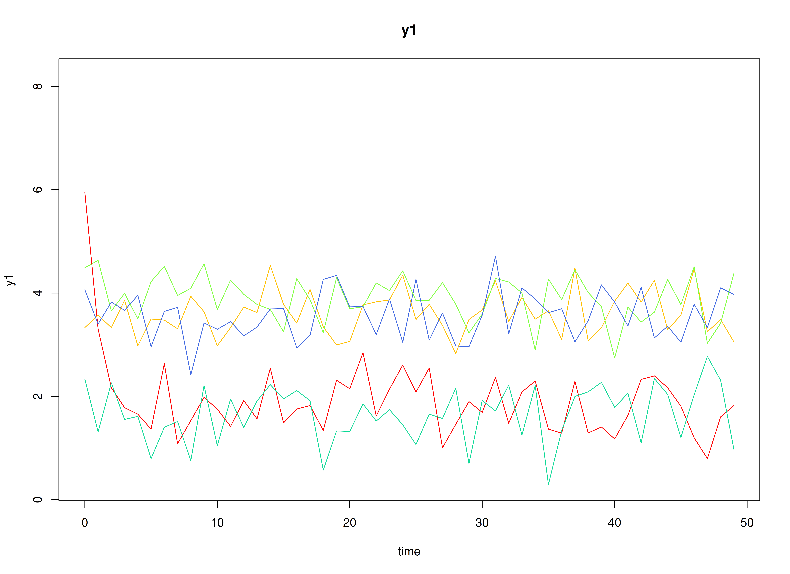

> **Note:** When the discrete-time vector autoregressive model is estimated separately for each ID,
> any of the parameters can vary across individuals.
> In this example, however, we are only varying $\boldsymbol{\alpha}$ and $\boldsymbol{\beta}$.

## Model

The measurement model is given by
\begin{equation}
  \mathbf{y}_{i, t}
  =
  \boldsymbol{\Lambda}
  \boldsymbol{\eta}_{i, t}
  +
  \boldsymbol{\varepsilon}_{i, t},
  \quad
  \mathrm{with}
  \quad
  \boldsymbol{\varepsilon}_{i, t}
  \sim
  \mathcal{N}
  \left(
  \mathbf{0},
  \boldsymbol{\Theta}
  \right)
\end{equation}
where
$\mathbf{y}_{i, t}$,
$\boldsymbol{\eta}_{i, t}$,
and
$\boldsymbol{\varepsilon}_{i, t}$
are random variables
and
$\boldsymbol{\Lambda}$,
and
$\boldsymbol{\Theta}$
are model parameters.
$\mathbf{y}_{i, t}$
represents a vector of observed random variables,
$\boldsymbol{\eta}_{i, t}$
a vector of latent random variables,
and
$\boldsymbol{\varepsilon}_{i, t}$
a vector of random measurement errors,
at time $t$ and individual $i$.
$\boldsymbol{\Lambda}$
denotes a matrix of factor loadings,
and
$\boldsymbol{\Theta}$
the covariance matrix of
$\boldsymbol{\varepsilon}$.
In this model,
$\boldsymbol{\Lambda}$ is an identity matrix and
$\boldsymbol{\Theta}$ is a diagonal matrix.

The dynamic structure is given by
\begin{equation}
  \boldsymbol{\eta}_{i, t}
  =
  \boldsymbol{\alpha}_{i}
  +
  \boldsymbol{\beta}_{i}
  \boldsymbol{\eta}_{i, t - 1}
  +
  \boldsymbol{\zeta}_{i, t},
  \quad
  \mathrm{with}
  \quad
  \boldsymbol{\zeta}_{i, t}
  \sim
  \mathcal{N}
  \left(
  \mathbf{0},
  \boldsymbol{\Psi}
  \right)
\end{equation}
where
$\boldsymbol{\eta}_{i, t}$,
$\boldsymbol{\eta}_{i, t - 1}$,
and
$\boldsymbol{\zeta}_{i, t}$
are random variables,
and
$\boldsymbol{\alpha}_{i}$,
$\boldsymbol{\beta}_{i}$,
and
$\boldsymbol{\Psi}$
are model parameters.
Here,
$\boldsymbol{\eta}_{i, t}$
is a vector of latent variables
at time $t$ and individual $i$,
$\boldsymbol{\eta}_{i, t - 1}$
represents a vector of latent variables
at time $t - 1$ and individual $i$,
and
$\boldsymbol{\zeta}_{i, t}$
represents a vector of dynamic noise
at time $t$ and individual $i$.
$\boldsymbol{\alpha}_{i}$
denotes a vector of intercepts
for individual $i$,
$\boldsymbol{\beta}_{i}$
a matrix of autoregression
and cross regression coefficients
for individual $i$,
and
$\boldsymbol{\Psi}$
the covariance matrix of
$\boldsymbol{\zeta}_{i, t}$.
In this model,
$\boldsymbol{\Psi}$ is a symmetric matrix.

## Data Generation

The parameters used in this example were based on @Bringmann-Vissers-Wichers-etal-2013.

### Notation

Let $t = 1000$ be the number of time points and $n = 1000$ be the number of individuals.

Let the measurement model intecept vector $\boldsymbol{\nu}$ be given by

\begin{equation}
\boldsymbol{\nu}
=
\left(
\begin{array}{c}
  0 \\
  0 \\
\end{array}
\right) .
\end{equation}

Let the factor loadings matrix $\boldsymbol{\Lambda}$ be given by

\begin{equation}
\boldsymbol{\Lambda}
=
\left(
\begin{array}{cc}
  1 & 0 \\
  0 & 1 \\
\end{array}
\right) .
\end{equation}

Let the measurement error covariance matrix $\boldsymbol{\Theta}$ be given by

\begin{equation}
\boldsymbol{\Theta}
=
\left(
\begin{array}{cc}
  0.2 & 0 \\
  0 & 0.2 \\
\end{array}
\right) .
\end{equation}

Let the initial condition
$\boldsymbol{\eta}_{0}$
be given by

\begin{equation}
\boldsymbol{\eta}_{0} \sim \mathcal{N} \left( \boldsymbol{\mu}_{\boldsymbol{\eta} \mid 0}, \boldsymbol{\Sigma}_{\boldsymbol{\eta} \mid 0} \right)
\end{equation}

\begin{equation}
\boldsymbol{\mu}_{\boldsymbol{\eta} \mid 0}
=
\left(
\begin{array}{c}
  3.8143546 \\
  2.5763481 \\
\end{array}
\right)
\end{equation}

\begin{equation}
\boldsymbol{\Sigma}_{\boldsymbol{\eta} \mid 0}
=
\left(
\begin{array}{cc}
  1.3978842 & 0.5782369 \\
  0.5782369 & 1.6636513 \\
\end{array}
\right) .
\end{equation}

Let the intercept vector $\boldsymbol{\alpha}$ be normally distributed with the following means

\begin{equation}
\left(
\begin{array}{c}
  2.87 \\
  2.04 \\
\end{array}
\right)
\end{equation}

and covariance matrix

\begin{equation}
\left(
\begin{array}{cc}
  1.2 & 0.459565 \\
  0.459565 & 1.1 \\
\end{array}
\right) .
\end{equation}

Let the transition matrix $\boldsymbol{\beta}$ be normally distributed with the following means

\begin{equation}
\left(
\begin{array}{cc}
  0.28 & -0.048 \\
  -0.035 & 0.26 \\
\end{array}
\right)
\end{equation}

and covariance matrix

\begin{equation}
\left(
\begin{array}{cccc}
  0.0169 & 0.00468 & 0.001456 & 0.00832 \\
  0.00468 & 0.0081 & 0.001008 & 0.00576 \\
  0.001456 & 0.001008 & 0.000784 & 0.001792 \\
  0.00832 & 0.00576 & 0.001792 & 0.0256 \\
\end{array}
\right) .
\end{equation}

The `SimAlphaN` and `SimBetaN` functions from the `simStateSpace` package generates random intercept vectors and transition matrices from the multivariate normal distribution. Note that the `SimBetaN` function generates transition matrices that are weakly stationary.

Let the dynamic process noise $\boldsymbol{\Psi}$ be given by

\begin{equation}
\boldsymbol{\Psi}
=
\left(
\begin{array}{cc}
  1.3 & 0.5696315 \\
  0.5696315 & 1.56 \\
\end{array}
\right) .
\end{equation}


### R Function Arguments


``` r
n
#> [1] 1000
time
#> [1] 1000
mu0
#> [[1]]
#> [1] 3.814355 2.576348
sigma0
#> [[1]]
#>           [,1]      [,2]
#> [1,] 1.3978842 0.5782369
#> [2,] 0.5782369 1.6636513
sigma0_l # sigma0_l <- t(chol(sigma0))
#> [[1]]
#>           [,1]     [,2]
#> [1,] 1.1823215 0.000000
#> [2,] 0.4890691 1.193509
# first alpha in the list of length n
alpha[[1]]
#> [1] 1.382816 2.056527
# first beta in the list of length n
beta[[1]]
#>            [,1]       [,2]
#> [1,] 0.21090478 0.00660174
#> [2,] 0.01360809 0.37057228
psi
#>           [,1]      [,2]
#> [1,] 1.3000000 0.5696315
#> [2,] 0.5696315 1.5600000
psi_l # psi_l <- t(chol(psi))
#> [[1]]
#>           [,1]     [,2]
#> [1,] 1.1401754 0.000000
#> [2,] 0.4995998 1.144727
nu
#> [[1]]
#> [1] 0 0
lambda
#> [[1]]
#>      [,1] [,2]
#> [1,]    1    0
#> [2,]    0    1
theta
#>      [,1] [,2]
#> [1,]  0.2  0.0
#> [2,]  0.0  0.2
```

### Visualizing the Dynamics Without Process Noise (n = 5 with Different Initial Condition)



### Using the `SimSSMIVary` Function from the `simStateSpace` Package to Simulate Data


``` r
library(simStateSpace)
sim <- SimSSMIVary(
  n = n,
  time = time,
  mu0 = mu0,
  sigma0_l = sigma0_l,
  alpha = alpha,
  beta = beta,
  psi_l = psi_l,
  nu = nu,
  lambda = lambda,
  theta_l = theta_l
)
data <- as.data.frame(sim)
head(data)
#>   id time       y1       y2
#> 1  1    0 3.040533 3.202203
#> 2  1    1 3.630653 4.691667
#> 3  1    2 2.621350 5.240797
#> 4  1    3 2.073843 5.555230
#> 5  1    4 2.013430 5.269451
#> 6  1    5 1.677296 2.836631
plot(sim)
```


## Model Fitting

The `FitDTVARIDMx` function fits a DT-VAR model on each individual $i$.


``` r
library(fitDTVARMx)
fit <- FitDTVARIDMx(
  data = data,
  observed = paste0("y", seq_len(k)),
  id = "id",
  mu0_values = mu0[[1]],
  sigma0_values = sigma0[[1]],
  ncores = parallel::detectCores()
)
```

## Multivariate Meta-Analysis

The `MetaVARMx` function performs multivariate meta-analysis using the estimated parameters
and the corresponding sampling variance-covariance matrix for each individual $i$.
Estimates with the prefix `b0` correspond to the estimates of `beta_mu` and `alpha_mu`.
Estimates with the prefix `t2` correspond to the estimates of `beta_sigma` and `alpha_sigma`.
Estimates with the prefix `i2` correspond to the estimates of heterogeniety.


``` r
library(metaVAR)
meta <- MetaVARMx(
  object = fit,
  intercept = TRUE,
  ncores = parallel::detectCores()
)
#> Running Model with 27 parameters
#> 
#> Beginning initial fit attempt
#> Running Model with 27 parameters
#> 
#>  Lowest minimum so far:  5076.76047088063
#> 
#> Solution found
```



```
#> 
#>  Solution found!  Final fit=5076.7605 (started at 24849.813)  (1 attempt(s): 1 valid, 0 errors)
#>  Start values from best fit:
#> 0.195941235612849,-0.000771326306869664,-0.00732617353003464,0.201735807767578,3.06180422194225,2.04469844375628,0.2784445520813,0.0179432166685555,-0.0766759261524785,-0.0418161254871201,-0.723040365565661,-0.0525944176432962,0.146449158012092,0.0409291821371757,-0.151307086737977,0.0759915404727797,0.137591525419457,0.0509685541134466,0.0743863368478943,0.295031070666098,0.013779549394304,0.231270210105274,0.0247759683488446,-0.160968111556794,1.21439126042039,0.262487408556056,1.05844657014662
summary(meta)
#>            est     se        z      p    2.5%   97.5%
#> b0_1    0.1959 0.0094  20.7524 0.0000  0.1774  0.2144
#> b0_2   -0.0008 0.0057  -0.1365 0.8915 -0.0119  0.0103
#> b0_3   -0.0073 0.0040  -1.8243 0.0681 -0.0152  0.0005
#> b0_4    0.2017 0.0098  20.6352 0.0000  0.1826  0.2209
#> b0_5    3.0618 0.0474  64.5508 0.0000  2.9688  3.1548
#> b0_6    2.0447 0.0374  54.6073 0.0000  1.9713  2.1181
#> t2_1_1  0.0775 0.0040  19.1976 0.0000  0.0696  0.0854
#> t2_2_1  0.0050 0.0020   2.5091 0.0121  0.0011  0.0089
#> t2_3_1 -0.0213 0.0014 -15.3565 0.0000 -0.0241 -0.0186
#> t2_4_1 -0.0116 0.0028  -4.1480 0.0000 -0.0171 -0.0061
#> t2_5_1 -0.2013 0.0161 -12.4687 0.0000 -0.2330 -0.1697
#> t2_6_1 -0.0146 0.0116  -1.2604 0.2075 -0.0374  0.0081
#> t2_2_2  0.0218 0.0014  15.8317 0.0000  0.0191  0.0245
#> t2_3_2  0.0046 0.0009   5.0642 0.0000  0.0028  0.0064
#> t2_4_2 -0.0229 0.0019 -12.0839 0.0000 -0.0266 -0.0192
#> t2_5_2 -0.0018 0.0088  -0.2100 0.8337 -0.0191  0.0154
#> t2_6_2  0.0192 0.0065   2.9660 0.0030  0.0065  0.0319
#> t2_3_3  0.0102 0.0007  14.9989 0.0000  0.0088  0.0115
#> t2_4_3  0.0008 0.0014   0.5714 0.5678 -0.0020  0.0036
#> t2_5_3  0.0736 0.0062  11.8300 0.0000  0.0614  0.0858
#> t2_6_3  0.0104 0.0047   2.1863 0.0288  0.0011  0.0197
#> t2_4_4  0.0837 0.0043  19.3793 0.0000  0.0752  0.0921
#> t2_5_4  0.0464 0.0144   3.2343 0.0012  0.0183  0.0745
#> t2_6_4 -0.0548 0.0117  -4.6858 0.0000 -0.0778 -0.0319
#> t2_5_5  2.0910 0.1032  20.2541 0.0000  1.8886  2.2933
#> t2_6_5  0.3673 0.0601   6.1104 0.0000  0.2495  0.4851
#> t2_6_6  1.2370 0.0621  19.9322 0.0000  1.1154  1.3586
#> i2_1    0.8979 0.0048 188.0372 0.0000  0.8885  0.9072
#> i2_2    0.8101 0.0097  83.3920 0.0000  0.7910  0.8291
#> i2_3    0.7549 0.0123  61.1956 0.0000  0.7308  0.7791
#> i2_4    0.9163 0.0040 231.6514 0.0000  0.9086  0.9241
#> i2_5    0.9663 0.0016 601.3489 0.0000  0.9632  0.9695
#> i2_6    0.9557 0.0021 450.2164 0.0000  0.9516  0.9599
```

## References


