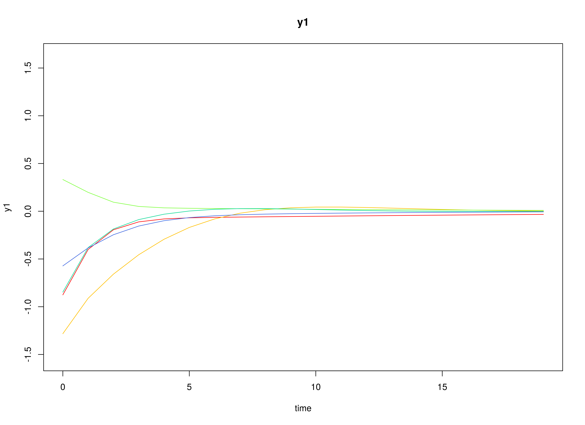

## Model

The measurement model is given by
\begin{equation}
  \mathbf{y}_{i, t}
  =
  \boldsymbol{\eta}_{i, t}
\end{equation}
where $\mathbf{y}_{i, t}$
represents a vector of observed variables
and $\boldsymbol{\eta}_{i, t}$
a vector of latent variables
for individual $i$ and time $t$.
Since the observed and latent variables are equal,
we only generate data
from the dynamic structure.

The dynamic structure is given by
\begin{equation}
  \boldsymbol{\eta}_{i, t}
  =
  \boldsymbol{\alpha}
  +
  \boldsymbol{\beta}
  \boldsymbol{\eta}_{i, t - 1}
  +
  \boldsymbol{\zeta}_{i, t},
  \quad
  \mathrm{with}
  \quad
  \boldsymbol{\zeta}_{i, t}
  \sim
  \mathcal{N}
  \left(
  \mathbf{0},
  \boldsymbol{\Psi}
  \right)
\end{equation}
where
$\boldsymbol{\eta}_{i, t}$,
$\boldsymbol{\eta}_{i, t - 1}$,
and
$\boldsymbol{\zeta}_{i, t}$
are random variables,
and
$\boldsymbol{\alpha}$,
$\boldsymbol{\beta}$,
and
$\boldsymbol{\Psi}$
are model parameters.
Here,
$\boldsymbol{\eta}_{i, t}$
is a vector of latent variables
at time $t$ and individual $i$,
$\boldsymbol{\eta}_{i, t - 1}$
represents a vector of latent variables
at time $t - 1$ and individual $i$,
and
$\boldsymbol{\zeta}_{i, t}$
represents a vector of dynamic noise
at time $t$ and individual $i$.
$\boldsymbol{\alpha}$
denotes a vector of intercepts,
$\boldsymbol{\beta}$
a matrix of autoregression
and cross regression coefficients,
and
$\boldsymbol{\Psi}$
the covariance matrix of
$\boldsymbol{\zeta}_{i, t}$.

An alternative representation of the dynamic noise
is given by
\begin{equation}
  \boldsymbol{\zeta}_{i, t}
  =
  \boldsymbol{\Psi}^{\frac{1}{2}}
  \mathbf{z}_{i, t},
  \quad
  \mathrm{with}
  \quad
  \mathbf{z}_{i, t}
  \sim
  \mathcal{N}
  \left(
  \mathbf{0},
  \mathbf{I}
  \right)
\end{equation}
where
$\left( \boldsymbol{\Psi}^{\frac{1}{2}} \right) \left( \boldsymbol{\Psi}^{\frac{1}{2}} \right)^{\prime} = \boldsymbol{\Psi}$ .

## Data Generation

### Notation

Let $t = 1000$ be the number of time points and $n = 100$ be the number of individuals.

Let the initial condition
$\boldsymbol{\eta}_{0}$
be given by

\begin{equation}
\boldsymbol{\eta}_{0} \sim \mathcal{N} \left( \boldsymbol{\mu}_{\boldsymbol{\eta} \mid 0}, \boldsymbol{\Sigma}_{\boldsymbol{\eta} \mid 0} \right)
\end{equation}

\begin{equation}
\boldsymbol{\mu}_{\boldsymbol{\eta} \mid 0}
=
\left(
\begin{array}{c}
  0 \\
  0 \\
  0 \\
\end{array}
\right)
\end{equation}

\begin{equation}
\boldsymbol{\Sigma}_{\boldsymbol{\eta} \mid 0}
=
\left(
\begin{array}{ccc}
  1 & 0 & 0 \\
  0 & 1 & 0 \\
  0 & 0 & 1 \\
\end{array}
\right) .
\end{equation}

Let the constant vector $\boldsymbol{\alpha}$ be given by

\begin{equation}
\boldsymbol{\alpha}
=
\left(
\begin{array}{c}
  0 \\
  0 \\
  0 \\
\end{array}
\right) .
\end{equation}

Let the transition matrix $\boldsymbol{\beta}$ be normally distributed with the following means

\begin{equation}
\left(
\begin{array}{ccc}
  0.7 & 0 & 0 \\
  0.5 & 0.6 & 0 \\
  -0.1 & 0.4 & 0.5 \\
\end{array}
\right)
\end{equation}

and covariance matrix

\begin{equation}
\left(
\begin{array}{ccc}
  0.01 & 0 & 0 & 0 & 0 & 0 & 0 & 0 & 0 \\
  0 & 0.01 & 0 & 0 & 0 & 0 & 0 & 0 & 0 \\
  0 & 0 & 0.01 & 0 & 0 & 0 & 0 & 0 & 0 \\
  0 & 0 & 0 & 0.01 & 0 & 0 & 0 & 0 & 0 \\
  0 & 0 & 0 & 0 & 0.01 & 0 & 0 & 0 & 0 \\
  0 & 0 & 0 & 0 & 0 & 0.01 & 0 & 0 & 0 \\
  0 & 0 & 0 & 0 & 0 & 0 & 0.01 & 0 & 0 \\
  0 & 0 & 0 & 0 & 0 & 0 & 0 & 0.01 & 0 \\
  0 & 0 & 0 & 0 & 0 & 0 & 0 & 0 & 0.01 \\
\end{array}
\right) .
\end{equation}

The `SimBetaN` function from the `simStateSpace` package generates random transition matrices from the multivariate normal distribution. Note that the function generates transition matrices that are weakly stationary.

Let the dynamic process noise $\boldsymbol{\Psi}$ be given by

\begin{equation}
\boldsymbol{\Psi}
=
\left(
\begin{array}{ccc}
  0.1 & 0 & 0 \\
  0 & 0.1 & 0 \\
  0 & 0 & 0.1 \\
\end{array}
\right) .
\end{equation}

### R Function Arguments


``` r
n
#> [1] 100
```

``` r
time
#> [1] 1000
```

``` r
mu0
#> [[1]]
#> [1] 0 0 0
```

``` r
sigma0
#>      [,1] [,2] [,3]
#> [1,]    1    0    0
#> [2,]    0    1    0
#> [3,]    0    0    1
```

``` r
sigma0_l
#> [[1]]
#>      [,1] [,2] [,3]
#> [1,]    1    0    0
#> [2,]    0    1    0
#> [3,]    0    0    1
```

``` r
alpha
#> [[1]]
#> [1] 0 0 0
```

``` r
# first beta in the list of length n
beta[[1]]
#>           [,1]       [,2]       [,3]
#> [1,] 0.6468498 0.02987347 0.09881764
#> [2,] 0.5821253 0.64048586 0.12907652
#> [3,] 0.1217450 0.33748281 0.46598132
```

``` r
psi
#>      [,1] [,2] [,3]
#> [1,]  0.1  0.0  0.0
#> [2,]  0.0  0.1  0.0
#> [3,]  0.0  0.0  0.1
```

``` r
psi_l
#> [[1]]
#>           [,1]      [,2]      [,3]
#> [1,] 0.3162278 0.0000000 0.0000000
#> [2,] 0.0000000 0.3162278 0.0000000
#> [3,] 0.0000000 0.0000000 0.3162278
```

### Visualizing the Dynamics Without Process Noise (n = 5 with Different Initial Condition)



### Using the `SimSSMVARIVary` Function from the `simStateSpace` Package to Simulate Data


``` r
library(simStateSpace)
sim <- SimSSMVARIVary(
  n = n,
  time = time,
  mu0 = mu0,
  sigma0_l = sigma0_l,
  alpha = alpha,
  beta = beta,
  psi_l = psi_l
)
data <- as.data.frame(sim)
head(data)
#>   id time          y1          y2          y3
#> 1  1    0  0.12737218 -0.28403507  0.22062143
#> 2  1    1 -0.04069348  0.05095369 -0.07975035
#> 3  1    2  0.19969250  0.55992657  0.29151437
#> 4  1    3  0.30608587  0.57340773  0.16515764
#> 5  1    4  0.44578809  0.94059304  0.46087071
#> 6  1    5  0.76944181  0.88267985  0.42186579
```

``` r
plot(sim)
```


## Model Fitting

The `FitDTVARIDMx` function from the `fitDTVARMx` package fits a DT-VAR model on each individual $i$.


``` r
library(fitDTVARMx)
#> Loading required package: OpenMx
#> To take full advantage of multiple cores, use:
#>   mxOption(key='Number of Threads', value=parallel::detectCores()) #now
#>   Sys.setenv(OMP_NUM_THREADS=parallel::detectCores()) #before library(OpenMx)
```

``` r
fit <- FitDTVARIDMx(
  data = data,
  observed = paste0("y", seq_len(k)),
  id = "id",
  beta_start = beta_mu,
  psi_start = psi,
  ncores = parallel::detectCores()
)
fit
#> 
#> Means of the estimated paramaters per individual.
#>      beta_11      beta_21      beta_31      beta_12      beta_22      beta_32 
#>  0.680538197  0.491146814 -0.096286416 -0.003674982  0.584713524  0.385652910 
#>      beta_13      beta_23      beta_33       psi_11       psi_22       psi_33 
#>  0.008386859 -0.011648323  0.492088875  0.099910448  0.099401607  0.099618299
```

## Multivariate Meta-Analysis

The `MetaVAR` function performs multivariate meta-analysis using the estimated transition matrices $\boldsymbol{\beta}$
and the corresponding sampling variance-covariance matrix for each individual $i$.


``` r
library(metaVAR)
meta <- MetaVAR(
  object = fit,
  ncores = parallel::detectCores()
)
#> Running Model with 54 parameters
#> 
#> Beginning initial fit attempt
#> Running Model with 54 parameters
#> 
#>  Lowest minimum so far:  -324004.726821384
#> 
#> Solution found
```



```
#> 
#>  Solution found!  Final fit=-324004.73 (started at 15426.445)  (1 attempt(s): 1 valid, 0 errors)
#>  Start values from best fit:
#> 0.101883198984649,-0.00286282921946523,-0.0361137412733438,-0.0288769759932819,-0.0131109161960623,-0.00804106395396702,0.0117385082037977,0.00787285143076008,-0.00409087176159637,0.111464638668266,0.00444687300040865,-0.00648040110250496,-0.00244628220337612,0.00760808665294777,-0.0063603846815441,-0.0135707174185174,-0.00107973944791772,0.104972058603052,-0.00180589972811345,-0.00327745249486331,-0.0139484291201538,0.00378979328537181,0.00787117457862378,0.0118466310609507,0.0919808589882831,0.00850373350094732,-0.00642087567549557,-0.00733466439800906,0.00533455043050436,0.000337590002483048,0.084441706925708,-0.0145792078618907,-0.00254857612130794,0.00166288686129708,-0.00168548688435295,0.105393664176534,-0.00269088627571512,0.0110588921941482,-0.00715392339343568,0.101605620488083,-0.00284475639136798,-0.0171261355848431,0.108442888837014,-0.00921727784342988,0.0951702586181485,0.68053805562744,0.491146907727121,-0.0962863359993057,-0.00367486620063222,0.584713522127033,0.385652830945664,0.00838669647271577,-0.0116484501378142,0.492088952981339
```

``` r
summary(meta)
#> $estimates
#>                           est     se        z      p    2.5%   97.5%
#> mu_beta_11             0.6805 0.0010 667.9596 0.0000  0.6785  0.6825
#> mu_beta_21             0.4911 0.0011 440.4853 0.0000  0.4890  0.4933
#> mu_beta_31            -0.0963 0.0011 -86.6668 0.0000 -0.0985 -0.0941
#> mu_beta_12            -0.0037 0.0010  -3.8026 0.0001 -0.0056 -0.0018
#> mu_beta_22             0.5847 0.0009 680.1137 0.0000  0.5830  0.5864
#> mu_beta_32             0.3857 0.0011 356.8610 0.0000  0.3835  0.3878
#> mu_beta_13             0.0084 0.0010   8.1521 0.0000  0.0064  0.0104
#> mu_beta_23            -0.0116 0.0011 -10.5333 0.0000 -0.0138 -0.0095
#> mu_beta_33             0.4921 0.0010 500.9848 0.0000  0.4902  0.4940
#> sigma_beta_11_beta_11  0.0104 0.0001  70.7106 0.0000  0.0101  0.0107
#> sigma_beta_21_beta_11 -0.0003 0.0001  -2.5667 0.0103 -0.0005 -0.0001
#> sigma_beta_31_beta_11 -0.0037 0.0001 -30.9135 0.0000 -0.0039 -0.0034
#> sigma_beta_12_beta_11 -0.0029 0.0001 -28.6297 0.0000 -0.0031 -0.0027
#> sigma_beta_22_beta_11 -0.0013 0.0001 -15.0758 0.0000 -0.0015 -0.0012
#> sigma_beta_32_beta_11 -0.0008 0.0001  -7.4202 0.0000 -0.0010 -0.0006
#> sigma_beta_13_beta_11  0.0012 0.0001  11.3366 0.0000  0.0010  0.0014
#> sigma_beta_23_beta_11  0.0008 0.0001   7.1011 0.0000  0.0006  0.0010
#> sigma_beta_33_beta_11 -0.0004 0.0001  -4.1612 0.0000 -0.0006 -0.0002
#> sigma_beta_21_beta_21  0.0124 0.0002  70.7106 0.0000  0.0121  0.0128
#> sigma_beta_31_beta_21  0.0006 0.0001   4.8302 0.0000  0.0004  0.0008
#> sigma_beta_12_beta_21 -0.0006 0.0001  -5.9258 0.0000 -0.0009 -0.0004
#> sigma_beta_22_beta_21 -0.0002 0.0001  -2.4522 0.0142 -0.0004  0.0000
#> sigma_beta_32_beta_21  0.0009 0.0001   7.2100 0.0000  0.0006  0.0011
#> sigma_beta_13_beta_21 -0.0007 0.0001  -6.4599 0.0000 -0.0010 -0.0005
#> sigma_beta_23_beta_21 -0.0015 0.0001 -12.3548 0.0000 -0.0018 -0.0013
#> sigma_beta_33_beta_21 -0.0001 0.0001  -0.9919 0.3212 -0.0003  0.0001
#> sigma_beta_31_beta_31  0.0123 0.0002  70.7106 0.0000  0.0120  0.0127
#> sigma_beta_12_beta_31  0.0008 0.0001   7.6563 0.0000  0.0006  0.0010
#> sigma_beta_22_beta_31  0.0001 0.0001   1.2412 0.2145 -0.0001  0.0003
#> sigma_beta_32_beta_31 -0.0011 0.0001  -9.4522 0.0000 -0.0014 -0.0009
#> sigma_beta_13_beta_31 -0.0001 0.0001  -0.4758 0.6342 -0.0003  0.0002
#> sigma_beta_23_beta_31  0.0005 0.0001   3.9167 0.0001  0.0002  0.0007
#> sigma_beta_33_beta_31  0.0014 0.0001  12.6041 0.0000  0.0012  0.0016
#> sigma_beta_12_beta_12  0.0093 0.0001  70.7107 0.0000  0.0091  0.0096
#> sigma_beta_22_beta_12  0.0012 0.0001  14.0910 0.0000  0.0010  0.0013
#> sigma_beta_32_beta_12 -0.0004 0.0001  -3.6601 0.0003 -0.0006 -0.0002
#> sigma_beta_13_beta_12 -0.0010 0.0001  -9.8019 0.0000 -0.0012 -0.0008
#> sigma_beta_23_beta_12  0.0003 0.0001   3.1523 0.0016  0.0001  0.0005
#> sigma_beta_33_beta_12  0.0001 0.0001   1.4198 0.1557 -0.0001  0.0003
#> sigma_beta_22_beta_22  0.0074 0.0001  70.7107 0.0000  0.0072  0.0076
#> sigma_beta_32_beta_22 -0.0012 0.0001 -12.3173 0.0000 -0.0013 -0.0010
#> sigma_beta_13_beta_22 -0.0004 0.0001  -4.8373 0.0000 -0.0006 -0.0003
#> sigma_beta_23_beta_22  0.0001 0.0001   0.9462 0.3441 -0.0001  0.0003
#> sigma_beta_33_beta_22 -0.0001 0.0001  -1.4446 0.1486 -0.0003  0.0000
#> sigma_beta_32_beta_32  0.0117 0.0002  70.7108 0.0000  0.0114  0.0120
#> sigma_beta_13_beta_32 -0.0004 0.0001  -3.5506 0.0004 -0.0006 -0.0002
#> sigma_beta_23_beta_32  0.0008 0.0001   6.9341 0.0000  0.0006  0.0011
#> sigma_beta_33_beta_32 -0.0009 0.0001  -8.1885 0.0000 -0.0011 -0.0007
#> sigma_beta_13_beta_13  0.0106 0.0001  70.7106 0.0000  0.0103  0.0109
#> sigma_beta_23_beta_13 -0.0002 0.0001  -1.3500 0.1770 -0.0004  0.0001
#> sigma_beta_33_beta_13 -0.0017 0.0001 -16.7352 0.0000 -0.0019 -0.0015
#> sigma_beta_23_beta_23  0.0122 0.0002  70.7106 0.0000  0.0119  0.0126
#> sigma_beta_33_beta_23 -0.0010 0.0001  -8.7603 0.0000 -0.0012 -0.0007
#> sigma_beta_33_beta_33  0.0096 0.0001  70.7107 0.0000  0.0094  0.0099
#> 
#> $heterogeneity
#> beta_11 beta_21 beta_31 beta_12 beta_22 beta_32 beta_13 beta_23 beta_33 
#>  0.9441  0.9530  0.9526  0.9553  0.9445  0.9639  0.9576  0.9634  0.9540
```

The `coef` and `vcov` functions extract the estimated mean vector and covariance matrix from the output of the `MetaVAR` function.


``` r
coef(meta)
#>      beta_11      beta_21      beta_31      beta_12      beta_22      beta_32 
#>  0.680538056  0.491146908 -0.096286336 -0.003674866  0.584713522  0.385652831 
#>      beta_13      beta_23      beta_33 
#>  0.008386696 -0.011648450  0.492088953
```

``` r
vcov(meta)
#>               beta_11       beta_21       beta_31       beta_12       beta_22
#> beta_11  0.0103801862 -0.0002916742 -3.679383e-03 -0.0029420787 -1.335782e-03
#> beta_21 -0.0002916742  0.0124325615  5.990566e-04 -0.0006396657 -2.351396e-04
#> beta_31 -0.0036793835  0.0005990566  1.234311e-02  0.0008244691  1.185650e-04
#> beta_12 -0.0029420787 -0.0006396657  8.244691e-04  0.0093396150  1.182556e-03
#> beta_22 -0.0013357821 -0.0002351396  1.185650e-04  0.0011825560  7.391337e-03
#> beta_32 -0.0008192493  0.0008710528 -1.139970e-03 -0.0003825100 -1.153165e-03
#> beta_13  0.0011959568 -0.0007425633 -5.438287e-05 -0.0009792475 -4.283423e-04
#> beta_23  0.0008021113 -0.0015351937  4.815880e-04  0.0003370615  8.996071e-05
#> beta_33 -0.0004167911 -0.0001086413  1.386500e-03  0.0001347871 -1.220050e-04
#>               beta_32       beta_13       beta_23       beta_33
#> beta_11 -0.0008192493  1.195957e-03  8.021113e-04 -0.0004167911
#> beta_21  0.0008710528 -7.425633e-04 -1.535194e-03 -0.0001086413
#> beta_31 -0.0011399702 -5.438287e-05  4.815880e-04  0.0013865005
#> beta_12 -0.0003825100 -9.792475e-04  3.370615e-04  0.0001347871
#> beta_22 -0.0011531651 -4.283423e-04  8.996071e-05 -0.0001220050
#> beta_32  0.0116787058 -3.949933e-04  8.306973e-04 -0.0008721344
#> beta_13 -0.0003949933  1.058385e-02 -1.536060e-04 -0.0017152986
#> beta_23  0.0008306973 -1.536060e-04  1.222958e-02 -0.0009552520
#> beta_33 -0.0008721344 -1.715299e-03 -9.552520e-04  0.0096480180
```

<!--
The following shows the difference between the estimated mean vector and covariance matrix and the population values.


``` r
tol <- 0.1
all(abs(coef(meta) - c(beta_mu)) <= tol)
#> [1] TRUE
```

``` r
all(abs(c(vcov(meta)) - c(beta_sigma)) <= tol)
#> [1] TRUE
```
-->

## References


