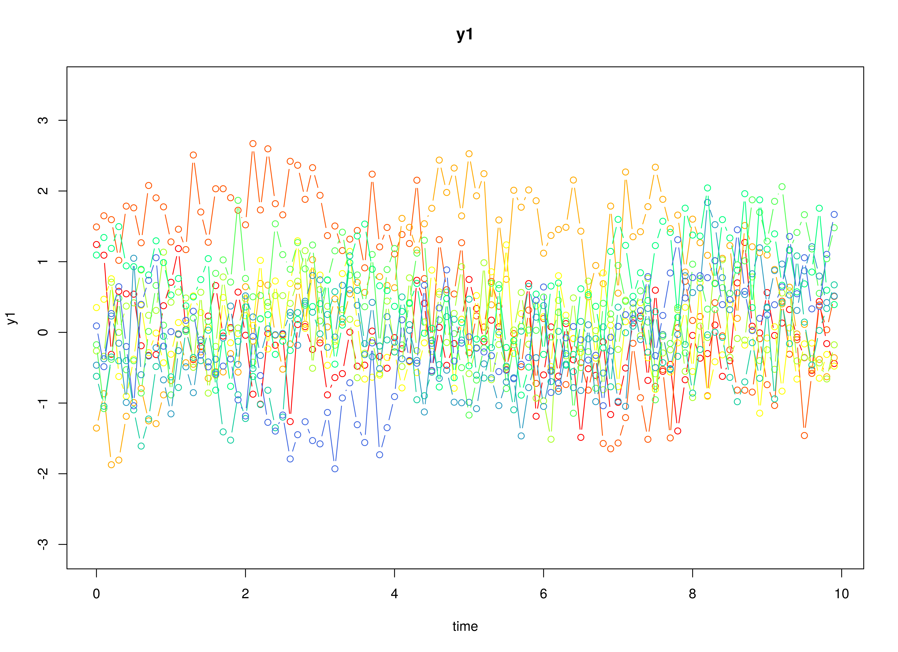

## Model

The measurement model is given by
\begin{equation}
  \mathbf{y}_{i, t}
  =
  \boldsymbol{\nu}
  +
  \boldsymbol{\Lambda}
  \boldsymbol{\eta}_{i, t}
  +
  \boldsymbol{\varepsilon}_{i, t},
  \quad
  \mathrm{with}
  \quad
  \boldsymbol{\varepsilon}_{i, t}
  \sim
  \mathcal{N}
  \left(
  \mathbf{0},
  \boldsymbol{\Theta}
  \right)
\end{equation}
where
$\mathbf{y}_{i, t}$,
$\boldsymbol{\eta}_{i, t}$,
and
$\boldsymbol{\varepsilon}_{i, t}$
are random variables
and
$\boldsymbol{\nu}$,
$\boldsymbol{\Lambda}$,
and
$\boldsymbol{\Theta}$
are model parameters.
$\mathbf{y}_{i, t}$
represents a vector of observed random variables,
$\boldsymbol{\eta}_{i, t}$
a vector of latent random variables,
and
$\boldsymbol{\varepsilon}_{i, t}$
a vector of random measurement errors,
at time $t$ and individual $i$.
$\boldsymbol{\nu}$
denotes a vector of intercepts,
$\boldsymbol{\Lambda}$
a matrix of factor loadings,
and
$\boldsymbol{\Theta}$
the covariance matrix of
$\boldsymbol{\varepsilon}$.

An alternative representation of the measurement error
is given by
\begin{equation}
  \boldsymbol{\varepsilon}_{i, t}
  =
  \boldsymbol{\Theta}^{\frac{1}{2}}
  \mathbf{z}_{i, t},
  \quad
  \mathrm{with}
  \quad
  \mathbf{z}_{i, t}
  \sim
  \mathcal{N}
  \left(
  \mathbf{0},
  \mathbf{I}
  \right)
\end{equation}
where
$\mathbf{z}_{i, t}$ is a vector of
independent standard normal random variables and
$\left( \boldsymbol{\Theta}^{\frac{1}{2}} \right) \left( \boldsymbol{\Theta}^{\frac{1}{2}} \right)^{\prime} = \boldsymbol{\Theta}$ .

The dynamic structure is given by
\begin{equation}
  \mathrm{d} \boldsymbol{\eta}_{i, t}
  =
  \boldsymbol{\Phi}
  \left(
  \boldsymbol{\eta}_{i, t}
  -
  \boldsymbol{\mu}
  \right)
  \mathrm{d}t
  +
  \boldsymbol{\Sigma}^{\frac{1}{2}}
  \mathrm{d}
  \mathbf{W}_{i, t}
\end{equation}
where
$\boldsymbol{\mu}$
is the long-term mean or equilibrium level,
$\boldsymbol{\Phi}$
is the rate of mean reversion,
determining how quickly the variable returns to its mean,
$\boldsymbol{\Sigma}$
is the matrix of volatility
or randomness in the process, and
$\mathrm{d}\boldsymbol{W}$
is a Wiener process or Brownian motion,
which represents random fluctuations.

## Data Generation

### Notation

Let $t = 100$ be the number of time points and $n = 100$ be the number of individuals.

Let the measurement model intecept vector $\boldsymbol{\nu}$ be given by

\begin{equation}
\boldsymbol{\nu}
=
\left(
\begin{array}{c}
  0 \\
  0 \\
  0 \\
\end{array}
\right) .
\end{equation}

Let the factor loadings matrix $\boldsymbol{\Lambda}$ be given by

\begin{equation}
\boldsymbol{\Lambda}
=
\left(
\begin{array}{ccc}
  1 & 0 & 0 \\
  0 & 1 & 0 \\
  0 & 0 & 1 \\
\end{array}
\right) .
\end{equation}

Let the measurement error covariance matrix $\boldsymbol{\Theta}$ be given by

\begin{equation}
\boldsymbol{\Theta}
=
\left(
\begin{array}{ccc}
  0.2 & 0 & 0 \\
  0 & 0.2 & 0 \\
  0 & 0 & 0.2 \\
\end{array}
\right) .
\end{equation}

Let the initial condition
$\boldsymbol{\eta}_{0}$
be given by

\begin{equation}
\boldsymbol{\eta}_{0} \sim \mathcal{N} \left( \boldsymbol{\mu}_{\boldsymbol{\eta} \mid 0}, \boldsymbol{\Sigma}_{\boldsymbol{\eta} \mid 0} \right)
\end{equation}

\begin{equation}
\boldsymbol{\mu}_{\boldsymbol{\eta} \mid 0}
=
\left(
\begin{array}{c}
  0 \\
  0 \\
  0 \\
\end{array}
\right)
\end{equation}

\begin{equation}
\boldsymbol{\Sigma}_{\boldsymbol{\eta} \mid 0}
=
\left(
\begin{array}{ccc}
  0.01 & 0 & 0 \\
  0 & 0.01 & 0 \\
  0 & 0 & 0.01 \\
\end{array}
\right) .
\end{equation}

Let the long-term mean vector $\boldsymbol{\mu}$ be given by

\begin{equation}
\boldsymbol{\mu}
=
\left(
\begin{array}{c}
  0 \\
  0 \\
  0 \\
\end{array}
\right) .
\end{equation}

Let the drift matrix $\boldsymbol{\Phi}$ be normally distributed with the following means

\begin{equation}
\left(
\begin{array}{ccc}
  -0.357 & 0 & 0 \\
  0.771 & -0.511 & 0 \\
  -0.45 & 0.729 & -0.693 \\
\end{array}
\right)
\end{equation}

and covariance matrix

\begin{equation}
\left(
\begin{array}{ccc}
  0.01 & 0 & 0 & 0 & 0 & 0 & 0 & 0 & 0 \\
  0 & 0.01 & 0 & 0 & 0 & 0 & 0 & 0 & 0 \\
  0 & 0 & 0.01 & 0 & 0 & 0 & 0 & 0 & 0 \\
  0 & 0 & 0 & 0.01 & 0 & 0 & 0 & 0 & 0 \\
  0 & 0 & 0 & 0 & 0.01 & 0 & 0 & 0 & 0 \\
  0 & 0 & 0 & 0 & 0 & 0.01 & 0 & 0 & 0 \\
  0 & 0 & 0 & 0 & 0 & 0 & 0.01 & 0 & 0 \\
  0 & 0 & 0 & 0 & 0 & 0 & 0 & 0.01 & 0 \\
  0 & 0 & 0 & 0 & 0 & 0 & 0 & 0 & 0.01 \\
\end{array}
\right) .
\end{equation}

> **_NOTE:_**  This example depends on the development version of simStateSpace (1.2.1.9000).

The SimPhiN function from the simStateSpace package generates random drift matrices from the multivariate normal distribution. Note that the function generates drift matrices that are stable.

Let the dynamic process noise covariance matrix $\boldsymbol{\Sigma}$ be given by

\begin{equation}
\boldsymbol{\Sigma}
=
\left(
\begin{array}{ccc}
  0.1 & 0 & 0 \\
  0 & 0.1 & 0 \\
  0 & 0 & 0.1 \\
\end{array}
\right) .
\end{equation}

Let $\Delta t = 0.1$.

### R Function Arguments


``` r
n
#> [1] 100
```

``` r
time
#> [1] 100
```

``` r
delta_t
#> [1] 0.1
```

``` r
mu0
#> [[1]]
#> [1] 0 0 0
```

``` r
sigma0
#>      [,1] [,2] [,3]
#> [1,] 0.01 0.00 0.00
#> [2,] 0.00 0.01 0.00
#> [3,] 0.00 0.00 0.01
```

``` r
sigma0_l
#> [[1]]
#>      [,1] [,2] [,3]
#> [1,]  0.1  0.0  0.0
#> [2,]  0.0  0.1  0.0
#> [3,]  0.0  0.0  0.1
```

``` r
mu
#> [[1]]
#> [1] 0 0 0
```

``` r
# first phi in the list of length n
phi[[1]]
#>            [,1]        [,2]        [,3]
#> [1,] -0.4101502  0.02987347  0.09881764
#> [2,]  0.8531253 -0.47051414  0.12907652
#> [3,] -0.2282550  0.66648281 -0.72701868
```

``` r
sigma
#>      [,1] [,2] [,3]
#> [1,]  0.1  0.0  0.0
#> [2,]  0.0  0.1  0.0
#> [3,]  0.0  0.0  0.1
```

``` r
sigma_l
#> [[1]]
#>           [,1]      [,2]      [,3]
#> [1,] 0.3162278 0.0000000 0.0000000
#> [2,] 0.0000000 0.3162278 0.0000000
#> [3,] 0.0000000 0.0000000 0.3162278
```

``` r
nu
#> [[1]]
#> [1] 0 0 0
```

``` r
lambda
#> [[1]]
#>      [,1] [,2] [,3]
#> [1,]    1    0    0
#> [2,]    0    1    0
#> [3,]    0    0    1
```

``` r
theta
#>      [,1] [,2] [,3]
#> [1,]  0.2  0.0  0.0
#> [2,]  0.0  0.2  0.0
#> [3,]  0.0  0.0  0.2
```

``` r
theta_l
#> [[1]]
#>           [,1]      [,2]      [,3]
#> [1,] 0.4472136 0.0000000 0.0000000
#> [2,] 0.0000000 0.4472136 0.0000000
#> [3,] 0.0000000 0.0000000 0.4472136
```

### Visualizing the Dynamics Without Process Noise (n = 5 with Different Initial Condition)


### Using the SimSSMVARIVary Function from the simStateSpace Package to Simulate Data


``` r
library(simStateSpace)
sim <- SimSSMOUIVary(
  n = n,
  time = time,
  delta_t = delta_t,
  mu0 = mu0,
  sigma0_l = sigma0_l,
  mu = mu,
  phi = phi,
  sigma_l = sigma_l,
  nu = nu,
  lambda = lambda,
  theta_l = theta_l
)
data <- as.data.frame(sim)
head(data)
#>   id time         y1          y2          y3
#> 1  1  0.0  0.2498385  0.07906124 -0.16629221
#> 2  1  0.1  0.5633032  0.01741791  0.14494905
#> 3  1  0.2 -0.2225339 -0.43546978  0.26119933
#> 4  1  0.3 -0.3063337  0.18457080 -0.62072064
#> 5  1  0.4  0.3347948  0.03868089  0.05410158
#> 6  1  0.5  0.5684380  0.33269594  0.39418663
```

``` r
plot(sim)
```



## Model Fitting

The FitCTVAR function fits a CT-VAR model on each individual $i$.


``` r
library(metaVAR)
fit <- FitCTVAR(
  data = data,
  observed = paste0("y", seq_len(k)),
  id = "id",
  time = "time",
  ncores = parallel::detectCores()
)
```

## Multivariate Meta-Analysis

The Meta function performs multivariate meta-analysis using the estimated drift matrices $\boldsymbol{\Phi}$
and the corresponding sampling variance-covariance matrix for each individual $i$.


``` r
meta <- Meta(
  fit,
  ncores = parallel::detectCores()
)
#> Running Model with 54 parameters
#> 
#> Beginning initial fit attempt
#> Running Model with 54 parameters
#> 
#>  Lowest minimum so far:  319959.685199841
#> 
#> Solution found
```



```
#> 
#>  Solution found!  Final fit=319959.69 (started at 4390996.3)  (1 attempt(s): 1 valid, 0 errors)
#>  Start values from best fit:
#> 2.57045041198161,0.468930980785761,-0.257886492262304,-0.66936204825407,0.0784236354916846,0.152774198312384,0.37398966078404,-0.00976069102585751,-0.146573050430463,5.62833139918228,-2.10996267631426,-3.9019916992487,0.044871052757345,0.650732427923535,1.6430092493141,-0.245643663015824,-0.121719665010525,5.22531273576206,0.624805441252129,-0.264687534883276,-1.7319366038225,-3.11317199471195,1.92875005960373,0.32077193697664,3.36295308640622,0.264141173675346,0.380519949505941,-0.0263904148146097,-0.258067688163512,0.0068428616771322,2.94310588868953,0.493251739005763,0.143370790528556,-0.496025216888125,-0.0340433280944094,3.78623237854051,0.333249676264271,-1.7569108922083,-0.107235460620243,3.55465663533645,-0.181202831076479,-0.139898184135355,3.51039609602785,0.0353200447563189,2.78691618958451,-9.6193275115745,1.89961715171848,-0.736353451055666,1.26514556260112,-8.7418562213028,1.34585402962534,-0.0718892173122352,1.47643596241372,-9.10743118282062
```

``` r
summary(meta)
#>               est     se         z      p     2.5%    97.5%
#> sigma_11   6.6072 0.0934   70.7094 0.0000   6.4241   6.7904
#> sigma_21   1.2054 0.1463    8.2370 0.0000   0.9186   1.4922
#> sigma_31  -0.6629 0.1452   -4.5654 0.0000  -0.9475  -0.3783
#> sigma_41  -1.7206 0.1362  -12.6354 0.0000  -1.9875  -1.4537
#> sigma_51   0.2016 0.0763    2.6416 0.0083   0.0520   0.3511
#> sigma_61   0.3927 0.1095    3.5861 0.0003   0.1781   0.6073
#> sigma_71   0.9613 0.1297    7.4103 0.0000   0.7071   1.2156
#> sigma_81  -0.0251 0.1135   -0.2211 0.8250  -0.2475   0.1973
#> sigma_91  -0.3768 0.0725   -5.1951 0.0000  -0.5189  -0.2346
#> sigma_22  31.8980 0.4512   70.6930 0.0000  31.0136  32.7824
#> sigma_32 -11.9965 0.3410  -35.1806 0.0000 -12.6648 -11.3282
#> sigma_42 -22.2756 0.3702  -60.1709 0.0000 -23.0012 -21.5500
#> sigma_52   0.2893 0.1677    1.7250 0.0845  -0.0394   0.6181
#> sigma_62   3.7342 0.2439   15.3089 0.0000   3.2561   4.2123
#> sigma_72   9.4228 0.2997   31.4398 0.0000   8.8354  10.0102
#> sigma_82  -1.3871 0.2504   -5.5402 0.0000  -1.8779  -0.8964
#> sigma_92  -0.7538 0.1593   -4.7329 0.0000  -1.0660  -0.4416
#> sigma_33  31.8223 0.4503   70.6765 0.0000  30.9399  32.7048
#> sigma_43  11.6705 0.3179   36.7103 0.0000  11.0474  12.2936
#> sigma_53  -1.4980 0.1681   -8.9129 0.0000  -1.8274  -1.1686
#> sigma_63 -10.4623 0.2625  -39.8580 0.0000 -10.9768  -9.9479
#> sigma_73 -19.8304 0.3463  -57.2566 0.0000 -20.5093 -19.1516
#> sigma_83  10.5991 0.2711   39.0984 0.0000  10.0678  11.1305
#> sigma_93   1.9708 0.1601   12.3117 0.0000   1.6570   2.2845
#> sigma_44  27.3734 0.3873   70.6823 0.0000  26.6144  28.1325
#> sigma_54   0.4953 0.1555    3.1863 0.0014   0.1906   0.8000
#> sigma_64  -2.4439 0.2246  -10.8793 0.0000  -2.8841  -2.0036
#> sigma_74  -8.6952 0.2777  -31.3142 0.0000  -9.2395  -8.1510
#> sigma_84   1.3023 0.2318    5.6186 0.0000   0.8480   1.7565
#> sigma_94   0.7965 0.1476    5.3964 0.0000   0.5072   1.0858
#> sigma_55   8.8099 0.1246   70.7151 0.0000   8.5657   9.0540
#> sigma_65   2.0518 0.1282   16.0036 0.0000   1.8005   2.3031
#> sigma_75   1.3421 0.1498    8.9599 0.0000   1.0485   1.6356
#> sigma_85  -2.0503 0.1328  -15.4415 0.0000  -2.3106  -1.7901
#> sigma_95  -0.2002 0.0837   -2.3928 0.0167  -0.3643  -0.0362
#> sigma_66  18.1700 0.2570   70.6899 0.0000  17.6663  18.6738
#> sigma_76   7.8405 0.2284   34.3320 0.0000   7.3929   8.2882
#> sigma_86 -10.4968 0.2158  -48.6443 0.0000 -10.9197 -10.0738
#> sigma_96  -1.0774 0.1206   -8.9321 0.0000  -1.3138  -0.8410
#> sigma_77  25.2991 0.3579   70.6899 0.0000  24.5976  26.0005
#> sigma_87  -7.7057 0.2354  -32.7331 0.0000  -8.1671  -7.2443
#> sigma_97  -1.7915 0.1428  -12.5456 0.0000  -2.0714  -1.5116
#> sigma_88  19.5356 0.2764   70.6882 0.0000  18.9939  20.0773
#> sigma_98   1.0029 0.1250    8.0239 0.0000   0.7579   1.2478
#> sigma_99   7.9396 0.1123   70.7130 0.0000   7.7196   8.1597
#> mu_1      -9.6193 0.0257 -374.2367 0.0000  -9.6697  -9.5689
#> mu_2       1.8996 0.0565   33.6262 0.0000   1.7889   2.0103
#> mu_3      -0.7364 0.0565  -13.0227 0.0000  -0.8472  -0.6255
#> mu_4       1.2651 0.0523   24.1846 0.0000   1.1626   1.3677
#> mu_5      -8.7419 0.0297 -294.5161 0.0000  -8.8000  -8.6837
#> mu_6       1.3459 0.0426   31.5695 0.0000   1.2623   1.4294
#> mu_7      -0.0719 0.0504   -1.4260 0.1539  -0.1707   0.0269
#> mu_8       1.4764 0.0442   33.4024 0.0000   1.3898   1.5631
#> mu_9      -9.1074 0.0282 -323.2000 0.0000  -9.1627  -9.0522
```
