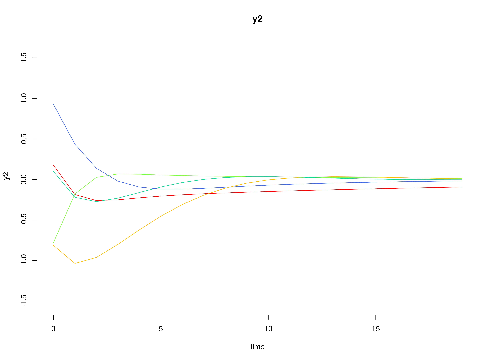

## Model

The measurement model is given by
\begin{equation}
  \mathbf{y}_{i, t}
  =
  \boldsymbol{\eta}_{i, t}
\end{equation}
where $\mathbf{y}_{i, t}$
represents a vector of observed variables
and $\boldsymbol{\eta}_{i, t}$
a vector of latent variables
for individual $i$ and time $t$.
Since the observed and latent variables are equal,
we only generate data
from the dynamic structure.

The dynamic structure is given by
\begin{equation}
  \boldsymbol{\eta}_{i, t}
  =
  \boldsymbol{\alpha}
  +
  \boldsymbol{\beta}
  \boldsymbol{\eta}_{i, t - 1}
  +
  \boldsymbol{\zeta}_{i, t},
  \quad
  \mathrm{with}
  \quad
  \boldsymbol{\zeta}_{i, t}
  \sim
  \mathcal{N}
  \left(
  \mathbf{0},
  \boldsymbol{\Psi}
  \right)
\end{equation}
where
$\boldsymbol{\eta}_{i, t}$,
$\boldsymbol{\eta}_{i, t - 1}$,
and
$\boldsymbol{\zeta}_{i, t}$
are random variables,
and
$\boldsymbol{\alpha}$,
$\boldsymbol{\beta}$,
and
$\boldsymbol{\Psi}$
are model parameters.
Here,
$\boldsymbol{\eta}_{i, t}$
is a vector of latent variables
at time $t$ and individual $i$,
$\boldsymbol{\eta}_{i, t - 1}$
represents a vector of latent variables
at time $t - 1$ and individual $i$,
and
$\boldsymbol{\zeta}_{i, t}$
represents a vector of dynamic noise
at time $t$ and individual $i$.
$\boldsymbol{\alpha}$
denotes a vector of intercepts,
$\boldsymbol{\beta}$
a matrix of autoregression
and cross regression coefficients,
and
$\boldsymbol{\Psi}$
the covariance matrix of
$\boldsymbol{\zeta}_{i, t}$.

An alternative representation of the dynamic noise
is given by
\begin{equation}
  \boldsymbol{\zeta}_{i, t}
  =
  \boldsymbol{\Psi}^{\frac{1}{2}}
  \mathbf{z}_{i, t},
  \quad
  \mathrm{with}
  \quad
  \mathbf{z}_{i, t}
  \sim
  \mathcal{N}
  \left(
  \mathbf{0},
  \mathbf{I}
  \right)
\end{equation}
where
$\left( \boldsymbol{\Psi}^{\frac{1}{2}} \right) \left( \boldsymbol{\Psi}^{\frac{1}{2}} \right)^{\prime} = \boldsymbol{\Psi}$ .

## Data Generation

### Notation

Let $t = 100$ be the number of time points and $n = 100$ be the number of individuals.

Let the initial condition
$\boldsymbol{\eta}_{0}$
be given by

\begin{equation}
\boldsymbol{\eta}_{0} \sim \mathcal{N} \left( \boldsymbol{\mu}_{\boldsymbol{\eta} \mid 0}, \boldsymbol{\Sigma}_{\boldsymbol{\eta} \mid 0} \right)
\end{equation}

\begin{equation}
\boldsymbol{\mu}_{\boldsymbol{\eta} \mid 0}
=
\left(
\begin{array}{c}
  0 \\
  0 \\
  0 \\
\end{array}
\right)
\end{equation}

\begin{equation}
\boldsymbol{\Sigma}_{\boldsymbol{\eta} \mid 0}
=
\left(
\begin{array}{ccc}
  0.01 & 0 & 0 \\
  0 & 0.01 & 0 \\
  0 & 0 & 0.01 \\
\end{array}
\right) .
\end{equation}

Let the constant vector $\boldsymbol{\alpha}$ be given by

\begin{equation}
\boldsymbol{\alpha}
=
\left(
\begin{array}{c}
  0 \\
  0 \\
  0 \\
\end{array}
\right) .
\end{equation}

Let the transition matrix $\boldsymbol{\beta}$ be normally distributed with the following means

\begin{equation}
\left(
\begin{array}{ccc}
  0.7 & 0 & 0 \\
  0.5 & 0.6 & 0 \\
  -0.1 & 0.4 & 0.5 \\
\end{array}
\right)
\end{equation}

and covariance matrix

\begin{equation}
\left(
\begin{array}{ccc}
  0.01 & 0 & 0 & 0 & 0 & 0 & 0 & 0 & 0 \\
  0 & 0.01 & 0 & 0 & 0 & 0 & 0 & 0 & 0 \\
  0 & 0 & 0.01 & 0 & 0 & 0 & 0 & 0 & 0 \\
  0 & 0 & 0 & 0.01 & 0 & 0 & 0 & 0 & 0 \\
  0 & 0 & 0 & 0 & 0.01 & 0 & 0 & 0 & 0 \\
  0 & 0 & 0 & 0 & 0 & 0.01 & 0 & 0 & 0 \\
  0 & 0 & 0 & 0 & 0 & 0 & 0.01 & 0 & 0 \\
  0 & 0 & 0 & 0 & 0 & 0 & 0 & 0.01 & 0 \\
  0 & 0 & 0 & 0 & 0 & 0 & 0 & 0 & 0.01 \\
\end{array}
\right) .
\end{equation}

> **_NOTE:_**  This example depends on the development version of simStateSpace (1.2.1.9000).

The SimBetaN function from the simStateSpace package generates random transition matrices from the multivariate normal distribution. Note that the function generates transition matrices that are weakly stationary.

Let the dynamic process noise $\boldsymbol{\Psi}$ be given by

\begin{equation}
\boldsymbol{\Psi}
=
\left(
\begin{array}{ccc}
  0.1 & 0 & 0 \\
  0 & 0.1 & 0 \\
  0 & 0 & 0.1 \\
\end{array}
\right) .
\end{equation}

### R Function Arguments


``` r
n
#> [1] 100
```

``` r
time
#> [1] 100
```

``` r
mu0
#> [[1]]
#> [1] 0 0 0
```

``` r
sigma0
#>      [,1] [,2] [,3]
#> [1,] 0.01 0.00 0.00
#> [2,] 0.00 0.01 0.00
#> [3,] 0.00 0.00 0.01
```

``` r
sigma0_l
#> [[1]]
#>      [,1] [,2] [,3]
#> [1,]  0.1  0.0  0.0
#> [2,]  0.0  0.1  0.0
#> [3,]  0.0  0.0  0.1
```

``` r
alpha
#> [[1]]
#> [1] 0 0 0
```

``` r
# first beta in the list of length n
beta[[1]]
#>           [,1]       [,2]       [,3]
#> [1,] 0.6468498 0.02987347 0.09881764
#> [2,] 0.5821253 0.64048586 0.12907652
#> [3,] 0.1217450 0.33748281 0.46598132
```

``` r
psi
#>      [,1] [,2] [,3]
#> [1,]  0.1  0.0  0.0
#> [2,]  0.0  0.1  0.0
#> [3,]  0.0  0.0  0.1
```

``` r
psi_l
#> [[1]]
#>           [,1]      [,2]      [,3]
#> [1,] 0.3162278 0.0000000 0.0000000
#> [2,] 0.0000000 0.3162278 0.0000000
#> [3,] 0.0000000 0.0000000 0.3162278
```

### Visualizing the Dynamics Without Process Noise (n = 5 with Different Initial Condition)



### Using the SimSSMVARIVary Function from the simStateSpace Package to Simulate Data


``` r
library(simStateSpace)
sim <- SimSSMVARIVary(
  n = n,
  time = time,
  mu0 = mu0,
  sigma0_l = sigma0_l,
  alpha = alpha,
  beta = beta,
  psi_l = psi_l
)
data <- as.data.frame(sim)
head(data)
#>   id time          y1          y2          y3
#> 1  1    0  0.01273722 -0.02840351  0.02206214
#> 2  1    1 -0.12682965  0.12232084 -0.09996024
#> 3  1    2  0.14411023  0.55288557  0.29569548
#> 4  1    3  0.27033532  0.53708190  0.15796288
#> 5  1    4  0.42086670  0.89558688  0.44090629
#> 6  1    5  0.75000409  0.83676974  0.39433988
```

``` r
plot(sim)
```


## Model Fitting

The FitDTVAR function fits a DT-VAR model on each individual $i$.


``` r
library(metaVAR)
fit <- FitDTVAR(
  data = data,
  observed = paste0("y", seq_len(k)),
  id = "id",
  ncores = parallel::detectCores()
)
```

## Multivariate Meta-Analysis

The Meta function performs multivariate meta-analysis using the estimated transition matrices $\boldsymbol{\beta}$
and the corresponding sampling variance-covariance matrix for each individual $i$.


``` r
meta <- Meta(
  fit,
  ncores = parallel::detectCores()
)
#> Running Model with 54 parameters
#> 
#> Beginning initial fit attempt
#> Running Model with 54 parameters
#> 
#>  Lowest minimum so far:  -263709.253762576
#> 
#> Solution found
```



```
#> 
#>  Solution found!  Final fit=-263709.25 (started at 15592.752)  (1 attempt(s): 1 valid, 0 errors)
#>  Start values from best fit:
#> 0.138930112538755,0.00214256439932022,-0.00720212468878862,-0.038670688772732,0.00276184943471816,-0.0131702335683732,0.0139264519053117,-0.00481822542362907,-0.0127800730623413,0.160980840593111,-0.00886950475351882,-0.000923811741368618,-0.0160620482395619,-0.00113101724438008,-0.00536118373064293,-0.00930294018571431,0.00466506983682121,0.163945931400279,0.00471452853587313,0.00139982842841324,-0.0263292121625236,0.0143855354819047,0.0124086084181042,0.0145902349829927,0.120344606305684,0.0034476089966316,0.00201758109151178,-0.0332004870458779,0.0033032276855519,0.00295564004852461,0.121708987108671,-0.0139364447838897,0.0105168598865447,-0.0265045147123335,-0.00112197106128337,0.136200475407804,-0.00552321090468321,0.0122954455460807,-0.0305164838828037,0.144338949891911,-0.00650875406326007,-0.0148500880703461,0.147142988763409,-0.00944254471506526,0.134269361382525,0.640600696995588,0.486085526037077,-0.102347804377842,0.0135888929693786,0.581217928353902,0.399397160946591,-0.0112398480654201,-0.00624687311079252,0.465320221682638
```

``` r
summary(meta)
#>              est     se        z      p    2.5%   97.5%
#> sigma_11  0.0193 0.0003  70.7107 0.0000  0.0188  0.0198
#> sigma_21  0.0003 0.0002   1.3307 0.1833 -0.0001  0.0007
#> sigma_31 -0.0010 0.0002  -4.3782 0.0000 -0.0014 -0.0006
#> sigma_41 -0.0054 0.0002 -29.2350 0.0000 -0.0057 -0.0050
#> sigma_51  0.0004 0.0002   2.2475 0.0246  0.0000  0.0007
#> sigma_61 -0.0018 0.0002  -9.3620 0.0000 -0.0022 -0.0014
#> sigma_71  0.0019 0.0002   9.2432 0.0000  0.0015  0.0023
#> sigma_81 -0.0007 0.0002  -3.1878 0.0014 -0.0011 -0.0003
#> sigma_91 -0.0018 0.0002  -9.0731 0.0000 -0.0022 -0.0014
#> sigma_22  0.0259 0.0004  70.7106 0.0000  0.0252  0.0266
#> sigma_32 -0.0014 0.0003  -5.4467 0.0000 -0.0020 -0.0009
#> sigma_42 -0.0002 0.0002  -1.1370 0.2555 -0.0006  0.0002
#> sigma_52 -0.0026 0.0002 -12.9337 0.0000 -0.0030 -0.0022
#> sigma_62 -0.0002 0.0002  -0.9326 0.3511 -0.0007  0.0002
#> sigma_72 -0.0008 0.0002  -3.4477 0.0006 -0.0013 -0.0004
#> sigma_82 -0.0015 0.0002  -6.1881 0.0000 -0.0020 -0.0010
#> sigma_92  0.0007 0.0002   3.2025 0.0014  0.0003  0.0012
#> sigma_33  0.0270 0.0004  70.7106 0.0000  0.0263  0.0278
#> sigma_43  0.0011 0.0002   5.0905 0.0000  0.0007  0.0015
#> sigma_53  0.0004 0.0002   1.7435 0.0812  0.0000  0.0007
#> sigma_63 -0.0042 0.0002 -17.9985 0.0000 -0.0047 -0.0038
#> sigma_73  0.0023 0.0002   9.3111 0.0000  0.0018  0.0028
#> sigma_83  0.0022 0.0002   8.6338 0.0000  0.0017  0.0026
#> sigma_93  0.0024 0.0002  10.5368 0.0000  0.0020  0.0029
#> sigma_44  0.0160 0.0002  70.7108 0.0000  0.0156  0.0164
#> sigma_54  0.0003 0.0002   2.1201 0.0340  0.0000  0.0006
#> sigma_64  0.0006 0.0002   3.5481 0.0004  0.0003  0.0010
#> sigma_74 -0.0045 0.0002 -22.8846 0.0000 -0.0048 -0.0041
#> sigma_84  0.0007 0.0002   3.4044 0.0007  0.0003  0.0010
#> sigma_94  0.0009 0.0002   5.1463 0.0000  0.0006  0.0013
#> sigma_55  0.0151 0.0002  70.7108 0.0000  0.0147  0.0155
#> sigma_65 -0.0017 0.0002 -10.0857 0.0000 -0.0021 -0.0014
#> sigma_75  0.0013 0.0002   7.0912 0.0000  0.0009  0.0017
#> sigma_85 -0.0031 0.0002 -16.2733 0.0000 -0.0034 -0.0027
#> sigma_95 -0.0002 0.0002  -1.2543 0.2097 -0.0006  0.0001
#> sigma_66  0.0196 0.0003  70.7108 0.0000  0.0191  0.0202
#> sigma_76 -0.0015 0.0002  -7.2242 0.0000 -0.0019 -0.0011
#> sigma_86  0.0018 0.0002   8.4670 0.0000  0.0014  0.0022
#> sigma_96 -0.0044 0.0002 -21.6451 0.0000 -0.0048 -0.0040
#> sigma_77  0.0225 0.0003  70.7107 0.0000  0.0219  0.0231
#> sigma_87 -0.0012 0.0002  -5.4390 0.0000 -0.0017 -0.0008
#> sigma_97 -0.0021 0.0002  -9.8262 0.0000 -0.0025 -0.0017
#> sigma_88  0.0228 0.0003  70.7107 0.0000  0.0222  0.0235
#> sigma_98 -0.0014 0.0002  -6.7292 0.0000 -0.0018 -0.0010
#> sigma_99  0.0197 0.0003  70.7107 0.0000  0.0191  0.0202
#> mu_1      0.6406 0.0014 461.0954 0.0000  0.6379  0.6433
#> mu_2      0.4861 0.0016 301.9253 0.0000  0.4829  0.4892
#> mu_3     -0.1023 0.0016 -62.2767 0.0000 -0.1056 -0.0991
#> mu_4      0.0136 0.0013  10.7425 0.0000  0.0111  0.0161
#> mu_5      0.5812 0.0012 473.1050 0.0000  0.5788  0.5836
#> mu_6      0.3994 0.0014 285.1610 0.0000  0.3967  0.4021
#> mu_7     -0.0112 0.0015  -7.4921 0.0000 -0.0142 -0.0083
#> mu_8     -0.0062 0.0015  -4.1351 0.0000 -0.0092 -0.0033
#> mu_9      0.4653 0.0014 331.7189 0.0000  0.4626  0.4681
```
