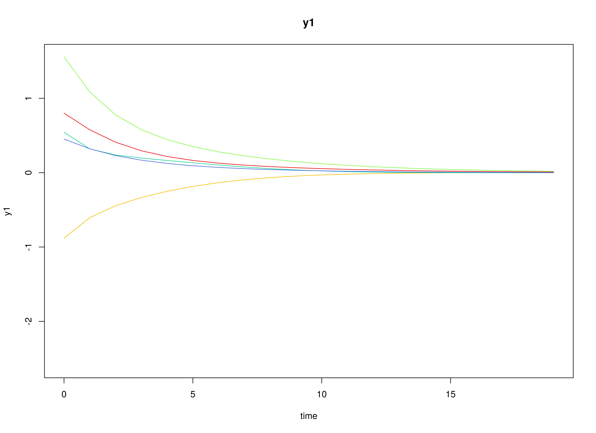
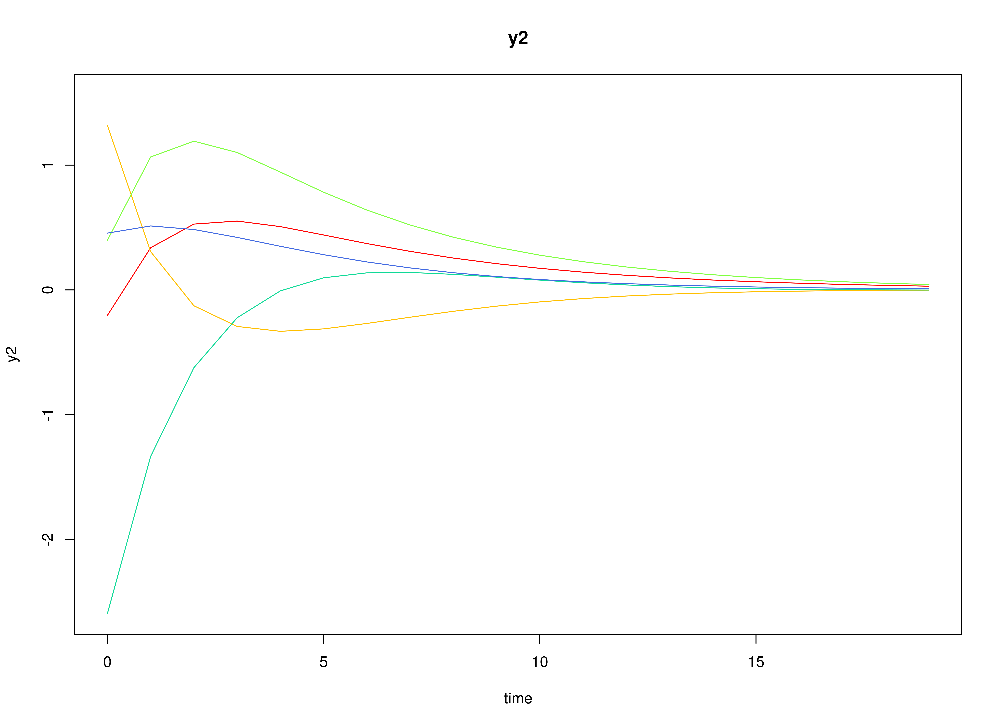
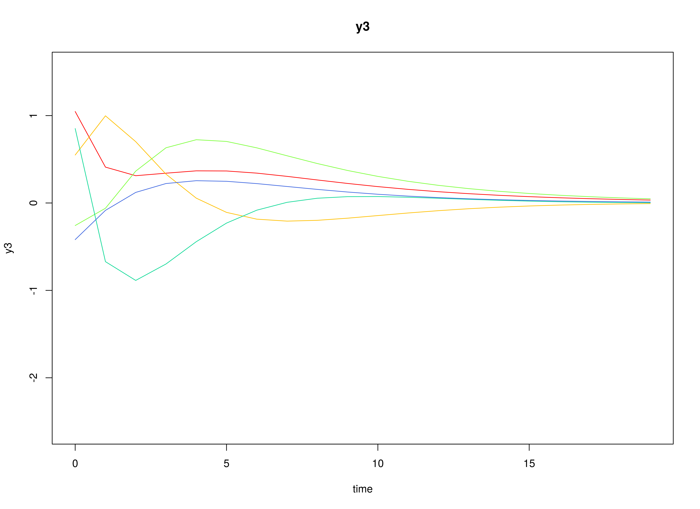

## Model

The measurement model is given by
\begin{equation}
  \mathbf{y}_{i, t}
  =
  \boldsymbol{\eta}_{i, t}
\end{equation}
where $\mathbf{y}_{i, t}$
represents a vector of observed variables
and $\boldsymbol{\eta}_{i, t}$
a vector of latent variables
for individual $i$ and time $t$.
Since the observed and latent variables are equal,
we only generate data
from the dynamic structure.

The dynamic structure is given by
\begin{equation}
  \boldsymbol{\eta}_{i, t}
  =
  \boldsymbol{\alpha}
  +
  \boldsymbol{\beta}
  \boldsymbol{\eta}_{i, t - 1}
  +
  \boldsymbol{\zeta}_{i, t},
  \quad
  \mathrm{with}
  \quad
  \boldsymbol{\zeta}_{i, t}
  \sim
  \mathcal{N}
  \left(
  \mathbf{0},
  \boldsymbol{\Psi}
  \right)
\end{equation}
where
$\boldsymbol{\eta}_{i, t}$,
$\boldsymbol{\eta}_{i, t - 1}$,
and
$\boldsymbol{\zeta}_{i, t}$
are random variables,
and
$\boldsymbol{\alpha}$,
$\boldsymbol{\beta}$,
and
$\boldsymbol{\Psi}$
are model parameters.
Here,
$\boldsymbol{\eta}_{i, t}$
is a vector of latent variables
at time $t$ and individual $i$,
$\boldsymbol{\eta}_{i, t - 1}$
represents a vector of latent variables
at time $t - 1$ and individual $i$,
and
$\boldsymbol{\zeta}_{i, t}$
represents a vector of dynamic noise
at time $t$ and individual $i$.
$\boldsymbol{\alpha}$
denotes a vector of intercepts,
$\boldsymbol{\beta}$
a matrix of autoregression
and cross regression coefficients,
and
$\boldsymbol{\Psi}$
the covariance matrix of
$\boldsymbol{\zeta}_{i, t}$.

An alternative representation of the dynamic noise
is given by
\begin{equation}
  \boldsymbol{\zeta}_{i, t}
  =
  \boldsymbol{\Psi}^{\frac{1}{2}}
  \mathbf{z}_{i, t},
  \quad
  \mathrm{with}
  \quad
  \mathbf{z}_{i, t}
  \sim
  \mathcal{N}
  \left(
  \mathbf{0},
  \mathbf{I}
  \right)
\end{equation}
where
$\left( \boldsymbol{\Psi}^{\frac{1}{2}} \right) \left( \boldsymbol{\Psi}^{\frac{1}{2}} \right)^{\prime} = \boldsymbol{\Psi}$ .

## Data Generation

### Notation

Let $t = 100$ be the number of time points and $n = 1000$ be the number of individuals.

Let the initial condition
$\boldsymbol{\eta}_{0}$
be given by

\begin{equation}
\boldsymbol{\eta}_{0} \sim \mathcal{N} \left( \boldsymbol{\mu}_{\boldsymbol{\eta} \mid 0}, \boldsymbol{\Sigma}_{\boldsymbol{\eta} \mid 0} \right)
\end{equation}

\begin{equation}
\boldsymbol{\mu}_{\boldsymbol{\eta} \mid 0}
=
\left(
\begin{array}{c}
  0 \\
  0 \\
  0 \\
\end{array}
\right)
\end{equation}

\begin{equation}
\boldsymbol{\Sigma}_{\boldsymbol{\eta} \mid 0}
=
\left(
\begin{array}{ccc}
  1 & 0.2 & 0.2 \\
  0.2 & 1 & 0.2 \\
  0.2 & 0.2 & 1 \\
\end{array}
\right) .
\end{equation}

Let the constant vector $\boldsymbol{\alpha}$ be given by

\begin{equation}
\boldsymbol{\alpha}
=
\left(
\begin{array}{c}
  0 \\
  0 \\
  0 \\
\end{array}
\right) .
\end{equation}

Let the transition matrix $\boldsymbol{\beta}$ be normally distributed with the following means

\begin{equation}
\left(
\begin{array}{ccc}
  0.7 & 0 & 0 \\
  0.5 & 0.6 & 0 \\
  -0.1 & 0.4 & 0.5 \\
\end{array}
\right)
\end{equation}

and covariance matrix

\begin{equation}
\left(
\begin{array}{ccc}
  0.001 & 0 & 0 & 0 & 0 & 0 & 0 & 0 & 0 \\
  0 & 0.001 & 0 & 0 & 0 & 0 & 0 & 0 & 0 \\
  0 & 0 & 0.001 & 0 & 0 & 0 & 0 & 0 & 0 \\
  0 & 0 & 0 & 0.001 & 0 & 0 & 0 & 0 & 0 \\
  0 & 0 & 0 & 0 & 0.001 & 0 & 0 & 0 & 0 \\
  0 & 0 & 0 & 0 & 0 & 0.001 & 0 & 0 & 0 \\
  0 & 0 & 0 & 0 & 0 & 0 & 0.001 & 0 & 0 \\
  0 & 0 & 0 & 0 & 0 & 0 & 0 & 0.001 & 0 \\
  0 & 0 & 0 & 0 & 0 & 0 & 0 & 0 & 0.001 \\
\end{array}
\right) .
\end{equation}

Let the dynamic process noise $\boldsymbol{\Psi}$ be given by

\begin{equation}
\boldsymbol{\Psi}
=
\left(
\begin{array}{ccc}
  0.1 & 0 & 0 \\
  0 & 0.1 & 0 \\
  0 & 0 & 0.1 \\
\end{array}
\right) .
\end{equation}

### R Function Arguments


``` r
n
#> [1] 1000
```

``` r
time
#> [1] 100
```

``` r
mu0
#> [[1]]
#> [1] 0 0 0
```

``` r
sigma0
#>      [,1] [,2] [,3]
#> [1,]  1.0  0.2  0.2
#> [2,]  0.2  1.0  0.2
#> [3,]  0.2  0.2  1.0
```

``` r
sigma0_l
#> [[1]]
#>      [,1]      [,2]      [,3]
#> [1,]  1.0 0.0000000 0.0000000
#> [2,]  0.2 0.9797959 0.0000000
#> [3,]  0.2 0.1632993 0.9660918
```

``` r
alpha
#> [[1]]
#> [1] 0 0 0
```

``` r
# first beta in the list of length n
beta[[1]]
#>             [,1]        [,2]       [,3]
#> [1,]  0.68319244 0.009446821 0.03124888
#> [2,]  0.52597029 0.612802754 0.04081758
#> [3,] -0.02987808 0.380230327 0.48924235
```

``` r
psi
#>      [,1] [,2] [,3]
#> [1,]  0.1  0.0  0.0
#> [2,]  0.0  0.1  0.0
#> [3,]  0.0  0.0  0.1
```

``` r
psi_l
#> [[1]]
#>           [,1]      [,2]      [,3]
#> [1,] 0.3162278 0.0000000 0.0000000
#> [2,] 0.0000000 0.3162278 0.0000000
#> [3,] 0.0000000 0.0000000 0.3162278
```

### Visualizing the Dynamics Without Process Noise (n = 5 with Different Initial Condition)



### Using the SimSSMVARIVary Function from the simStateSpace Package to Simulate Data


``` r
library(simStateSpace)
sim <- SimSSMVARIVary(
  n = n,
  time = time,
  mu0 = mu0,
  sigma0_l = sigma0_l,
  alpha = alpha,
  beta = beta,
  psi_l = psi_l
)
data <- as.data.frame(sim)
head(data)
#>   id time         y1         y2         y3
#> 1  1    0  0.8162334 -0.5984788  1.0164707
#> 2  1    1  0.3925259 -0.2439741  0.8744118
#> 3  1    2  0.5923988 -0.5948630  0.2196216
#> 4  1    3 -0.1433093  0.2590177 -0.2179947
#> 5  1    4  0.5304555  0.2258476  0.2396965
#> 6  1    5  0.1241148  0.1422155 -0.4477143
```

``` r
plot(sim)
```


## Model Fitting

The FitDTVAR function fits a DT-VAR model on each individual $i$.


``` r
library(metaVAR)
fit <- FitDTVAR(
  data = data,
  observed = paste0("y", seq_len(k)),
  id = "id",
  ncores = parallel::detectCores()
)
```

## Multivariate Meta-Analysis

The Meta function performs multivariate meta-analysis using the estimated transition matrices $\boldsymbol{\beta}$
and the corresponding sampling variance-covariance matrix for each individual $i$.


``` r
meta <- Meta(
  fit,
  ncores = parallel::detectCores()
)
#> Running Model with 54 parameters
#> 
#> Beginning initial fit attempt
#> Running Model with 54 parameters
#> 
#>  Lowest minimum so far:  -31724767.5383823
#> 
#> Solution found
```



```
#> 
#>  Solution found!  Final fit=-31724768 (started at 1571251)  (1 attempt(s): 1 valid, 0 errors)
#>  Start values from best fit:
#> 0.122038937304799,-0.00278062706138962,-0.00561185425365858,-0.0396135710728098,-0.00051625764533643,0.000786659733540775,0.0158065878342269,-0.000412983664173903,-0.000738916450286877,0.120321826115439,-0.00507096808791206,-6.37095700505735e-05,-0.0367701353090698,0.0031440116352232,-0.00497156987330953,0.009684815906288,0.00125893416704102,0.125336306971819,-0.00071041377392949,-0.00245843374630463,-0.039854604327409,0.000937844042787619,-0.00268786435662035,0.00930699457502895,0.0954303608841253,0.00257793352750584,-0.000939214667273276,-0.0376694141913889,0.00126712309189785,-0.00221341340458025,0.0946321949823871,0.000280899209376801,0.00108420417682248,-0.0401644517155693,-0.00345268609501754,0.093120278097422,0.000354677909268121,0.00235814035873813,-0.0371775233013141,0.0979459154359789,-0.000782368781903507,-0.00426586409537682,0.0966121046162382,-0.00306640853777855,0.0979542552362299,0.67674865077765,0.50413907899266,-0.103486538887421,-0.00159539982791195,0.582998182731147,0.40913643791505,0.00312583824617578,-0.00370139176131255,0.480855801944939
```

``` r
summary(meta)
#>              est    se         z      p    2.5%   97.5%
#> sigma_11  0.0149 0e+00  707.1053 0.0000  0.0149  0.0149
#> sigma_21 -0.0003 0e+00  -23.0975 0.0000 -0.0004 -0.0003
#> sigma_31 -0.0007 0e+00  -44.6483 0.0000 -0.0007 -0.0007
#> sigma_41 -0.0048 0e+00 -357.9703 0.0000 -0.0049 -0.0048
#> sigma_51 -0.0001 0e+00   -5.0818 0.0000 -0.0001  0.0000
#> sigma_61  0.0001 0e+00    7.7618 0.0000  0.0001  0.0001
#> sigma_71  0.0019 0e+00  147.1476 0.0000  0.0019  0.0020
#> sigma_81 -0.0001 0e+00   -3.9276 0.0001 -0.0001  0.0000
#> sigma_91 -0.0001 0e+00   -7.0100 0.0000 -0.0001 -0.0001
#> sigma_22  0.0145 0e+00  707.1051 0.0000  0.0144  0.0145
#> sigma_32 -0.0006 0e+00  -39.3114 0.0000 -0.0006 -0.0006
#> sigma_42  0.0001 0e+00    8.2407 0.0000  0.0001  0.0001
#> sigma_52 -0.0044 0e+00 -340.1638 0.0000 -0.0044 -0.0044
#> sigma_62  0.0004 0e+00   30.8198 0.0000  0.0004  0.0004
#> sigma_72 -0.0006 0e+00  -50.1523 0.0000 -0.0007 -0.0006
#> sigma_82  0.0012 0e+00   91.7835 0.0000  0.0011  0.0012
#> sigma_92  0.0002 0e+00   12.1016 0.0000  0.0001  0.0002
#> sigma_33  0.0158 0e+00  707.1018 0.0000  0.0157  0.0158
#> sigma_43  0.0001 0e+00   10.2958 0.0000  0.0001  0.0002
#> sigma_53 -0.0001 0e+00   -9.3108 0.0000 -0.0001 -0.0001
#> sigma_63 -0.0050 0e+00 -366.6800 0.0000 -0.0050 -0.0050
#> sigma_73  0.0001 0e+00    4.0515 0.0001  0.0000  0.0001
#> sigma_83 -0.0004 0e+00  -29.0482 0.0000 -0.0004 -0.0004
#> sigma_93  0.0012 0e+00   87.6288 0.0000  0.0011  0.0012
#> sigma_44  0.0107 0e+00  707.1056 0.0000  0.0106  0.0107
#> sigma_54  0.0003 0e+00   25.7658 0.0000  0.0002  0.0003
#> sigma_64 -0.0001 0e+00   -8.8498 0.0000 -0.0001 -0.0001
#> sigma_74 -0.0042 0e+00 -358.8856 0.0000 -0.0042 -0.0042
#> sigma_84  0.0001 0e+00   12.7534 0.0000  0.0001  0.0002
#> sigma_94 -0.0002 0e+00  -17.3181 0.0000 -0.0002 -0.0002
#> sigma_55  0.0103 0e+00  707.1055 0.0000  0.0103  0.0103
#> sigma_65  0.0000 0e+00    0.5953 0.5517  0.0000  0.0000
#> sigma_75  0.0002 0e+00   16.4730 0.0000  0.0002  0.0002
#> sigma_85 -0.0041 0e+00 -361.9022 0.0000 -0.0042 -0.0041
#> sigma_95 -0.0004 0e+00  -37.4439 0.0000 -0.0004 -0.0004
#> sigma_66  0.0103 0e+00  707.1061 0.0000  0.0102  0.0103
#> sigma_76  0.0000 0e+00    2.6131 0.0090  0.0000  0.0000
#> sigma_86  0.0003 0e+00   32.2984 0.0000  0.0003  0.0004
#> sigma_96 -0.0038 0e+00 -337.3687 0.0000 -0.0039 -0.0038
#> sigma_77  0.0113 0e+00  707.1067 0.0000  0.0113  0.0113
#> sigma_87 -0.0002 0e+00  -20.0701 0.0000 -0.0002 -0.0002
#> sigma_97 -0.0004 0e+00  -32.1802 0.0000 -0.0004 -0.0003
#> sigma_88  0.0111 0e+00  707.1053 0.0000  0.0110  0.0111
#> sigma_98 -0.0003 0e+00  -23.2029 0.0000 -0.0003 -0.0002
#> sigma_99  0.0111 0e+00  707.1052 0.0000  0.0111  0.0111
#> mu_1      0.6767 1e-04 5545.3365 0.0000  0.6765  0.6770
#> mu_2      0.5041 1e-04 4188.7834 0.0000  0.5039  0.5044
#> mu_3     -0.1035 1e-04 -824.1681 0.0000 -0.1037 -0.1032
#> mu_4     -0.0016 1e-04  -15.4401 0.0000 -0.0018 -0.0014
#> mu_5      0.5830 1e-04 5738.7743 0.0000  0.5828  0.5832
#> mu_6      0.4091 1e-04 4036.9596 0.0000  0.4089  0.4093
#> mu_7      0.0031 1e-04   29.4194 0.0000  0.0029  0.0033
#> mu_8     -0.0037 1e-04  -35.2016 0.0000 -0.0039 -0.0035
#> mu_9      0.4809 1e-04 4561.9373 0.0000  0.4806  0.4811
```
